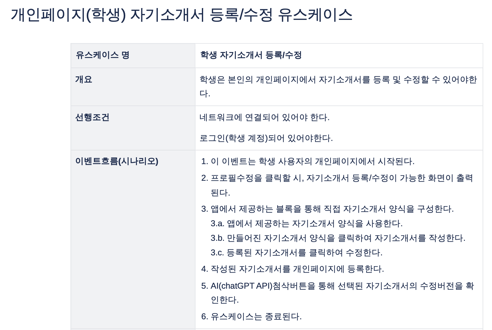
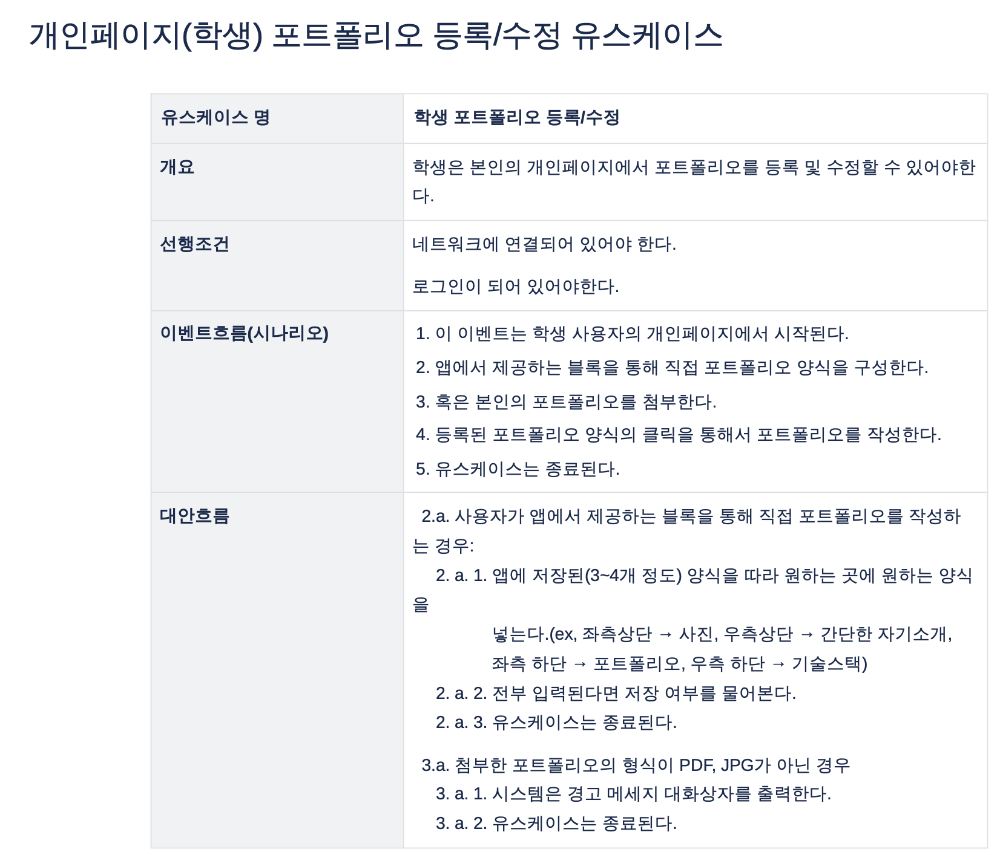
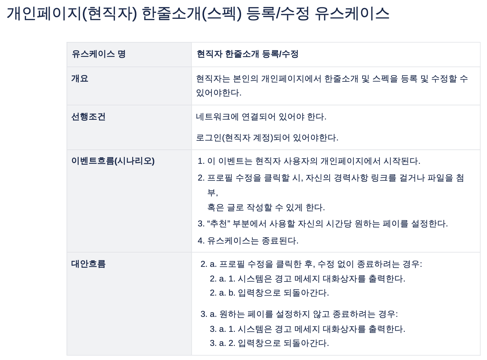
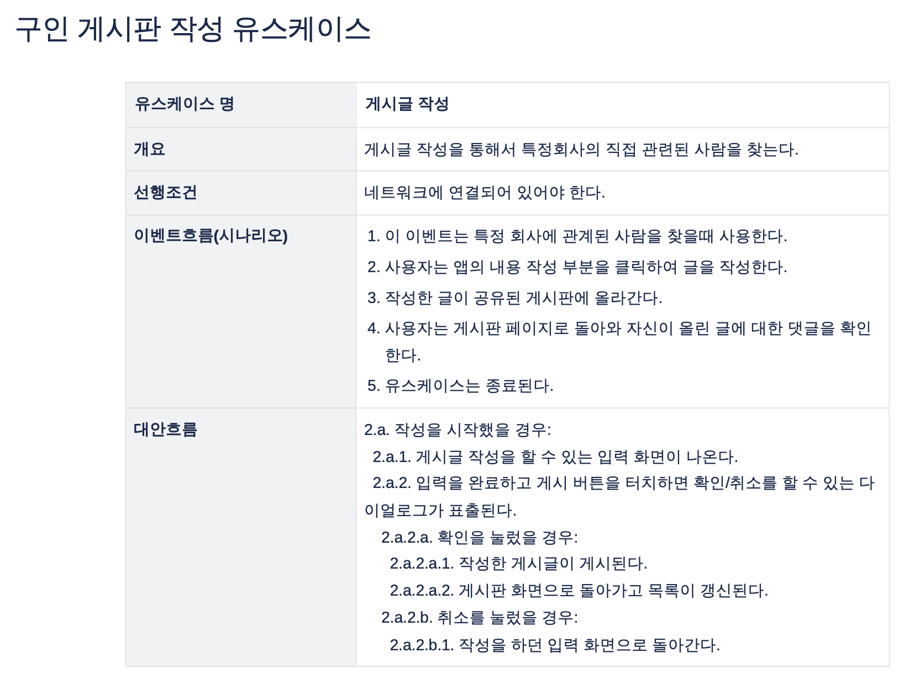
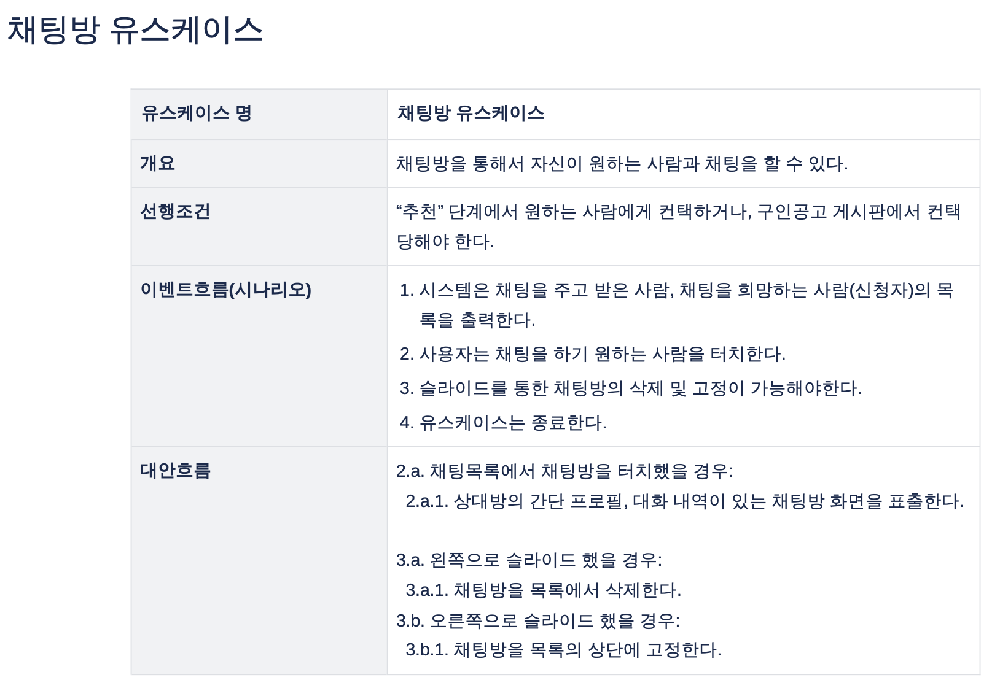
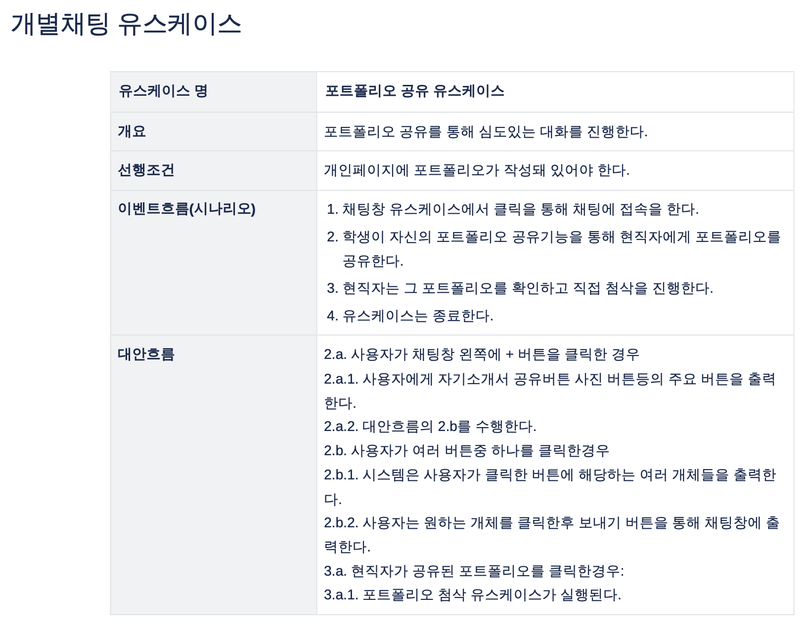
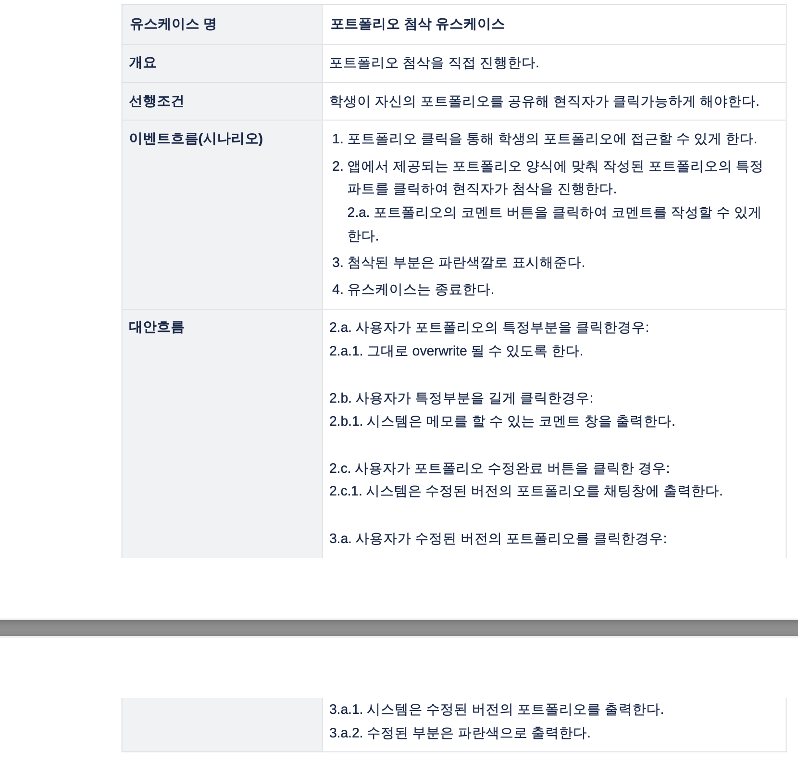
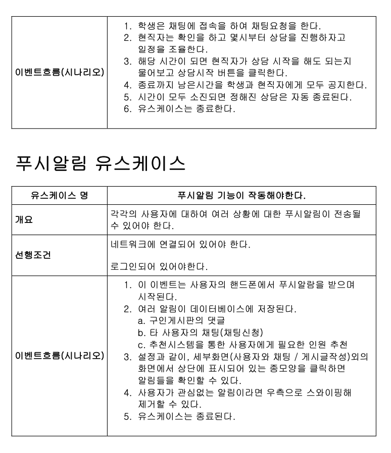
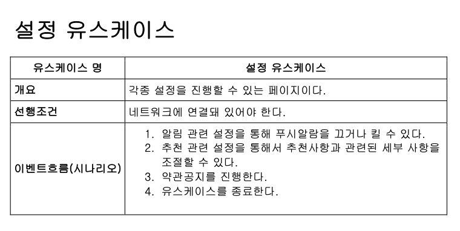

# DongA UseCase

---

드디어 새로운 프로젝트를 시작했다. 물론 학교에서 졸업하려면 시키는 졸업작품이긴 하지만, 그래도 최대한 많은것을 남기고자 열정이 있는 친구들과 같이 하게 되었다. 참 감사한 일이라고 생각한다. 

현재 하고 있는것은 기획에 관한 것들이다. 아직 개발은 거의 시작도 안했다고 봐도 무방하고, 어떤 툴을 사용할거고, 어떤 아이디어이며, 어떤 아키텍쳐고, 어떤 방식으로 개발을 진행할건지를 먼저 정해두는 거 같다. 다음학기에 좋은 개발을 하기 위해서 겪는 과정이라고 생각하고, 그렇게 재미없지도 않다. 나름 재밌게 하고있는 중이다.

뭔가 프로젝트에 관해서 자세히 말하고 게시글을 써야할 거 같지만, 음,,, 프로젝트가 어떤 프로젝트인지는 발표로 풀어나가서 솔직히 말로쓰기 어렵다. 지금부터 작성할 이 카테고리에서 보다보면 하고있는 프로젝트가 뭔지 이해가 될거라고 생각한다.

그니까 게시글을 좀 열씨미 써라 진성아...........!!!!!!!!!!! 넵.

다음은 기획과정에서 유스케이스를 만들었던 것들이다. Confluence를 사용해 제작하였고, 팀원들과 같이 첨삭해가며 만들었다.(사실 아직 미완성)

이렇게 미리 기획해두니 TDD에 대해서 조금 더 깊게 생각되는 거 같다. 이런 자세한 기획이 있다면 진짜 TDD하기도 좋고, TDD를 할수만 있다면야 더 안정성있게 개발하는 것도 가능하다고 생각한다.

말이 되에게 길었던 거 같다. 유스케이스이다.

우선, 이런 유스케이스를 작성했다. 아직 대안흐름에 관해서도 작성 못한것도 많긴하지만, 앞으로 더 열씨미 할거니까. 화성 갈끄니까.

진짜진짜 하면서 느끼는 것들을 많이 적어서 기록하려고 노력해봐야겠다

사실 입이 근질근질하다. 왜와이. 프로젝트에서 ORM을 골라야했는데, 써봤던 TypeORM이나 Sequelize가 아닌, Prisma를 사용했기 때문이다. 근데 아직 자세히 써보진 않아서 말은 아끼겠다. 둑흔둑흔 벌써 기대된다.
