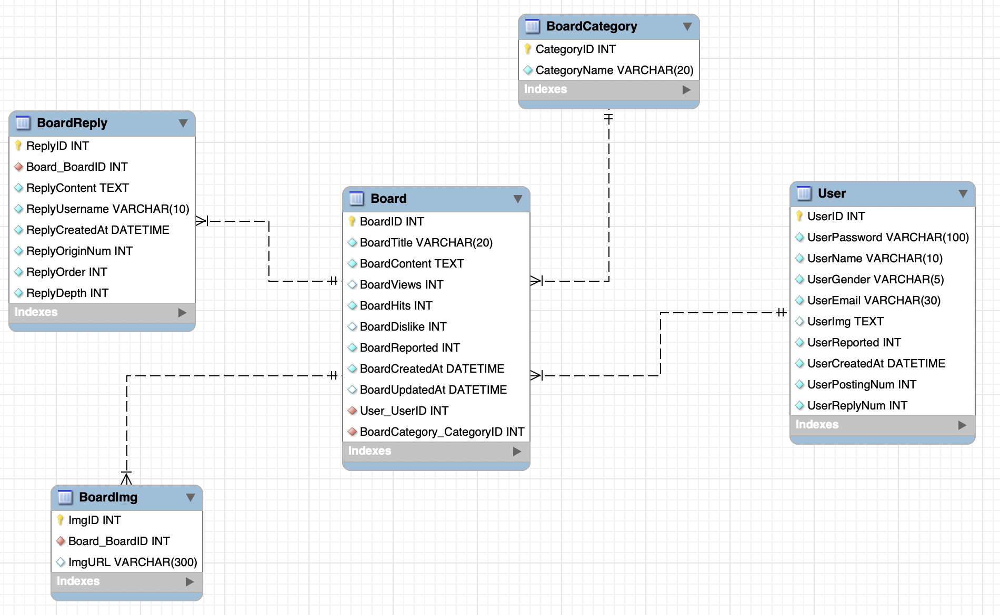
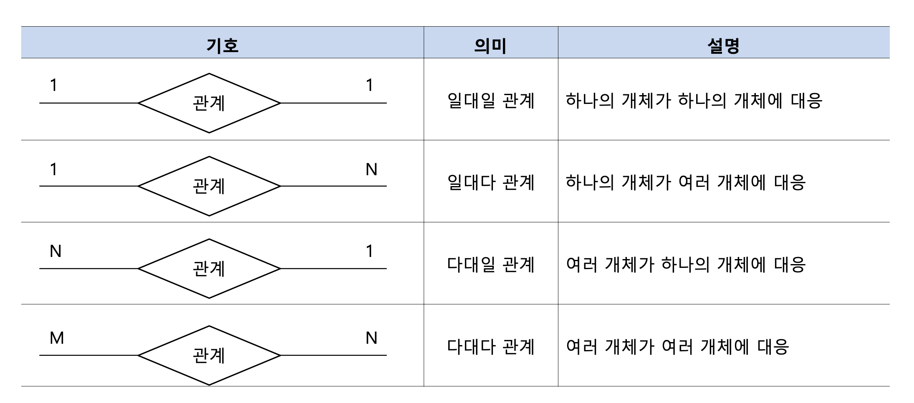
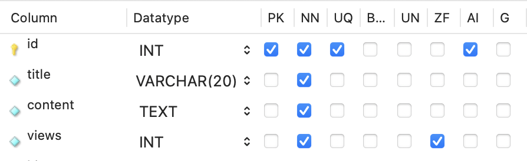
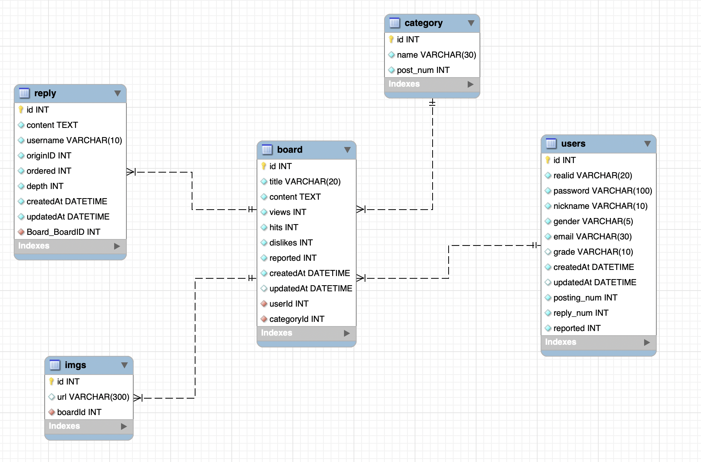

# NoGwari ERD

---------------------

프로젝트 시작하면서 데이터베이스 구조 및 배포를 먼저 하려고 했었다. 지금 글은 상당히 늦게 쓰고있긴 하지만 이미 배포까지 다 끝난 상태이다. 배포 끝나고 또 이제 코드 만져도 된다는 마음에 신나서 게시판 작업을 하던 상태이다. ㅎ

블로그 글 쓰는게 워낙 귀찮다보니 이렇게 하나둘씩 밀려가나 싶다. 근데 와중에 블로그 써야할 내용들은 개발하면서 주석처리로 "이거 써야겠다!" 라고 표시해뒀다 ㅋㅋㅋㅋ 차근차근 올려야겠다......

ㅋㅋㅋㅋㅋ 일단 이거부터 봐야한다. 데이터베이스 ERD를 구축하는 과정에서 우선, 게시판과 게시판에서의 카테고리 테이블, Img테이블, reply테이블을 만들고 user와 결합하는게 제일 먼저 프로젝트의 내용이다. 근데 ㅋㅋㅋㅋ 저렇게 테이블명을짜고, 저렇게 스키마들 앞에 테이블명들을 다 명시해줘야 나중에 스키마값을 따올때 더 편할거라고 생각했었다. 근데 진짜 막상 코드짜보면서 db에 접근하기 정말 불편하다.

예를들어 board의 외래키들을 보면 User_UserID이러는데 ㅋㅋㅋ 이거 이대로 썼다간 진짜 오히려 뇌에 과부하가 걸릴 거 같아서 ERD개설시 주의사항과, 그냥 ERD의 이해도 부족한 거 같아서 찾아보았다.

우선 데이터베이스 과목시간에 배웠던 pdf파일들로 찾아보았다.

그 중 좀 깊게 생각해봐야했던건 관계 타입에 유형에 관한 이야기이다.

### 관계 타입

이 내용인데, 이건 진짜 죽어도 안 까먹을 거 같으니 설명을 대강 하자면, 진짜 의미에 써있는 그대로라고 생각하면 될 거 같다. 이 프로젝트에서 예시를 들자면, 게시판에서의 댓글에 관한 예시가 편할 거 같다. 게시물 한개에 대해 여러개의 댓글이 달릴 수 있다. 이처럼 한개 → 여러개라는건 너무나도 일대다 관계를 의미하지 않나 싶다.

두번째로 생각해봐야했던건 이렇게 부르는지는 모르겠지만 스키마 제약조건 에 관한 이야기이다.

### 스키마 제약조건

board테이블을 예시로 들자면, PK NN UQ B UN ZF AI G 이 녀석들 이야기인데, 하나하나 표로 정리해보겠다.

| 종류 | 의미                                                         |
| ---- | ------------------------------------------------------------ |
| PK   | 기본키이다. 진짜 가장 기초가되는 애. 그래서 위에 보다싶이 id에 PK 옵션이 붙어있다. 얘는 중복해서 저장될 수 없기때문에 후술할 UQ옵션도 자동으로 붙어있다.그리고 다른 테이블에서 이 테이블을 참조할때, 이 pk옵션을 외래키로 갖는다. |
| NN   | NotNull의 약자이다. 이름대로 Null값을 가질 수 없는, 뭐라도 채워야하는 값일때 쓰인다. |
| UQ   | Unique의 약자이다. PK에서 서술했듯 값이 중복되면 안되는 곳에 이 옵션을 준다. |
| B    | Binary의 약자이다. True or False 값만 받을 수 있다           |
| UN   | Unsigned의 약자이다. 음이 없는 정수의 값을 받을때 옵션을 추가한다. |
| ZF   | ZeroFill의 약자이다. 0으로 채우는데, 만약 INT(5)옵션안에 들어간다면 0을 5개 추가하는 식이다. |
| AI   | AutoIncrease의 약자이다. id값이 올라갈때마다 하나씩 증가한다. 위에 표에서도 보다싶이 id값이 이 옵션을 갖는다. |
| G    | Generated의 약자이다. 잘 안쓴다. 그래도 찾아봤더니 다른 열을 기반으로하는 수식에 의해 생성된 값일때 이 옵션을 쓴다고 한다. 쓸 일 있을지 잘 모르겠다 ㅎ.. |

마지막으로 데이터베이스 구축?시 주의사항 및 느낀점이다.

### 데이터베이스 구축 주의사항

1. 테이블 명은 대소문자를 구분한다. 그러니 조심하자. 그냥 소문자로 다 쓰는게 좋은듯?
1. 특수문자는 _ , - 둘 중 하나아니면 넣지말자.
1. 예약어 회피. 이것때문에 고생했다. 데이터베이스에서 지정해둔 예약어는 테이블이나 스키마에 넣지말자.
1. 데이터 타입 선택시 적절하게 넣자. 날짜에 VARCHAR같은거 쓰지말고 DATETIME으로!

이정도가 나에게 고문을 시켰던 주의사항들이다. 그리고 후술하겠지만 NoGwari프로젝트에서 ORM(sequelize)를 사용한다. Sequelize를 사용할때는 그냥 진짜 테이블명이건 칼럼명이건 다 소문자로 쓰자. 잘 못 알아먹는다. 후... 다시 생각해도 열받네.

위에서 서술한 주의사항들을 수렴하여 만든 ERD이다. 프로젝트가 진행되면서 ERD의 수정사항이 생길 수 있는데, 최대한 많은걸 생각해서 만든 첫 ERD니 애정이 가는 거 같다.

열심히 해봐야겠당 헤헤
