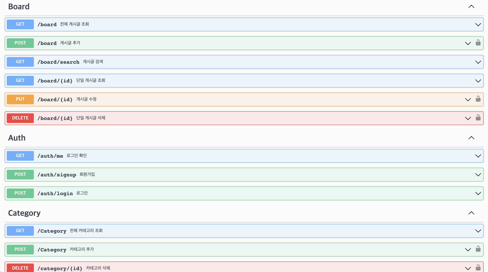

# NoGwari Apply Swagger

---------------------

아. 지금 일자는 6월 14일 글로 들어와있지만 지금 날짜는 7월 5일이다. swagger를 적용한 시기에 맞춰서 날짜를 설정했다. 그래서 기억이 잘 안나지만, 우여곡절했던 내용과 어떻게 설정했는지, 그리고 Swagger-auto-gen을 사용한 후기는 어땠는지, 설명해보려고 한다. 그래도 그때 여러 방법들에 대해 주석으로 각각 정리해두어서 글이라도 쓸 수 있게 됐다. 다행이다. 깃헙 예전 커밋들도 있으니까.. 확인해보며 썼다. 이러려고 형상관리하는게 맞나?

우선 3가지 방법으로 Swagger를 적용했었다.

1. Swagger.js 파일 생성해주어 간단히 옵션을 정해주고 끌어와서 쓰는 방법
2. Swagger-auto-gen을 사용해 자동으로 swagger를 추가해주는 방법
3. yamljs를 이용하여 swagger.yaml을 만들고, 그 파일을 끌어와서 쓰는 방법

현재는 3번째 방법으로 사용하고 있다. swagger를 적용하는 과정 자체가 1 → 2 → 3이였고, 3번이 제일 좋다. 편하기도 하고 가독성도 해치지않는다.

각각 방법을 설명해보겠다.

### Swagger.js 파일 생성해주어 간단히 옵션을 정해주고 끌어와서 쓰는 방법

여기서는 swagger.js파일이 중요한데 내용은 다음과 같다.

```javascript
import swaggerUi from "swagger-ui-express";
import swaggerJsdoc from "swagger-jsdoc";
import {config} from "./config.js";

const options = {
    definition: {
        openapi: "3.0.3",
        info: {
            title: "Nogwari",
            version: "1.0.0",
            description: "Nogwari swagger",
        },
        components: {
            securitySchemes: {
                Authorization: {
                    type: "http",
                    scheme: "bearer",
                    bearerFormat: "JWT",
                    value: "Bearer <JWT token here>",
                },
            },
        },
        host: config.swagger.host,
        basePath: "/",
    },
    apis: ["./router/*.js"],
};
export const specs = swaggerJsdoc(options);
```

위와 같이 파일을 만들어주었다. 여기까진 순조롭고 너무 아름다웠다.

```javascript
// app.js
import {specs} from "./swagger.js";
app.use("/api-docs", swaggerUi.serve, swaggerUi.setup(swaggerDocument));
```

app.js에서 이렇게 불러와주면 /api-docs를 실행시켰을때 swagger 창이 떴었다. 근데 이 친구에 고질적 문제는 이것이다.

```javascript
import express from "express";
import "express-async-errors";
import * as boardController from "../controller/board_controller.js";
const router = express.Router();

// GET /board?page=1&list_num=5&category=1
/**
 * @swagger
 * definitions:
 *   Board:
 *     properties:
 *       id:
 *         type: integer
 *       title:
 *         type: string
 *       content:
 *         type: string
 *       views:
 *         type: integer
 *       hits:
 *         type: integer
 *       dislikes:
 *         type: integer
 *       reported:
 *         type: integer
 *       createdAt:
 *         type: string
 *         format: date-time
 *       updatedAt:
 *         type: string
 *         format: date-time
 *       userId:
 *         type: integer
 *       categoryId:
 *         type: integer
 *       userNickname:
 *         type: string
 *       userImg:
 *         type: string
 *       userGrade:
 *         type: string
 *       categoryName:
 *         type: string
 */

/**
 * @swagger
 * paths:
 *  /board:
 *    get:
 *      summary: "전체 게시글 조회"
 *      parameters:
 *      - in: query
 *        name: page
 *        type: integer
 *        description: "page 번호 / defalut = 1"
 *      - in: query
 *        name: list_num
 *        type: integer
 *        description: "item 개수 / defalut = 5"
 *      - in: query
 *        name: category
 *        type: integer
 *        description: "category 번호 / 기입안할시 전체 게시글 검색"
 *      responses:
 *        "200":
 *          description: 게시글 조회 성공
 *          content:
 *            application/json:
 *              schema:
 *                $ref: '#/definitions/Board'
 */

router.get("/", boardController.getPostingByPage);

// GET /board/id
/**
 * @swagger
 * paths:
 *  /board/{id}:
 *    get:
 *      summary: "단일 게시글 조회"
 *      parameters:
 *        - in: path
 *          name: id
 *          required: true
 *          type: integer
 *          minimun: 1
 *          description: "게시글의 ID값으로 서칭"
 *      responses:
 *        "200":
 *          description: 게시글 조회 성공
 *          content:
 *            application/json:
 *              schema:
 *                $ref: '#/definitions/Board'
 *        "404":
 *          description: 해당 게시글 미존재
 */
router.get("/:id", boardController.getPosting);

// POST /board
/**
 * @swagger
 * paths:
 *  /board:
 *    post:
 *      summary: "게시글 추가"
 *      consumes:
 *        - application/json
 *      parameters:
 *        - in: body
 *          name: board
 *          schema:
 *            type: object
 *            required:
 *              - title
 *              - content
 *              - userId
 *              - categoryId
 *            properties:
 *              title:
 *                type: string
 *              content:
 *                type: string
 *              hiddenNum:
 *                type: string
 *              userId:
 *                type: integer
 *              categoryId:
 *                type: integer
 *      responses:
 *        "201":
 *          description: 게시글 추가 성공
 *          content:
 *            application/json:
 *              schema:
 *                $ref: '#/definitions/Board'
 */
router.post("/", boardController.newPosting);

// PUT /board/:id
/**
 * @swagger
 * paths:
 *  /board/{id}:
 *    put:
 *      summary: "게시글 수정"
 *      consumes:
 *        - application/json
 *      parameters:
 *        - in: path
 *          name: id
 *          required: true
 *          type: integer
 *          minimun: 1
 *          description: "게시글의 ID값으로 수정대상 찾기"
 *        - in: body
 *          name: board
 *          schema:
 *            type: object
 *            required:
 *              - title
 *              - content
 *              - categoryId
 *            properties:
 *              title:
 *                type: string
 *              content:
 *                type: string
 *              hiddenNum:
 *                type: string
 *              categoryId:
 *                type: integer
 *      responses:
 *        "200":
 *          description: 게시글 수정 성공
 *          content:
 *            application/json:
 *              schema:
 *                $ref: '#/definitions/Board'
 *        "404":
 *          description: 해당 게시글 미존재
 */
router.put("/:id", boardController.updatePost);

// DELETE /board/:id
/**
 * @swagger
 * paths:
 *  /board/{id}:
 *    delete:
 *      summary: "단일 게시글 삭제"
 *      parameters:
 *        - in: path
 *          name: id
 *          required: true
 *          type: integer
 *          minimun: 1
 *          description: "게시글의 ID값으로 서칭"
 *      responses:
 *        "200":
 *          description: 게시글 조회 성공
 *          content:
 *            application/json:
 *              schema:
 *                $ref: '#/definitions/Board'
 *        "404":
 *          description: 해당 게시글 미존재
 */
router.delete("/:id", boardController.deletePost);

export default router;
```

놀랍겠지만 라우터에 저런식으로 주석을 작성하여 swagger를 하나하나 추가해주었다. 뭐 api-docs에 들어가보면 하나하나 너무 색깔이 영롱해서 기분은 좋았지만, router의 기본은 이제 어떤 api가 있나 스윽스윽 볼 수 있는것도 중요하다고 생각한다. 이거 이대로 하면 1000줄은 가뿐히 넘어갈 거 같길래 이 방법은 여기서 포기하였다.

그래서 찾은 두번째 방법은 다음과 같다.


### Swagger.js 파일 생성해주어 간단히 옵션을 정해주고 끌어와서 쓰는 방법

라이브러리를 찾아보니 저렇게 주석으로 해줄필요 없이 알아서 swagger를 생성해준다는 라이브러리가 있었다. 걔가 swagger-auto-gen이다. 근데 진짜 진심으로 이렇게 맛없는 라이브러리는 처음봤다. 정확히 동작구조는 router의 지점을 알려주면 거기서부터 api들을 찾아서 swagger.json을 만든 후, 그 json파일을 불러오면서 swagger가 생성되는 원리이다. 

어.. 사진은 없긴한데 고질적인 문제점들을 찾아보자면 

1. Api 호출하는 주소를 잘 못 찾는다. 예를들어 /auth/login과 /auth/signup이 있다고 가정하자. 근데 이 친구는 신기하게도 /auth/login은 기똥차게 가져왔는데, /auth/signup은 그냥 /signup으로 가져와버린다. 테스트? 당연히 안된다.
2. 태그 지정이 어렵다. json파일을 결국 본인 손으로 만져줘야 태그 지정이 가능하다.

그냥 그런 느낌으로 생각하면 될 거 같다. 라이브러리가 다 해준다는 생각을 버리고, 대충 만들어준 라이브러리를 가지고 확인해보면서 json 파일을 수정해주는 것. 딱 그런 느낌이다. 

설정하는 코드는 다음과 같다.

```javascript
// swagger.js
import swaggerAutogen from "swagger-autogen";
const doc = {
    info: {
        title: "Nogwari",
        version: "1.0.0",
        description: "Nogwari swagger",
    },
    host: config.swagger.host,
    basePath: "/",
    schemes: ["http"],
};

const outputFile = "./swagger-output.json";
const endpointsFiles = ["./router/auth_router.js", "./router/board_router.js", "./router/category_router.js"];

swaggerAutogen(outputFile, endpointsFiles, doc);
```

```javascript
//app.js
import swaggerFile from "./swagger-output.json" assert {type: "json"};
app.use("/api-docs", swaggerUi.serve, swaggerUi.setup(swaggerFile));
```

그렇다. 걍 저렇게 불러와서 한다. 근데 맛 없는게 큰 단점이다. 그래서 마지막으로, 결국 현재까지도 채용해서 사용하고 있는 방법은


### yamljs를 이용하여 swagger.yaml을 만들고, 그 파일을 끌어와서 쓰는 방법

사실 json 파일을 auth-gen된걸 수정해서 쓰나 이거나 그게 그거라고 생각하긴 한다. 근데 나는 auto-gen이 만든거 일일히 하나하나 읽으면서 이해한다음 수정할빠엔 내가 새로 만들자. 란 마인드가 강했다. 그래서 YAML파일을 사용하여 불러왔다.

근데 이 친구의 좋은점은 swagger.js파일을 따로 만들어주지 않아도, yaml파일 안에서 다 해결해낼 수 있다는 거였다. 그리고 설정하는 코드 마저도 cool 그 자체다. 아래는 코드이다.

```javascript
import YAML from "yamljs";
const swaggerDocument = YAML.load("./swagger.yaml");
app.use("/api-docs", swaggerUi.serve, swaggerUi.setup(swaggerDocument));
```

진짜 세상에서 이렇게 쿨할 수 있을까?

그리고 1, 2번째 방법을 채택하지 않았던 큰 이유중 하나는, Swagger version자체가 OAS3여야 JWT토큰을 발급받는 과정을 test해볼 수 있다는 거였다. 이건 좀 긴가민가한 사실인데, 1,2번째 방법에서는 어떻게 해줘도 JWT토큰과, 그 토큰이 있을때만 허용해주는 api에 대해서 설정이 불가능했다. 그래서 좀 많이 헤매다 yamljs를 채택한 것이다. 

간단하게 yaml파일을 어떻게 작성하였는지 아래와 같이 서술하겠다. 이건 일일이 설명하긴 굉장히 길기 때문에 코드보면서 읽는게 더 편할것이라 생각든다.

```yaml
openapi: 3.0.0
info:
    title: Nogwari
    version: 1.0.0
    description: "Nogwari swagger"
servers:
    - url: http://localhost:3000
      description: Local development server
paths:
    /board:
        get:
            summary: "전체 게시글 조회"
            tags: [Board]
            parameters:
                - in: query
                  name: page
                  type: integer
                  description: "page 번호 / defalut = 1"
                - in: query
                  name: list_num
                  type: integer
                  description: "item 개수 / defalut = 5"
                - in: query
                  name: category
                  type: integer
                  description: "category 번호 / 기입안할시 전체 게시글 검색"
            responses:
                "200":
                    description: 게시글 조회 성공
                    content:
                        application/json:
                            schema:
                                $ref: "#/components/schemas/Board"
        post:
            summary: "게시글 추가"
            security:
                - bearerAuth: []
            tags: [Board]
            requestBody:
                required: true
                content:
                    application/json:
                        schema:
                            $ref: "#/components/schemas/Board"
            responses:
                "201":
                    description: 게시글 추가 성공
                    content:
                        application/json:
                            schema:
                                $ref: "#/components/schemas/Board"
                "401":
                    description: 인증 실패
        delete:
            summary: "단일 게시글 삭제"
            security:
                - bearerAuth: []
            tags: [Board]
            parameters:
                - in: path
                  name: id
                  required: true
                  type: integer
                  minimun: 1
                  description: "게시글의 ID값으로 서칭"
            responses:
                "204":
                    description: 게시글 삭제 성공
                    content:
                        application/json:
                            schema:
                                $ref: "#/components/schemas/Board"
                "401":
                    description: 인증 실패
                "403":
                    description: 삭제 권한 없음
                "404":
                    description: 해당 게시글 미존재
components:
    schemas:
        Board:
            required:
                - id
                - title
            properties:
                id:
                    type: integer
                    format: int64
                title:
                    type: string
                content:
                    type: string
                views:
                    type: integer
                    format: int64
                hits:
                    type: integer
                    format: int64
                dislikes:
                    type: integer
                    format: int64
                reported:
                    type: integer
                    format: int64
                createdAt:
                    type: string
                    format: date-time
                updatedAt:
                    type: string
                    format: date-time
                userId:
                    type: integer
                    format: int64
                categoryId:
                    type: integer
                    format: int64
                userNickname:
                    type: string
                userImg:
                    type: string
                userGrade:
                    type: string
                categoryName:
                    type: string
        Auth:
            properties:
                token:
                    type: string
                realid:
                    type: string
        Category:
            properties:
                id:
                    type: integer
                    format: int64
                name:
                    type: string
                post_num:
                    type: integer
                    format: int64
        PostCategory:
            propertirs:
                name:
                    type: string
        Signup:
            properties:
                required:
                    - realid
                    - password
                    - nickname
                    - email
                realid:
                    type: string
                password:
                    type: string
                nickname:
                    type: string
                email:
                    type: string
                img:
                    type: string
        Login:
            properties:
                realid:
                    type: string
                password:
                    type: string
        Error:
            properties:
                code:
                    type: integer
                    format: int32
                message:
                    type: string
    securitySchemes:
        bearerAuth:
            type: http
            scheme: bearer
            bearerFormat: JWT

```

좀 기네? 간단한 CRUD들과 tag기능을 하는 components, 그리고 JWT를 확인할 수 있는 securitySchemes에 대하여 이렇게 구현하였다. 이렇게 한번 구현해두면 나중에 복붙해서 새로운 api를 적용하는것도 어렵지 않았다.


FE는 진짜 학교에서 찍먹으로 배워본 거 말고는 배워본적이 없는데, swagger하다보니 색깔도 알록달록 이뻐서 하나하나 적용하는게 너무 재밌었던 거 같다. Swagger api 색깔 만든 사람 진짜 상줘야할 거 같다. 야무지다.

 
