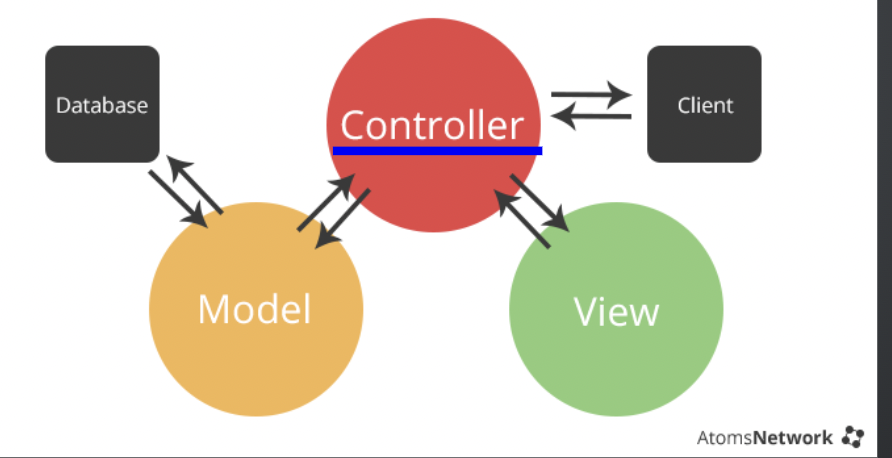

# MVC parttern

---

Dwitter말고 새로운 프로젝트를 시작하려고하니, MVC 패턴을 중요시 여겨 프로젝트를 진행해야 보다, 깔끔하게 진행될 거 같아 복습할겸 이렇게 게시글을 써본다.

강의에서 들었을때 MVC에 대해 난 되게 잘 이해했다고 생각했는데, 게시글을 쓰며 여러군데를 찾아보니까 조금 아쉽게 이해한 거 같았다.

우선 MVC가 무엇인지부터 살펴보자.

## MVC

MVC는 Model - View - Controller의 앞글자만 따서 만든 단어이다. 세가지가 상호작용하며 진행되는데, 이로 인해 비지니스 로직을 수정할 때, 온갖 코드를 들쑤시며 전부 수정할 소요 없이 알아서 딱 잘 깔끔하고 센스있게 고칠 수 있게 된다. 아래는 상호작용하는 것에 대한 사진이다.



### Model

* Controller와 Database랑 연동되어서 작동한다.
* DB와의 호흡,, 화합,,, 이 주 목적이다.
* Client / View에 노출되지 않는다.

### Controller

* 사용자의 요청을 받고 응답을 조종한다. 즉, 생각하는건 거의 다 지 몫이다. 비지니스 로직에 해당되는 부분.
* View 요청이 들어와서 Controller에서 생각한다음 Model에 데이터 보내달라하고 그걸 받아 View에 다시 띄우는 모든 역할은 Controller가 한다. 바쁨.

### View

* 클라이언트에 나타나는 부분.
* HTML / CSS / JS 예쁘게 꾸미고, 화려하게 움직여 표현하는게 얘.
* 확실하진 않지만, 백엔드에서의 View는 Router에 해당한다고 생각한다. 제일 바깥에서 Client랑 소통하려하는게 Router기 때문이다.

말로만 하면 이해안될 수 있으니 Dwitter에서의 예시를 가져와봤다.

```javascript
app.use("/tweets", tweetsRouter);
```

이렇게 Router타고 이동하면

```javascript
const router = express.Router();


// GET /tweets
// GET /tweets?username=:username
router.get("/", isAuth, tweetController.getTweets);

// GET /tweets/:id
router.get("/:id", isAuth, tweetController.getTweet);

// POST /tweets
router.post("/", isAuth, validateTweet, tweetController.createTweet);

// PUT /tweets/:id
router.put("/:id", isAuth, validateTweet, tweetController.updateTweet);

// DELETE /tweets/:id
router.delete("/:id", isAuth, tweetController.deleteTweet);

// DELETE /tweets?username=:username
router.delete("/", isAuth, tweetController.deleteTweetByUserId);

```

각 api마다 Controller에 어떤 함수를 실행시켜야하는지 가르킨다. 이게 **View**다.

그리고 여기서 updateTweet 함수를 예로들면,

```javascript
export async function updateTweet(req, res) {
    const id = req.params.id;
    const text = req.body.text;
    const tweet = await tweetRepository.getById(id);
    if (!tweet) {
        return res.sendStatus(404);
    }
    const reqUserId = req.userId.toString;
    const reqTweetId = tweet.userId.toString;
    if (reqUserId !== reqTweetId) {
        return res.sendStatus(403);
    }
    const updated = await tweetRepository.update(id, text);
    res.status(200).json(updated);
}
```

이런식으로 구성되어있다.

여기서 보면 tweet을 찾지 못했을 때 404에러를 띄워준다던가, UserId와 TweetId가 다르다면 다른 사용자가 삭제를 시도한것이기 때문에 403에러를 띄워주는 등 생각해서 뱉어내는 역할인 **Controller**다.

그 후, Id, text 값을 받아 getById와 update 함수를 사용하였는데, update만 예시를 든다면

```javascript
const Tweet = sequelize.define("tweet", {
    id: {
        type: DateTypes.INTEGER,
        autoIncrement: true,
        allowNull: false,
        primaryKey: true,
    },
    text: {
        type: DateTypes.TEXT,
        allowNull: false,
    },
});

export async function update(id, text) {
    return Tweet.findByPk(id, {
        ...INCLUDED_USER,
    }).then((tweet) => {
        tweet.text = text;
        return tweet.save();
    });
}
```

이런식으로 구성되어있는데, 나는 참고로 Sequelize ORM을 사용한 코드이다.
보다싶이 데이터와 실질적으로 접근하고, 바꾸는 역할을 하는 여기가 **Model**이다.

확실히 100% 블로그에 한번 더 정리하니까 이젠 안 까먹을 거 같다. 좋다 좋아.

