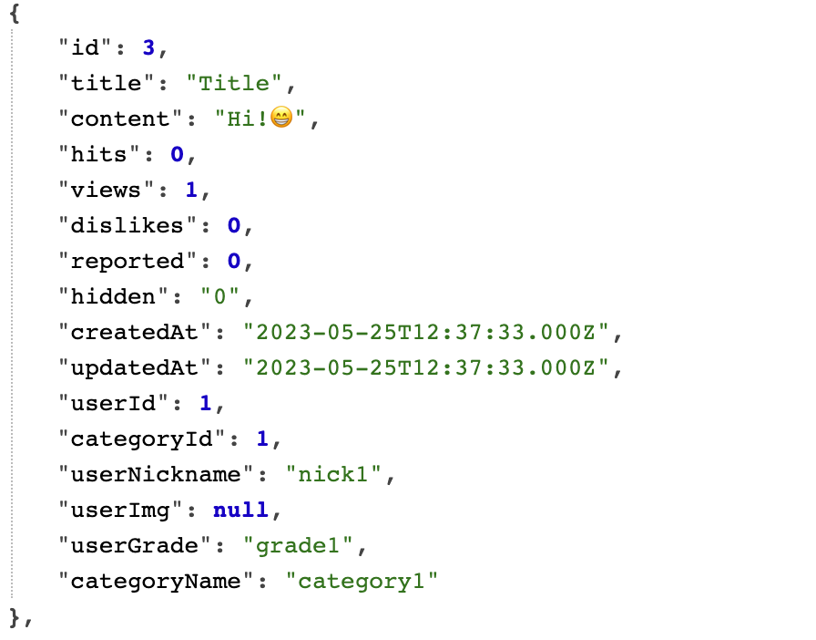

# NoGwari Join

---------------------


아직 FE는 시작도 안했지만,, 나는 테이블 조인단계에 벌써 들어와버렸다. 이번 글은 조인하면서 방황한 일에 간단하게 정의하고 글을 끝내려고 한다. 글은 짧아도 이걸로 6시간은 방황한 거 같으니 기분나빠서라도 써야겠다. 

사실 ORM을 쓰기때문에, join이라고 말하기는 어렵지만, board 한개에 포함되어야하는 내용은 위에 ERD에서 보이는 값들 뿐 아니라, user의 profile img, nickname, grade까지 보여주는게 맞다고 생각했다. 그래서 코드를 아래와 같이 작성하였다.

```javascript
// Board User 일대일관계
User.hasOne(Board);
Board.belongsTo(User);
// Board Category 일대일관계
Category.hasOne(Board);
Board.belongsTo(Category);

const INCLUDED_ALL = {
    attributes: [
        "id",
        "title",
        "content",
        "hits",
        "views",
        "dislikes",
        "reported",
        "hidden",
        "createdAt",
        "updatedAt",
        "userId",
        "categoryId",
        [Sequelize.col("user.nickn  ame"), "userNickname"],
        [Sequelize.col("user.img"), "userImg"],
        [Sequelize.col("user.grade"), "userGrade"],
    ],
    include: [
        {
            model: User,
            attributes: [],
        }
    ],
};

const ORDER_DESC = {order: [["createdAt", "DESC"]]};

export async function getAllbyPages() {
    return Board.findAll({
        ...INCLUDED_ALL,
        ...ORDER_DESC,
        where: {hidden: 0},
    });
}
```

INCLUDED_ALL이라는 변수는 attribute를 일일이 쓰기 번거로워서 저렇게 변수로 빼두었다. INCLUDED_ALL변수는 저런식으로 attribute와 include를 포함하고 있는데, 저런식으로 include안 배열에 model를 User로 정의함으로써 조인? 비슷하게 작동하는 걸로 알고있었다.

근데 진행하다보니 한개의 board안에서는 User에서 저 세개뿐아니라 Category테이블에서 Category.name도 받아와야한다. 그게 진정한 board라고 생각하였기 때문에, 수정하고자 하였다.

근데 두개의 테이블을 조인하는 과정에서 어려움을 겪었는데, 알고보니 include는 배열형태로 받고 각각 다른 객체를 선언하면 두개의 테이블을 동시에 조인하는게 된다는 걸 진짜 끝없는 방황끝에 깨달았다 ㅎ

뭐 여튼 깨달았으면 오케이 아닐까요?

아래는 수정된 INCLUDED_ALL 변수 코드이다.

```javascript
const INCLUDED_ALL = {
    attributes: [
        "id",
        "title",
        "content",
        "hits",
        "views",
        "dislikes",
        "reported",
        "hidden",
        "createdAt",
        "updatedAt",
        "userId",
        "categoryId",
        [Sequelize.col("user.nickn  ame"), "userNickname"],
        [Sequelize.col("user.img"), "userImg"],
        [Sequelize.col("user.grade"), "userGrade"],
        [Sequelize.col("category.name"), "categoryName"],
    ],
    include: [
        {
            model: User,
            attributes: [],
        }, // model을 두개 정의하는 법을 이렇게 하면 되는구나!
        {
            model: Category,
            attributes: [],
        },
    ],
};
```


