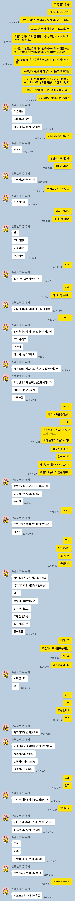
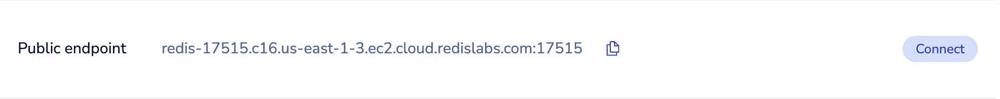
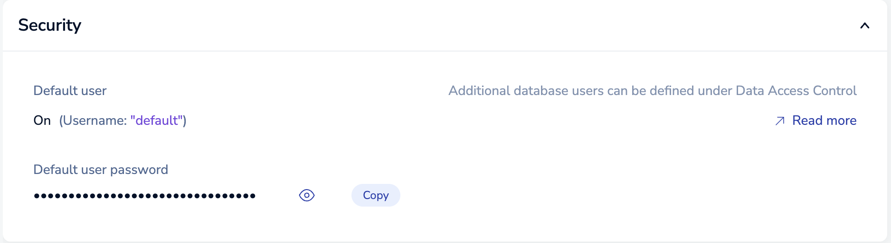

# NoGwari Email Verify(redis)

---------------------

이게 좀 골치아팠다. 문제점은 이거였다. 메일을 전송하는 함수(mailSubmit)에서 인증키를 발급한다. 이 인증키를 발급하는 과정은 어찌어찌 찾아보니

const verifyKey = Math.floor(Math.random() * 899999) + 100000; 과 같은 코드로 6자리 임의의 숫자를 만들 수 있었다. 여기까지는 순조로웠다.

근데 메일을 전송하는 함수에서 전송된 메일에 인증키를 검증하는 함수를 또 만들었는데, 이 둘 사이에 인증키는 같아야하지않는가? 근데 그게 불가능했다.

사실 로컬스토리지로 그냥 객체를 만들어서 key : value로 이메일 : 인증키 이런식으로 저장해보려고도 했는데, 이는 단점이 명확히 있었다. 우선 서버가 재부팅될때마다 객체가 비워지기때문에 어차피 일회용 키값들에 대해서는 날려주는것도 나쁘지않다고 생각할 수도 있지만, 만약 이메일 전송이 완료된 후 key:value로 로컬스토리지 객체에 저장했는데 그 순간에 재부팅이 되었다고 가정해보자. 인증키 뻥~하고 날라가버린다.

그래서 여기선 이제 동기중 먼저 스프링으로 취직한 형한테 자문을 구했다.



그렇다고 한다. 어렵게 들어간 회사에서 사표쓰고 회사 나가야하는건 애로하다. 카톡에서 보다싶이 원래는 이메일 인증여부랑 userId값만 받는 테이블하나 새로 파서 거기에다 저장하여 조인해서 쓰려했으나, redis라는걸 처음 들어보기도 했고, 뭐든 한번 하고싶어지기 때문에 적용하고자 마음 먹었다. 근데 이녀석이 생각보다 번거로웠다.

우선 아래 사이트에 들어가서 구글로그인을 하든 깃헙로그인을 하든 한 다음에 무료 DB를 받자. 나의 경우는 aws를 빌렸고, 지역은 그냥 미국으로 했다.

[redis]

그럼 최대 30MB짜리 메모리를 하나 할당해주는데, 이 30MB는 메모리단위이기 때문에 프리티어여도 넉넉할것이다.

그 후, DB정보를 찾다보면





아래와 같이 정보가 있다. password는 옆에 눈알모양을 눌러 확인한다음 아래와 같이 config해두자.

```javascript
// .env
REDIS_USERNAME=default
REDIS_PASSWORD=abcdefgh~~~~
REDIS_HOST=redis-17515.c16.us-east-1-3.ec2.cloud.redislabs.com
REDIS_PORT=17515
```

HOST에 endpoint 주소부분을, PORT에 endpoint주소 뒷 부분을 저렇게 입력해주었고, USERNAME은 위에 써져있는데로 그냥 defalut였으며, password는 눈알모양 눌러서 복붙하자.

그 후, 하던대로 config.js파일을 입력해준다.

그리고 내가 좀 특이하게 한 편인 거 같긴 한데, 사실 redis를 사용하는 경우는 지금 기준으로 회원가입중 이메일로 보낸 인증키를 저장했다가 검증하는 역할밖에 없기때문에 redis를 서버가 실행될때마다 연결해주는게 손해라고 생각하였다. 그래서 redisMiddleware함수를 만들어, 정말 필요할때만 가져와서 쓸 수 있도록 만들어주었다. 설정하는 과정은 아래 코드를 보자.

```javascript
// auth_middleware.js
export const redisMiddleware = async (req, res, next) => {
    const redisURL = `redis://${process.env.REDIS_USERNAME}:${process.env.REDIS_PASSWORD}@${process.env.REDIS_HOST}:${process.env.REDIS_PORT}`;
    const client = await redis.createClient({
        url: redisURL,
        legacyMode: true, // 요거 꼭 필요하다.
    });
    req.redisClient = client;
    next();
};
```

위 코드처럼 config하면서 차곡차곡 쌓아놓았던 REDIS_USERNAME, REDIS_PASSWORD, REDIS_HOST, REDIS_PORT를 저렇게 썼다. 다 합쳐서 url을 만들어주고 client를 만들면서 url정보랑 **legacyMode**를 켜주었다. legacyMode를 true로 설정해주는 이유는, redis가 업데이트를 굉장히 많이하는데, 그 업데이트마다 쓰는 방법이 달라진다. 근데 이 달라짐에 폭이 커서 옛날 문법처럼 작성해도 허용해주겠다고 하는게 legacyMode인 듯 하다. 옛날 문법은 모르겠지만 모든 다 된다고하면 좀 더 유연하게 쓰일 수 있으니 true로 설정해주었다.

그 후, client를 req안에 넣어주고, router에서 이를 사용한 코드는 다음과 같다.

```javascript
// auth_router.js
const router = express.Router();
// ...
router.post("/mailsubmit", redisMiddleware, authController.mailSubmit);
router.post("/checkkey", redisMiddleware, authController.checkVerifyKey);
// ...
export default router;
```

이제 진짜중에 진짜였던 controller를 살펴보자.

```javascript
export async function mailSubmit(req, res) {
    req.redisClient.connect(); // redis connect 완료
    const {email} = req.body;
    const verifyKey = Math.floor(Math.random() * 899999) + 100000; // 무작위값 생성
    await req.redisClient.set(`${email}`, `${verifyKey}`, "EX", 300);
    const emailConfig = {
        service: config.email.emailService,
        auth: {
            user: config.email.emailID,
            pass: config.email.emailPW,
        },
    };
    const transporter = nodemailer.createTransport(emailConfig);
    const mailOptions = {
        from: emailConfig,
        to: email,
        subject: "Nogwari 이메일 인증",
        text: `안녕하세요!\n\n 아래에 나오는 인증번호로 인증 부탁드려요! \n\n 인증번호 : ${verifyKey}`,
    };

    await transporter.sendMail(mailOptions, (error, info) => {
        if (error) {
            return res.sendStatus(404);
        } else {
            console.log("Email sent: " + info.response);
        }
    });
    res.sendStatus(200);
}

export async function checkVerifyKey(req, res) {
    req.redisClient.connect(); // redis connect 완료
    const {email, verifyKey} = req.body;
    req.redisClient.get(`${email}`, (error, result) => {
        if (error) {
            console.error("Error:", error);
            return res.sendStatus(404);
        } else if (result === null) {
            return res.sendStatus(404);
        } else {
            if (result === verifyKey) {
                return res.sendStatus(200);
            } else {
                return res.sendStatus(404);
            }
        }
    });
}
```

일단 mailSubmit와 checkVerifyKey 함수 둘 다 req에 넣어놨던 redisClient를 이용하여 connect해주었다. 그 후, 인증키를 만드는 mailSubmit함수에선 **req.redisClient.set**을 이용해 email을 key로 갖고, 인증키를 value로 갖는 객체를 생성해주는 과정을 구현하였고, 인증키가 맞나 확인하는 checkVerifyKey함수에서는 **req.redisClient.get**을 이용해 email에 key에 대해 post요청으로 온 사용자의 verifyKey가 일치한지 확인해주는 과정을 거쳤다.

아나 진짜 저 get함수가 진짜 오질라게 말썽피웠는데, 사용 방법이 다 제각각이다. 어떤 문서에는 그냥 let data = redisClient.get(`${email})하면 바로 data로 들어오지않나. 근데 난 안되고. 하. 화가 너무 났었다. 그래도 뭐 이젠 잘 되니 OK아닐까요?

[redis]: https://yvvyoon.github.io/ubuntu/ufw-enable-ssh-timeout/

