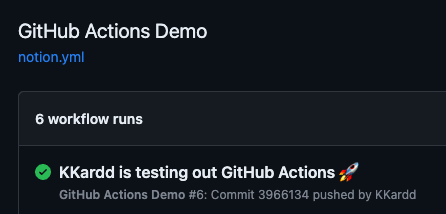

# Github Action

---

간단하게 토이프로젝트로 notion api와 github action을 이용한 걸 만들려고 하는데, GitHub Action을 써본적이 없다보니 궁금해서 찾아봤고, 깨우친 점을 써보려고 한다.

일단, 다들 너무 불친절하다. 내가 이해도가 부족해서 그런건지는 잘 모르겠으나, 다들 너무너무너무 불친절하다. 블로그들 찾아보면서 따라해봤고, 공식문서는 뭔가 공식문서만에 딱딱함? 때문에 잘 안 읽히는 느낌이다.

나만 그런건진 모르겠지만, 여튼 내가 지금 여기서 다시 github action에 대해 설명해두면, 미래의 내가 이해 못하진 않을거라 믿고있기 때문에 나름 내 스타일로 정리해보겠다.

우선, GitHub aciton을 적용할 레퍼지토리안에 **수동으로** (모르겠다. 자동으로 어캐하는지 모른다. 수동으로 하자. 손가락 10개 다 있으니까 어렵지않다.)

어떻게 만드냐? 일단 git clone해온 폴더 안에다가 **.github 폴더** 생성 후 그 안에 **workflows 폴더**를 생성하면 된다. 그 안에 yml 파일을 자유롭게 만들며 github action을 조작하면 된다.

나의 경우 commit message를 받아와 javascript파일을 실행시켜 그 파일을 log찍고 싶었다.

우선 yml파일의 코드를 보자.

```yaml
# .github/workflows/notion.yml

name: GitHub Actions Demo
run-name: ${{ github.actor }} is testing out GitHub Actions 🚀
on:
    push:
        branches:
            - main
jobs:
    Explore-GitHub-Actions:
        runs-on: ubuntu-latest
        steps:
            - name: Checkout repository
              uses: actions/checkout@v2

            - name: Run JavaScript
              run: npm start "${{ github.event.head_commit.message }}"

```

name, run-name은 딱히 신경쓸 필요 없다. 기능만 중요시 한다면 말이다. 사진 첨부한것처럼 그냥 "아.. 저 name, run-name이 이런식으로 들어가는구나..." 라고만 알아둬도 될 거 같다.(참고로 공식문서에서 조금 베껴와서 name과 run-name이 저런거다. 바꾸면 바꾼다.)



그리고 on부분과 jobs부분에 대해 설명하자면, 그냥 정말 간단하게 on은 "우리 이런 일이 발생했을때 github action이 등장할거다."에 이런 일을 담당한다.

위에 내 코드같은 경우 push했을때, 어디에? branch중 main에. 란 뜻이다. On에 대해서 더 궁금하다면 [On] 눌러보면 될 거 같다.

[On]: https://docs.github.com/ko/actions/using-workflows/triggering-a-workflow

그렇다면 jobs? 뻔하다. "아. 우리 On 조건에 맞는 트리거가 발생하면 어떤 일을 할까?"에서 어떤 일을 담당한다.

Explore어쩌구는 그냥 이벤트 이름이라고 생각하면 되고, runs-on은 운영체제이다. 웬만해서 그냥 저대로 입력하는게 맞을 거라 생각된다. 그리고 아래처럼 step이 존재한다. 위에서부터 순서를 정해줘서 그 스텝대로 움직인다고 생각하면 될 거 같다. 그래서 위에 yml파일의 경우 **checkout**을 먼저 진행해주었다.

checkout 액션은 GitHub Actions 워크플로우에서 레포지토리를 체크아웃(복제)하는 데 사용되는 액션이다. 워크플로우가 실행될 때 해당 레포지토리의 소스 코드와 파일을 가져오고, 이를 통해 워크플로우에서 소스 코드에 접근하여 작업을 수행할 수 있다. 만약 저 문구가 존재하지 않는다면, 레포에 접근하지 못하기 때문에 아래 기재되어있는 npm 명령어? 당연히 실행 못한다.

step 마지막으로 있는 Run javascript에 대해 설명하자면, 그냥 package.json의 명령어로 걸어둔 npm start 명령어를 실행하는것이다. 단, 옆에 기재되어있는 context를 가지고 말이다. 데이터를 보내기 위한다면 저런식으로 github 공식문서에 있는 엄청 여러가지의 필드들을 사용할 수 있다. 나의 경우 commit message가 필요했기때문에, 그 값만 보내주는 역할이다.

값들에 대해서는 [value] 여기에서 확인할 수 있다.

[Value]: https://docs.github.com/ko/actions/learn-github-actions/contexts


에 그러면 데이터는 어떻게 받아왔어요? 그리고 npm start해서 무슨 코드를 했나요?

아쉽게도 이 게시글은 github action에 대해서만 서술하기때문에(여태까지 아는게 이거밖에 없기도 함)해서 그냥 commit message를 출력하는걸로 끝났다. 코드는 아래와 같다.

```javascript
// app.js
const commitMessage = process.argv[2];
console.log("Commit Message:", commitMessage);
```

npm start 명령어는 node app.js이다.


사실 나도 지금 상태로 보면 github action 찍먹한것이다. 근데 그럼에도, 성공해서 기분이 좋기때문에 정리할겸 블로그 글 작성했다.

**야무치~!**
