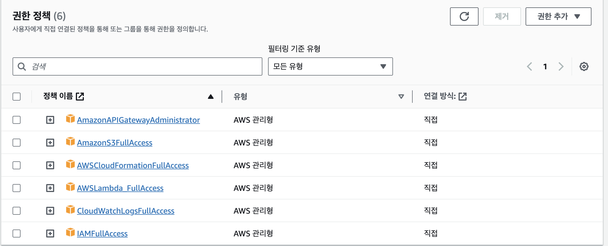
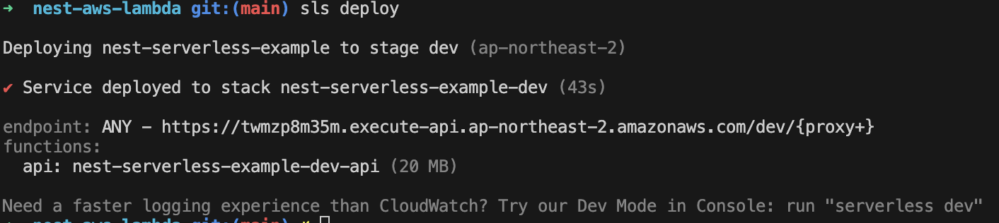
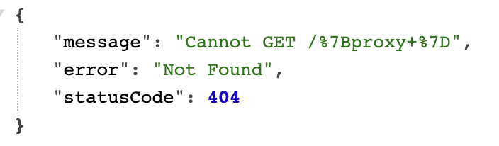
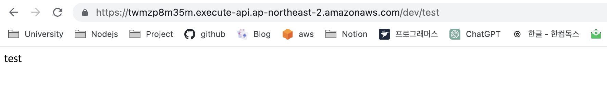

# Serverless setting(nest)

---

이실직고합니다. 솔직히 맨날 커밋하면서 공부한 건 진짜진짜 자신하는데, 블로그 글 쓰긴 너무 귀찮았습니다. 그래서 두달동안 게시글이 하나도.... 방학이라서 놀은 게 절대절대 아닙니다. 노과리 프로젝트도 많이 만들었구요... nestjs도 그래도 꽤 공부했는데... 블로그글 쓰기 너무 귀찮았습니다. 죄송합니다.

사실 노과리는 여태 공부했던 내용 복습같은 느낌이라서 쓸만한 내용이 없... 죄송합니다.

그래서 오랜만에 가지고 온 글은 제곧내. 서버리스 세팅입니다. nest와 여러 라이브러리들을 사용하여 세팅하는 방법을 공부했으며, 그 과정에서 진짜 우여곡절 얼렁뚱땅 된 부분도 있는 거 같고, 완벽히 이해했다고 생각이 들진 않지만, 그럼에도 분명 내가 이걸 다시할 때 까먹어서 얼탈게 뻔하니 블로그에 정리해두자. 란 느낌으로 가져와봤습니다.

다음은 참고한 게시글입니다. 거의 따라했다고 봐도 무방하지만, 따라하면 아마 안되실겁니다 ㅋㅋ 저도 그랬으니깐요.

[site1]

[site1]: https://falsy.me/nestjs-serverless-rds-%EB%B0%B0%ED%8F%AC%ED%95%98%EA%B8%B0/

우선 터미널에 다음과 같은 라이브러리들을 설치해줍니다.

```bash
$ npm i -g serverless
$ npm i @vendia/serverless-express aws-lambda
$ npm i -D @types/aws-lambda
```

뭐가 뭐하는 녀석인지 모르겠으나, nestjs 공식 문서에도 그냥 저거 설치하라고 나와있습니다. 안 알려주는데 어캐알아..

그 다음으로도 공식 홈페이지가 만든 것과 똑같이 main.ts를 설정해줍니다.

```typescript
import { NestFactory } from '@nestjs/core';
import serverlessExpress from '@vendia/serverless-express';
import { Callback, Context, Handler } from 'aws-lambda';

import { AppModule } from './app.module';

let server: Handler;

async function bootstrap(): Promise<Handler> {
  const app = await NestFactory.create(AppModule);
  await app.init();

  const expressApp = app.getHttpAdapter().getInstance();
  return serverlessExpress({ app: expressApp });
}

export const handler: Handler = async (
  event: any,
  context: Context,
  callback: Callback,
) => {
  server = server ?? (await bootstrap());
  return server(event, context, callback);
};

```

그 후, serverless 설정을 위한 파일(serverless.yml)을 만들 것인데, 이 내용도 공식문서와 같습니다.

```yaml
service: nest-serverless-test

frameworkVersion: '3'

plugins:

provider:
  name: aws
  region: ap-northeast-2
  runtime: nodejs16.x

functions:
  api:
    handler: dist/lambda.handler
    events:
      - http:
          method: any
          path: /{proxy+}

```

여기서 주의해야 할 점은 main.ts는 src안에 있지 않습니까? 근데 **serverless.yml파일은 src밖에 즉, tsconfig나 package.json이나 nest-cli.json같은 공간**에 있어야합니다. 이것때문에 제가 많이 헤맸거든요.. ㅎ

그 후, tsconfig의  **"incremental" 옵션과 "esModuleInterop"을 true**로 주었는데, 안 주면 오류걸립니다.

자 이제 다 했습니다. 위의 사이트 대로라면 여기서 터미널에

```bash
$ npm run build
$ sls deploy
```

를 했을 때 되어야합니다. 근데 이렇게 입력하면 aws사이트가 뜹니다. 이것까진 오케이. 근데 사용자를 만들랍니다. 뭐 만들어봅시다.

여기서 제가 많이많이 헤맸는데, sls deploy를 하는 과정에서 사용자를 선택할 때, IAM옵션에서 정책권한을 되게 여러개를 부여해줘야합니다. 내가 직접 aws에 들어가서 lambda를 설정하지않고, Api Gateway를 설정해주지않으며, Cloudflatform을 설정해주지 않기때문에, 저 sls deploy옵션이 실행되는 환경에서 접속되는 IAM에 이런 것을 전부 허락해주어야 합니다.

그래서 다음 이미지에 포함된 옵션들을 전부 선택해서 정책에 넣어주세요.



이 중 하나라도 선택이 안되어있으면 deploy 중간에 계속 오류가 뜹니다.

다음과 같이 설정해주었다면 sls deploy가 잘 작동합니다.



저기 써져있는 endpoint를 눌러서 접속한다면, 



이렇게 오류가 뜰텐데, 걱정하지 마십쇼. 일단 500이 아닌 404 에러가 나왔다는 건 서버가 켜졌고, api호출이 잘 되고 있다는 증거입니다.

테스트를 해보기 위해 cli로 test controller와 module을 만들어봅시다.

```bash
$ nest g mo test
$ nest g co test
```

그 후, test.controller.ts 파일을 다음과 같이 test Get요청을 만들어봅시다.

```typescript
import { Controller, Get } from '@nestjs/common';

@Controller('/test')
export class TestController {
  @Get()
  async test() {
    return 'test';
  }
}
```

그 후, 아까와 같은 방법으로

```bash
$ npm run build
$ sls deploy
```

해준다음, ~~~~/dev/test를 호출해본다면?



짜잔~ test가 잘 출력되는 것을 볼 수 있다.

이걸 보는 미래의 나와 있을 지 모르는 독자들을 위해서 열심히 글을 써봤다.

오늘도 알찬 하루~ **행쇼~**
