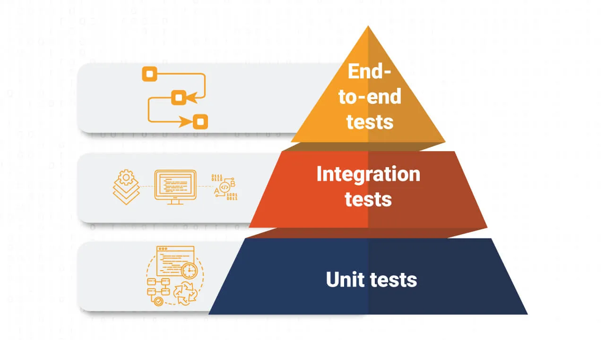

# Test?

---

테스트의 중요성을 진짜 다들 많이들 강조하는데, 난 사실 아직까지 몸으로 와닿지가 않는다. 왤까?

그래서 다들 왜 그리 중요하게 여기고, 진짜 개발관련 유튜브 영상들만 봐도 테스테스테스테스트테스트테스트 얘기하는게 너무 이해가 안돼서 공부하며 정리해보려고 한다.

## TEST란? 

### **제품이 예상하는대로(원하는대로) 동작**하는지 확인하는 과정이다. 이게 진짜 중요하다.

그렇다면 여기서 프로그래밍에서의 제품이란? **함수, 객체, 특정한 기능, UI, 성능, api스펙**등 모든것에 해당된다고 할 수 있을 거 같다. 하긴, 모든것에 대해 테스트하는게 딱봐도 맞아보이지 않는가.

모델이 있어서 그 모델을 출시할때까지 이전에는 DEV -> QA -> Publish순서로 했었는데 이 구조가 돈도 많이들고 시간도 오래걸린다고 한다.

그래서 최근에는 개발시 검증을 자동화 하는 방식으로 변화하였고, 근데 그럼에도 코드가 다 작성된 다음에서야 테스트를 해야하기때문에 이것도 그리 좋은 방법은 아니라고 한다.

현재는 개발하면서 중간에 수시로 자동으로 테스트를 작성한다.(속도 ↑, 쉽게 작성 가능, 해당하는 기능에 대한 높은 커버리지(꼼꼼히 작성))

| 테스트를 하며 얻을 수 있는 장점                              |
| ------------------------------------------------------------ |
| 기능이 정상 동작                                             |
| 요구 사항에 대해 자세히 알아보고 만족시킬 확률 올라감        |
| 이슈에 대한 예측이 가능해짐                                  |
| 버그를 빠르게 발견                                           |
| 자신감 있게 리팩토링할 수 있음                               |
| 손쉬운 유지보수                                              |
| 코드의 품질 향상                                             |
| 코드간 의존성을 낮춤(서로 독립적이고, 재사용 가능한 코드 작성 가능) |
| 좋은 문서화                                                  |
| 개발 시간을 절약할 수 있다.                                  |

결론적으론, 테스트를 통해 원하는대로 작동하리란 자신감이 생긴다고 한다. 자신감은 되게 중요하다.

본인이 자신감을 가지란 소리가 아니다. 사람도 가질 수 있지만, 자신감 있는 코드를 작성하는게 중요하다고 생각한다.

코드에 자신감이 없다면 유지보수하기 겁낼 수 밖에 없다. 하나가 망가지면 우르르르 무너지기 시작할 것이기 때문이다.

## 테스트 피라미드란?

세가지 테스트 unit, integration, e2e test가 있다. 모든 테스트들을 객체에서 자주 드는 예시인 자동차를 사용해보려 한다.

- **Unit tests** → 단위 테스트(함수, 모듈, 클래스)
  -  자동차에서의 바퀴, 운전대, 전조등 등 딱 하나의 구성요소이다. 프로그래밍에서는 함수, 모듈, 클래스등을 테스트할 때 unit tests라고 한다.

- **Integration tests** → 통합 테스트(상호작용을 잘 하는지) 
  - 자동차에서의 엑셀을 밟았을때, 앞으로 잘 나아가는지이다. 바퀴가 있어야 앞으로 전진하듯, unit들을 통합하여 하나의 기능이 잘 작동하는지 테스트하는 것이다.

- **E2E tests(End-to-end tests)** → UI테스트, 사용자테스트(전부 잘 작동하는지) 
  - 운전자가 운전했을때 발생하는 모든것에 대해 잘 작동하는지이다. 진짜 사용자의 입장에서 클릭을 해보던, 입력을 넣어서 테스트를 해보는 방법이다.

왜 피라미드인가?

- **Cost** -> unit에서 e2e로 갈수록 비용 증가한다. 왜why? 사용자 입장으로 테스트해보는 것은 작성이 까다롭기 때문에 어찌됐든 인력낭비가 될 수 있다. 이는 즉 비용이 발생할 수 있다는 것이고, 개발 효율성으로 따져도 unit test가 좋다. unit에서 버그를 찾으면 금방 고칠 수 있기 때문이다.

- **Speed** -> unit에서 e2e로 갈수록 느리다.(플랫폼을 구동하고, 브라우저를 키고 하는 과정이 당연히 더 오래걸림)

**Unit test를 잘 작성하자. 좋으니까.**

**But! 아무리 그래도 unit test만 하면 안된다. 바퀴 하나 잘 작동한다고 자동차가 잘 작동하는건 아니니까.**

## TDD

**Test-Driven Development(테스트 주도 개발) → 개발(코드 작성)전 테스트 코드를 먼저 작성하는 방법이다.**

TDD의 실행 과정은 다음 그림과 같다.

한글로 요약하자면 
테스트 코드 작성 -> 테스트(실패) → 실패한 것에 대한 것만 성공으로 바꿀만큼 코드 작성(성공) -> 또 다른 테스트 작성
이 과정을 반복하는 것이다.

TDD를 하려면 요구사항 분석 및 이해를 무조건 해야한다. 그 후 설계하는 과정도 반드시 필요하다.

이로부터 다음과 같은 장점이 생긴다.

| TDD의 장점                                                   |
| ------------------------------------------------------------ |
| 모든 요구사항(목표)에 대해 이해 및 점검으로 인한 문제점 인식 ↑ |
| 사용자 입장에서 코드를 작성(구현보단 인터페이스위주로 개발하기에 코드의 퀄리티 향상) |
| 시스템 전반적인 설계 향상                                    |
| 개발집중력 향상(퀘스트 깨는 거 같은 느낌이 들 수 있어 재밌음) |

이렇게 공부했음에도 와! 꼭 나도 TDD를 해야지! 라고 생각이 들진 않는다. TDD는 방법일 뿐이고, 다른 테스트들도 많지만 그냥 아직까지는 와! 꼭 테스트를 해야겠다! 라는 생각도 들지 않는것 같다.

하지만! 그래도 이렇게 정리하다보니 왜 해야하는지는 갈피가 잡힌다. 블로그 글 쓰기 전보다는 훨씬 테스트의 의미를 깨달았고, 아직 협업경험이 부족한 나이기에 테스트가 몸으로 크게 와닿지 않는 거 같다.

앞으로 캡스톤디자인하면서 협업하게 되고, 몸으로 부딪힐때 테스트를 같이 사용해보고, 중요성을 깨달았으면 좋겠다.

## **와! 테스트를 해보자!**
