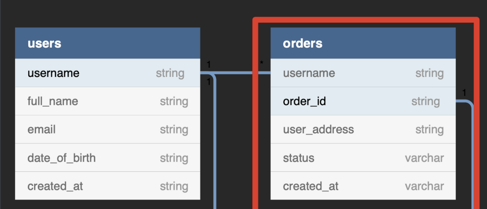
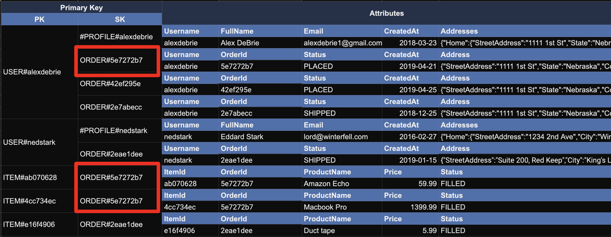
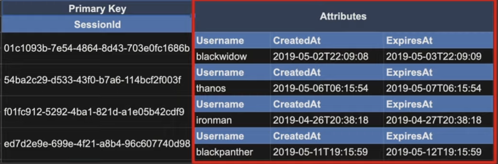
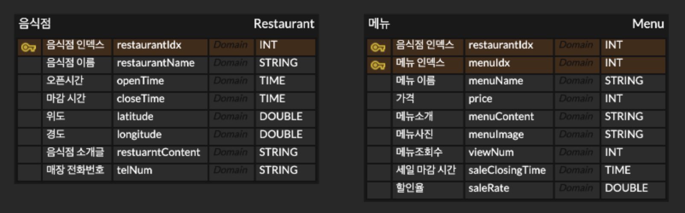
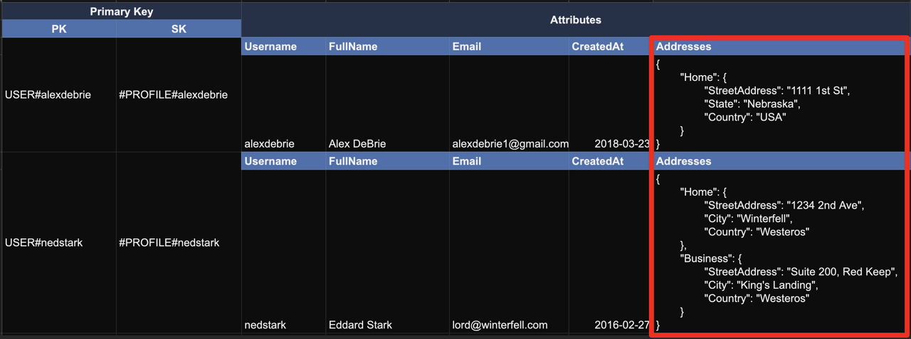
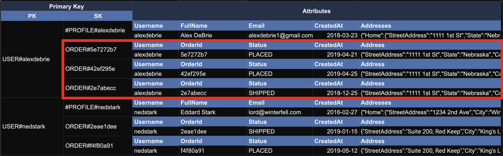
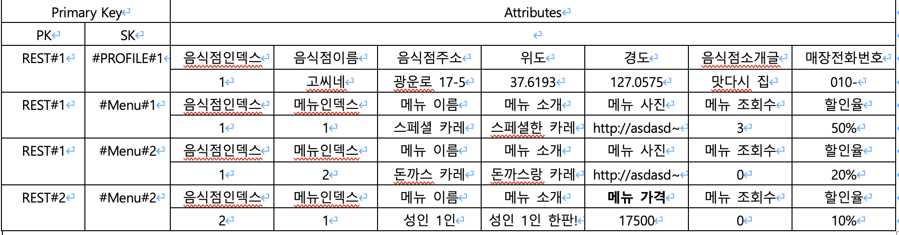

# 광생 DynamoDB modeling

---

뭔가 딱 깔끔하게 정리해서 하려면 노션이나 컨플루언스쓰면 편할 거 같은데,, 아직 들어온 지 얼마 안돼서 뭔가 건들이면 안될 거 같아 그냥 블로그에 써서 보여드리겠습니다.. 원하시면 노션이나 컨플루언스에 추가해놓겠습니다....

찾아본 결과, 결국 Key-value를 기반으로 하는 NoSQL이다.

## Key-value를 기반으로 하는 NoSQL

그래서 처음 생각했던 건, mongodb랑 얘는 뭐가 다른거지? 그냥 이름이 간지나는게 전부인가? 라고 생각했었다.
물론 db modeling말고는 dynamo는 serverless가 큰 특이점이고 dynamo는 AWS에서 지원해줘 고 가용성이고 이런 건 있지만, DB. modeling에선 큰 차이점을 찾이 못했었다.

왜냐하면 mongodb도 \_id로 지칭하는 값을 Key라고 생각하면 둘 다 유연하게 스키마를 가질 수 있고, Key값을 이용해 유일한 속성값들을 가져올 수 있는게 아닌가? 라고 생각했는데, 사실 틀리지는 않은 말 같다. 하지만 Key-value를 구성하는데에 mongo는 아예 관계성을 못 짓는다. 짓더라도 효율이 떨어진다. 이게 가장 큰 차이점이라고 생각한다.

예를 들면 다음과 같다.

ERD의 일부이다. NoSQL임에도 DynamoDB는 관계형 데이터베이스처럼 구현이 가능하다. 하지만, Attributes를 동적으로 수정가능하다. 아래를 보자.

Primary Key가 두 종류가 있다. 보면 PK라고 쓰여진 곳에 USER#alexdebrie라는 유저와 유저네임으로 보이는 값이 있고, SK라는 곳에 ORDER#5e~~라는 번호가 존재한다. 그리고 그 옆에 Attributes가 있다. 즉, USER테이블과 ORDER테이블을 관계짓고, 그 관계마다 하나하나마다 Attributes가 존재하는 DB라고 생각하면 된다.

그렇다면 Primary Key의 두 종류, PK랑 SK가 무엇인가? 그리고 이걸 어떻게 사용하는 것인가? 이는 DynamoDB의 두번째 특징이다.

## PK / SK

**PK -> Partition Key**
**SK -> Sort Key**

## Simple Primary Key / Composite Primary Key

### Simple Primary Key : Partition Key 하나만을 Primary Key로 쓰는 것이다.

### Composite Primary Key : Partition Key와 Sort Key의 조합으로 Primary Key를 쓰는 것이다.

요 예시가 Simple Primary Key

요 예시가 Composite Primary Key이다.
만약 Composite Primary Key에서 Movie의 값을 Attributes로 넣고서 일일이 Query를 돌린다면 효율이 많이 떨어진다고 한다. 그니까 Sort Key라는 sub key?를 넣는다고 생각하는게 좋을 거 같다.

상황에 맞게 둘 중 하나 선택해서 DB modeling을 진행하면 된다고 한다.

## Modeling의 시작

AWS는 DynamoDB의 db modeling을 다음과 같은 단계로 진행하라고 한다.

### 1. Start with an ERD

-   구현하고자하는 애플리케이션에서 필요한 Entity와 그 Entity들 간의 관계가 있을 것이다. 1:1관계든, 1:N 관계든. 일단 표현해야한다. 이 과정은 관계형 데이터베이스를 모델링 할 때와 다르지 않다.

보통 이 단계에서 ERD만들듯이 만들던데, 우리 프로젝트에 병목시켜서 만들어보면 다음과 같다.

음식점테이블에선 Simple Primary Key를 이용해 음식점 인덱스를 Partition Key로 메뉴테이블에선 Composite Primary Key로 음식점 인덱스와 메뉴 인덱스를 받아온다. 즉, 음식점과 메뉴는 1:N관계를 가진 DB라고 생각하면 편할 거 같다.

### 2. Define your access patterns

-   구현하고자하는 애플리케이션의 요구사항이 뭔지, 그에 따라, 데이터베이스에 어떤 데이터를 넣고, 데이터베이스로 부터 어떤 데이터를 읽을 것인지 등을 작성해야 한다. 앞서 살펴본 영화 배우 예시에서, "톰 행크스의 모든 영화를 가져와줘", "Toy Story에 출연한 배우들을 보여줘"와 같은 것이 액세스 패턴에 해당한다.

요구사항을 나열해보았다.

1. 음식점의 정보를 알려줘
2. 음식점에 있는 모든 메뉴를 알려줘
3. 메뉴의 정보를 알려줘

만약, 정말 검색기능으로 음식점과 그 음식점에 메뉴만 필요하다면 이정도가 끝일 거 같다.

### 3. Design your primary keys & secondary indexes

-   1, 2에서 도출한 내용을 바탕으로 Write/Delete/Modify에 대한 처리가 가능하면서도, Scan이 아닌 Query로 데이터를 얻고, 필터링 할 수 있도록 Key를 디자인해야 한다.

1:N테이블을 표현할 수 있는 방법에는 3가지 방법이 있다고 한다.

### (1) Attribute (list or map)

위의 예시와 같이 그냥 Attributes칸을 객체처럼 사용하는 방법이다. 광생에는 별로 안 맞는 거 같으니 패스!

### (2) Primary key + Query

이 방법이 광생과 제일 잘 어울릴 거 같다. 광생을 예시로 만들어본다면 다음과 같다.

이런식으로

### (3) Secondary index + Query

이거슨 테이블 세개에서 join을할 때 쓰는 거 같으므로 광생과는 좀 거리가 있다.
