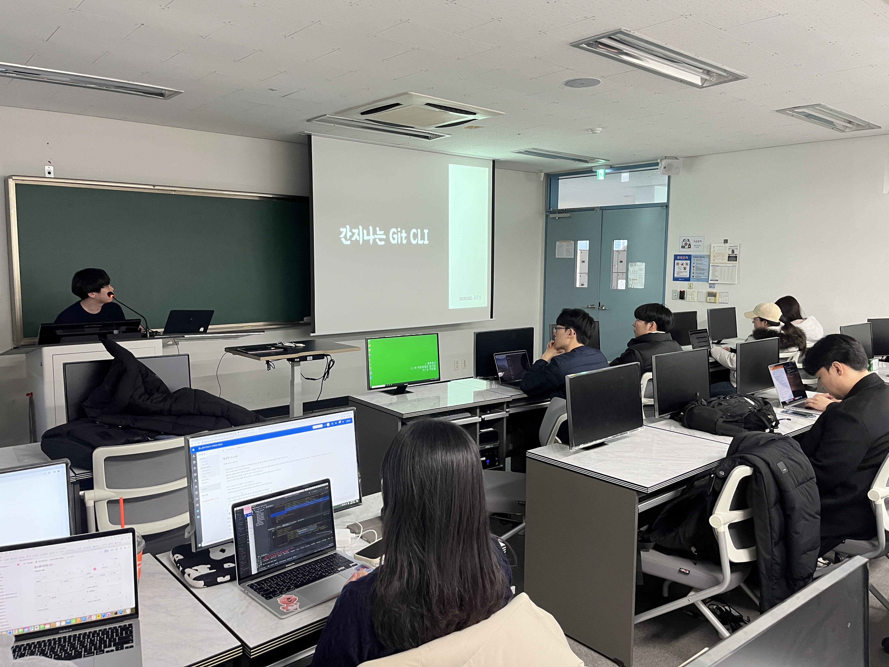
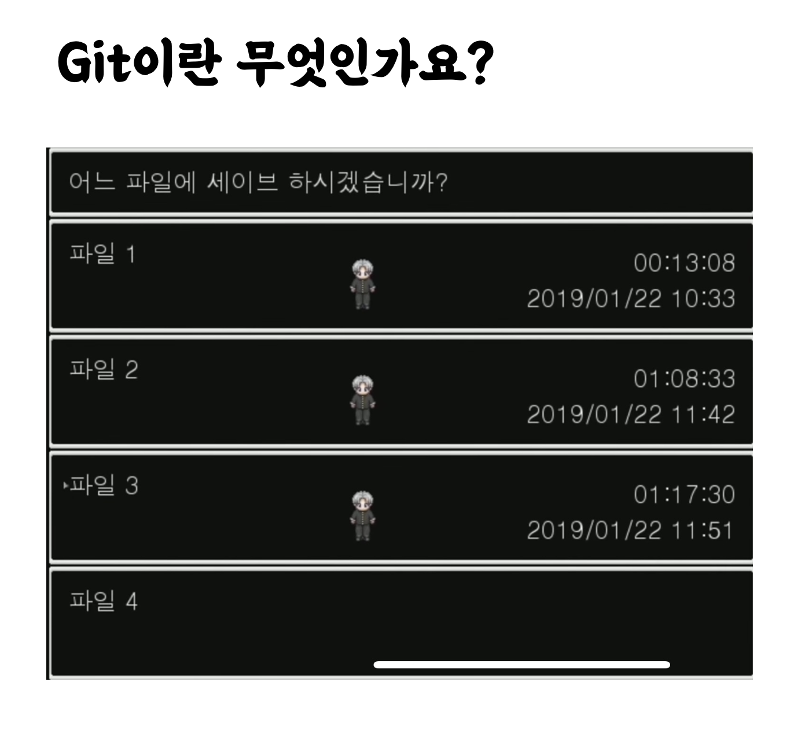

# 학술제 발표

---

~~간지나는 Git CLI라고 써냈지만,, CLI 별로 안쓴건 안비밀~~

우연한 기회로 교내 학술제에 발표자로 참여할 기회가 있었다. 같이 발표한 두분의 발표자보다 실력이 한참 뒤떨어진다고 생각하는데, 그래도 누군가에게 쉽게 이해시키는건 누구보다 자신있어서 불렀다고 생각한다.

### 주제 선정

어떤 주제로 발표를 해야할지 고민을 많이 했다. 발표는 항상 듣는 대상을 기준으로 주제를 선정해야한다고 생각했는데, 1 ~ 3학년까지 다양한 학년의 후배들이라 더 고민됐던 거 같다.

내용이 쉬워 모두가 이해할 수 있으며, 개발 경험이 있는 사람에게도 리마인드 해주면 좋은게 뭐가 있을까 고민하다가 Git에 대해 강의를 하기로 결정했다.

개발 경험이 있더라도 맨날 까먹는 Git flow를 다시 설명하는게 좋을 거라고 생각들었고, 경험이 없는 사람에게는 언젠가 꼭 버전 관리 시스템은 사용하기에 선정했다.

### 설명

버전 관리 시스템을 쉽게 설명하기 위해 쯔꾸르 게임을 예시로 들었다. 또래 친구중에 아오오니 모르는 친구는 없다고 생각했다 ㅎㅎㅎ…

아오오니를 플레이하는 영상을 보다보면, 분명 위 사진과 같이 파일을 여러군데 나눠서 저장하는 것을 볼 수 있다.
어떤 상황으로든 돌아갈 수 있어야하기 때문이다. 만약 제일 최근에 저장한 파일 3번이 아예 돌이킬 수 없는 길을 들어와서 답이 없을경우 그 이전인 파일 2번으로 돌아가야한다. 이처럼 게임에서도 한개의 파일에서 덮어씌우며 저장하는 일은 되도록 피한다.

Git도 마찬가지라고 생각한다. 제일 최근에 세이브한 코드가 정답이냐고 물어본다면,,, 자신있게 100% 정답이라고 얘기할 자신이 없다. 그렇기에 여러개로 나눠서 저장한다. 언제든 돌아갈 수 있어야한다.. 회귀해야한다..

### 피드백

~~PPT에 적혀있는 글자 크기가 너무 작아요.~~

앗차차,, 학생회장으로서 누군가의 앞에서서 얘기하는 것에 대해 좀 익숙하다고 생각했었다.

근데 절대…….아니다…. 발표자로서 누군가의 앞에서 지식을 공유한다는 것은 다른 긴장감이였다고 생각들었다. 물론 학생회장도 책임감을 느껴지만, 지식을 공유하는 사람으로서 느끼는 책임감은 처음이었다.

아마, “나조차도 내가 발표하고 있는 내용이 자신 없었다.”에 관해서도 원인이 있었던 거 같다. 발표함으로써 이걸 느꼈다는게 참 감사한 일이라고 생각한다. 본인이 뭘 모르는지도 모를때가 많은데, 스스로 단점을 깨닫게 되는 기회가 되었다고 생각한다.

다음번에 발표할 기회가 있을때는 적어도 “이 내용은 내가 꿰뚫고 있어야 해”라는 마음가짐으로 발표하려 한다.
그러려면 **또, 성장해야한다. 성장하자!**
