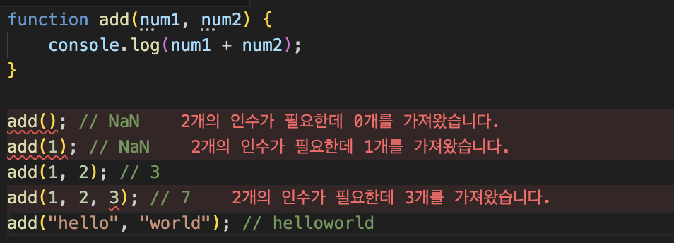
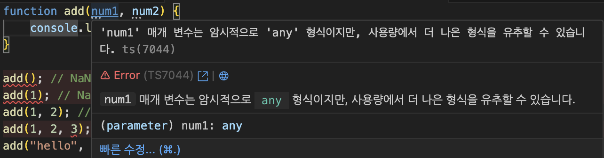
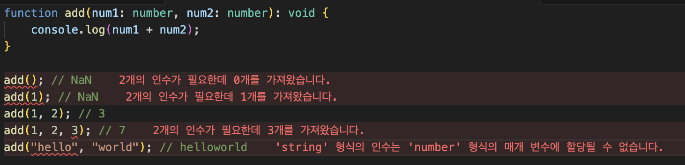
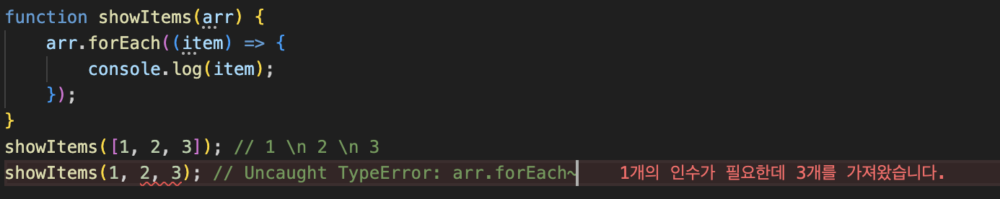
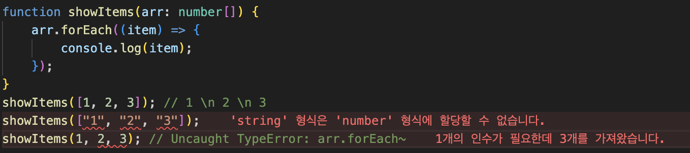

# Why Typescript?

---

글을 열심히 써보고자 했지만,, 프로젝트 일정이 너무 빡빡해서 블로그글을 작성하는게 쉽지않았다. 그래도 틈틈히 시간날때 작성하려고 노력중이다..

지금 좀 빡빡한 일정이 끝나서 숨을 한번 돌릴겸 Typescript를 왜 쓰는지, 그리고 어떻게 잘 사용할 수 있는지에 대해 작성해보려고 한다.

프로젝트 자체가 nestjs다 보니 계속 typescript를 사용해왔다. 근데 이걸 그냥 의무적으로 사용하는 느낌이 들기 시작했고, 의무적으로 코드를 작성하다보면 뭔가 놓치는게 분명히 있으리라 생각이 들었다. 분명 제대로 사용도 못하고 있었을거다. 그러니 다시 한번 정리해보고, 잘 써보려 한다.

## **Why?**

브라우저는 타입스크립트를 이해하지 못한다. 그러므로 타입스크립트로 작성된 코드는 브라우저에서 해석될때, 자바스크립트로 컴파일 되는 과정을 한번 더 거쳐야한다. 그러면 "엥? 왜 굳이굳이 타입스크립트로 개발하나요? 하나 더 돌아가나요? 자바스크립트가 더 좋은거 아닌가요?"란 생각이 든다. 

근데 타입스크립트를 도입하지 않았을때 **javascript**만의 문제점이 발생한다. 아래의 코드를 확인해보자.

```jsx
// javascript
function add(num1, num2) {
    console.log(num1 + num2);
}

add(); // NaN
add(1); // NaN
add(1, 2); // 3
add(3, 4, 5); // 7
add("hello", "world"); // helloworld
```

간단하게 숫자 두개를 받아 그 두개의 합을 로그찍는 add 함수를 선언했다. 그 후, add함수를 여러 파라미터로 호출해봤을때 우측의 결과값들을 주석으로 달아놨다.

add함수는 두개의 숫자 arg가 필요하지만, 함수를 호출할때 파라미터를 넣지않거나, 한개의 파라미터를 넣어도 실행이 된다. 그리고 세개의 파라미터를 넣었을땐, 모두를 다 합하는 것이 아닌 첫번째와 두번째 인자값만 합하여 출력한 것을 확인할 수 있다.
마지막 예시에선 숫자가 아님에도 잘 합쳐온것도 보인다.
다른 개발자가 파라미터를 3, 4, 5 넣었을때 예측하는 값은 7일수도 있지만, 대부분은 12가 나올것으로 예상할 것이다. 또한, 숫자가 아닌 “hello”, “world”를 넣었을때는 오류가 발생하는게 맞아보인다.

추가로 코드를 확인해보자.

```jsx
// javascript
function showItems(arr) {
    arr.forEach((item) => {
        console.log(item);
    });
}
showItems([1, 2, 3]); // 1 \n 2 \n 3
showItems(1, 2, 3); // Uncaught TypeError: arr.forEach~
```

위 코드 또한 자바스크립트로 array를 받아, 그 요소들을 콘솔로 찍어내는 코드이다.

showItems에 배열을 넣었을때는 순서대로 잘 찍힌 것을 확인할 수 있지만, 그 아래처럼 1, 2, 3을 넣었을땐 TypeError가 발생하는 것을 확인할 수 있다. 이 타입 에러는 코드를 실행했을때, 즉 런타임에 발생한다.

**Javascript는 동적언어로 런타임에 타입을 결정하고 오류가 있다면 뱉어내는 구조를 가지고 있다.
그에 반해 Java나 Typescript같은 정적언어는 컴파일 타임에 타입을 결정하고 오류를 발견한다.** 

**정적언어가 코드를 작성할 땐 더 오래걸릴 수 있지만, 안정성을 더 확보할 수 있는 방법인것은 분명하다.**

그럼 위의 코드를 **Typescript**에서 작성해보자. markdown의 코드블럭에선 별 다른 문제가 안 느껴져서 사진을 가져와봤다.



심지어 파라미터에 마우스를 가져다대면 다음과 같이 나온다.



실행시키지않아도 컴파일 과정에서 바로 오류를 발견했고, num1과 num2의 …이 우리를 불안에 떨게 만든다.

위에서의 any형식이란, 아무 타입이나 다 받아올 수 있다는 뜻이다. 하지만 개발을할때 숫자를 더하는 add함수에서 문자열 두개를 넣어 붙이는건 굉장히 위험한 사고라고 생각한다. 
함수에는 명확하게 의미가 부여되어 있는게 좋고, 한가지 일만을 하는게 좋기때문에, any가 아닌 number로 타입지정 해주는게 좋다.



number을 붙여주니 맨 밑에 hello world도 오류가 발생하는것을 확인할 수 있다. 
**결론적으론, add를 정확하게 사용하고 있는 경우를 제외하곤 모든 상황에서 에러가 발생한다. 기뻐할 일이다.**

참고로 add함수 파라미터 옆 :void는 이 함수의 리턴값을 타입을 지정해주는것인데, console.log만 진행하고 return 해주는것은 없기때문에 void타입이라고 지정한다. 아직까진 제외해줘도 무방하다.

마찬가지로 showItems함수를 타입스크립트에서 살펴보자.



정확히 사용할때가 아니라면 컴파일 과정에서 이미 오류가 발생하고, 파라미터와 callback함수의 item에서도 … 표시가 발생한것을 볼 수 있다. 위의 add함수와 동일하게 any타입이라서 불안에 떨고 있단 표시를 나타낸다.



타입스크립트로 변경 후, 하나의 예시를 추가했다. 배열에 숫자긴하지만, 문자열형태의 숫자를 넣어봤을때도 showItems함수에선 숫자형태의 배열만 받기때문에 오류가 발생하는것을 확인할 수 있다. 
추가로 item의 …은 별도로 정의해주지 않았음에도 사라진것을 확인할 수 있는데, 이는 arr를 숫자형태의 배열로 선언해준 상태에서 forEach문을 돌때 arr의 각각의 요소들은 number인 것을 알고 있기 떄문이다. 
원한다면 item: number로 써주어도 좋다.

---

타입스크립트는 자바스크립트의 치명적 단점인 **타입안정성을 보완**했다. 이로 인해 굳이굳이 코드를 실행시키지않아도, 개발도중에 오류를 발견해 수정하기 쉽고, 쉽게 예상하지 못했던 오류에 대해서도 발견할 수 있다.

사실 나도 의무적으로 타입스크립트를 사용했지만, 이젠 타입스크립트 아니면 개발이 너무 불편할거란 생각이 든다.


