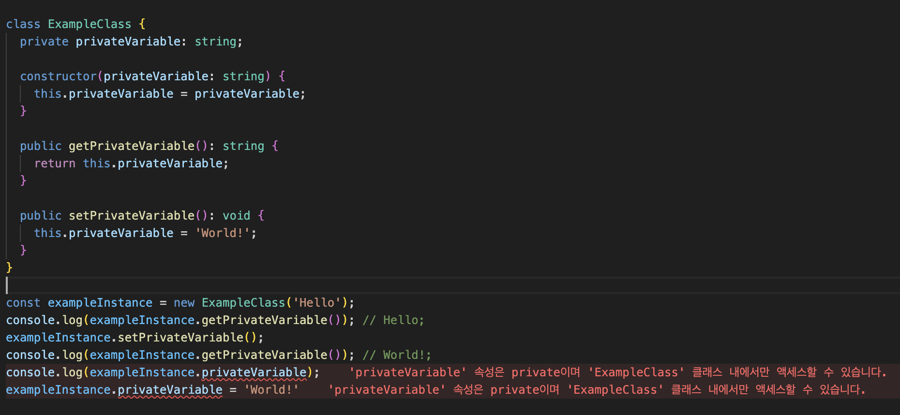
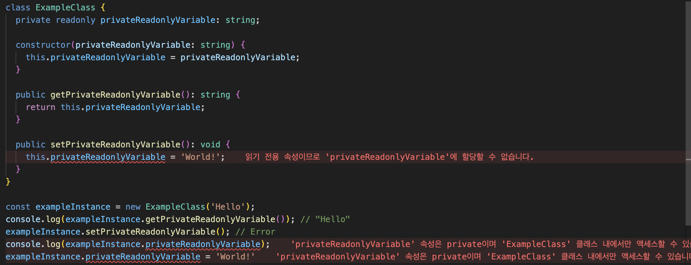

# private VS private readonly

---

요즘 nestjs를 사용하다보면 OOP의 개념이 부족한 탓인지 계속 의구심을 갖게 된다. 군대가기전에 자바 수업 좀 집중해서 들을걸… 코로나라고 동영상강의니까 언제든 보면 다시 보면 되겠지라고 대충 듣고 넘기지 말걸……..

후회해서 얻는것은 없다. 지금부터라도 잘 정리하고 다신 안 잊어버리면 된다.

제목에서 보다싶이 nestjs에서 의존성 주입하는 과정 중 constructor안에 private을 쓸 때도 있고, private readonly를 쓸 때도 있어서 좀 여러군데를 찾아보다가 깨달은 점을 정리해보려고 한다. 

[https://velog.io/@kwaktaemin_/JS-private-private-readonly](https://velog.io/@kwaktaemin_/JS-private-private-readonly) 

위의 nodejs개발자분이 정리한것을 봤는데, 이 예시를 보고서도 좀 이해가 안돼 TS컴파일러에 이것저것 끄적여보다가 깨우쳤다.

우선 의존성 주입 차원에서 말고, 객체지향프로그래밍 관점에서 둘을 비교해보자.

### private



좀 더 에러를 직관적으로 살펴보기 위해 vscode를 캡쳐해보았다.

간단하게 class안에 private 변수를 선언해두고, get set 메소드를 만들어 두었다. 그리고 그 밖 환경에서 인스턴스를 생성해 이리저리 조작해보았다.

메소드를 통해 privateVariable 변수를 접근하면 읽기와 수정 모두 예상한대로 작동하는 것을 볼 수 있다. 
하지만, class 외부에선 읽기와 수정 모두 불가능하여 캡슐화를 통해 은닉화가 진행된것을 확인할 수 있었다.

### private readonly



그에 반해 readonly까지 붙인건 당연하게도 set메소드 즉, 수정이 불가능한 것을 확인할 수 있다.
추가로 private 예시와 같이 private로 선언된것이기 때문에 클래스 외부에선 접근이 불가능하다.

### Nestjs에서는?

본론으로 돌아와, Nestjs에서 의존성주입을 진행할땐 둘을 어떻게 알맞게 사용해야하는지 살펴보았다.
결국, private readonly가 아닌 private만을 사용하는것은, 그 class안에서 선언한 무언가가 변경될 여지가 있다는 것이다. 그럼 예를 들어 서비스 레이어에서 가변성인 의존성이란게 존재할까? 

찾아보니 간혹 그런 경우가 존재한다고 하긴 한다. 

```jsx
@Injectable()
export class DatabaseService {
    private database: any;

    constructor(private readonly configService: ConfigService) {
        if (this.configService.get('ENVIRONMENT') === 'development') {
            this.database = new LocalDatabaseService();
        } else {
            this.database = new CloudDatabaseService();
        }
    }

    // 기타 메소드들...
}
```

이런식으로 configuration 작업의 경우, 동적으로 의존성을 부여받아 DB를 접근하는 방법도 존재한다.

하지만 이렇듯 의존성이 변경된다면 유연해지고, 이런 유연함은 코드의 복잡성을 증가시키는 잘못된 구조라고 생각되기때문에 app.module에서 config옵션을 주어 다른 방식의 동적 접근도 가능하니, 그렇게 하도록 습관화해야겠다는 생각이 든다.

# 💡

사실 이해한 지금으로는 이걸 왜 몰랐지 생각이 들긴 하는데, 원래 개발이란게 그런 거 같다. 한번 이해하고서 뒤를 돌아보면 삽질을 계속 하고 있던 경험이 많다.
하지만 삽질끝에 **분명한 달콤함**도 있기 때문에 개발이 재밌는 거 같다.

