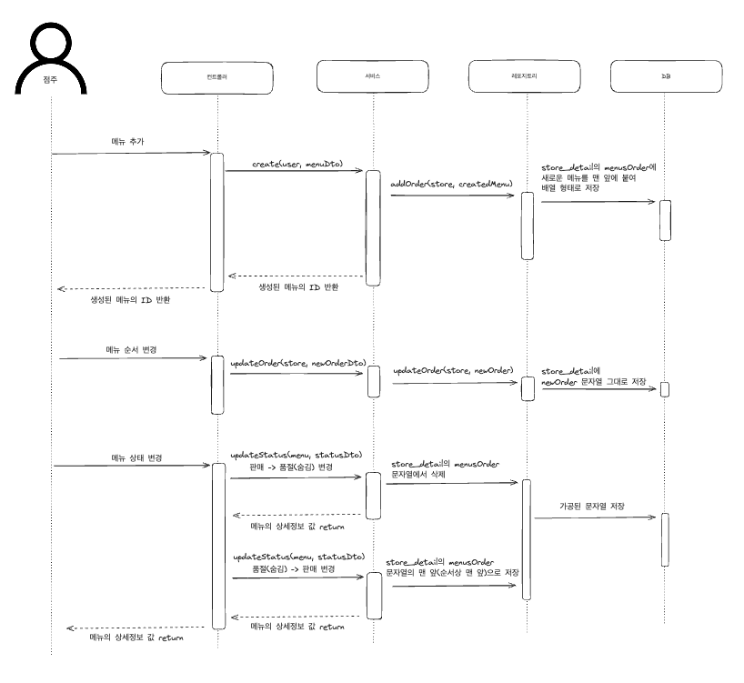
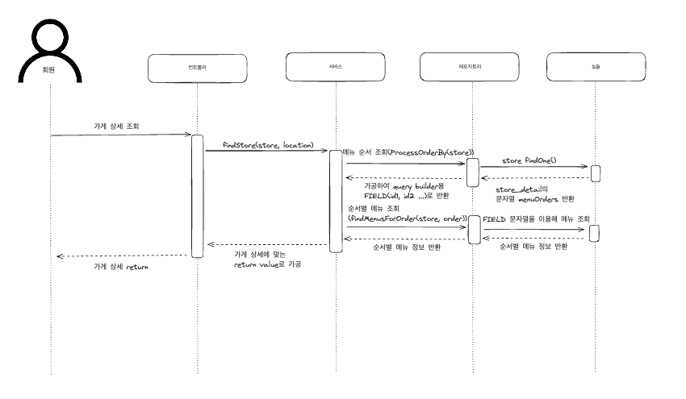

# 광생 Menu Orders Sequence Diagram

---

노션쓰다보니.. 노션이 편해서 자꾸 블로그에 정리를 안한다 ~~(github 블로그가 사실 쓰는게 좀 귀찮긴 하다)~~

광생에서 개발하다가 menu들의 order을 관리하는 부분을 맡았는데, 이게 백엔드 개발자들끼리 많이 얘기하다가 결국 내가 맡게 되어 내가 개발했다. 
개발한 뒤, 팀원들의 이해를 돕기 위해 Sequence Diagram을 제작하여 문서화를 진행하였다. 내용은 아래와 같다.

### 작동방식

- menu의 order컬럼을 두고, 그 order를 이용해서 구현하는 대신, store_detail에 menuOrder컬럼(배열을 문자열로 변환한 것)을 두고 이용
- 따라서, 메뉴 추가나 메뉴 순서 변경, 메뉴 품절처리 등 순서가 변경될 수 있는 곳에서
  store_detail의 문자열만 변경 가능

### 동기

- 드래그 방식으로 변경되는 메뉴 순서는 각각의 menu마다 order컬럼을 둔다면,
  무수히 많고 복잡한 update문이 작성되리라 예상

## Sequence Diagram ([Link](https://excalidraw.com/#json=fBGp43_9Z20vUQ5eBsxz3,jh1MQb5ZU5H4n7QFpqGN5g))

### 점주

### 유저

확실히 위와 같이 그림으로 표현하게 되면 한 눈에 보기 좋은 거 같다. Sequence Diagram을 자주 이용하도록 습관들이는 것도 좋을 거 같다는 생각이 든다.
