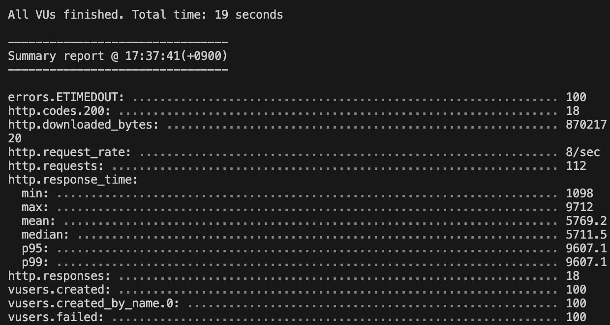
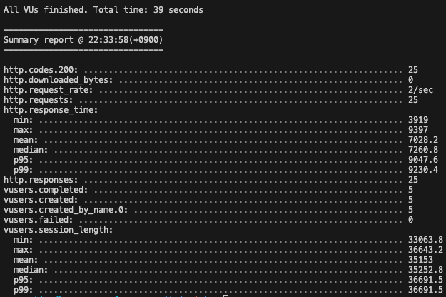
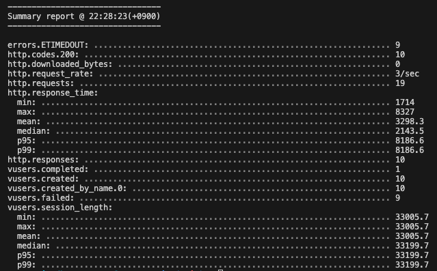
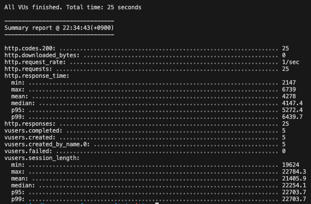
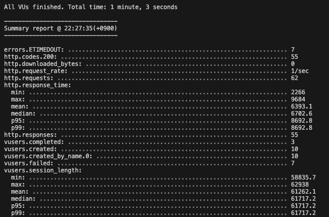

# Prisma VS TypeORM

---

Nodejs에는 많은 ORM이 있다. 유래 깊은 Sequelize부터 Typescript가 등장한 시점에서 강타입의 ORM의 TypeORM, 그리고 최근 많은 호평을 받은 Prisma까지.

심지어 Prisma는 공식문서에서 Prisma가 다른 ORM보다 나은 이유를 설명하기까지 한다.([링크](https://www.prisma.io/docs/orm/more/comparisons))

설명되어있는 이유들도 매력적이였지만, 성능에 관해서 얘기가 없었고 그래서 테스트해보기로 했다.

간단하게 테이블은 User(50,000 row), Company(3,774 row)이고 1:N 관계 지어져 있다.

추가로, id값들의 경우 인덱싱도 하였다.

# Normal Query

user테이블의 모든 값을 조회하는 쿼리이다.

## 실행된 쿼리

### TypeORM

SELECT `Users`.`id` AS `Users_id`, `Users`.`name` AS `Users_name`, `Users`.`gender` AS `Users_gender`, `Users`.`created_date` AS `Users_created_date`, `Users`.`updated_date` AS `Users_updated_date`, `Users`.`company_id` AS `Users_company_id` FROM `users` `Users`

### Prisma

SELECT `DongAJul`.`users`.`id`, `DongAJul`.`users`.`name`, `DongAJul`.`users`.`gender`, `DongAJul`.`users`.`created_date`, `DongAJul`.`users`.`updated_date`, `DongAJul`.`users`.`company_id` FROM `DongAJul`.`users` WHERE 1=1

## 성능 비교

TypeORM 10 사용자 / 10회

Prisma 10 사용자 / 10회

## 차이점

1. Prisma는 데이터베이스 명을 꼭 명시해줬다.
2. TypeORM은 AS를 통해 Users라는 객체를 만들고자 하는게 느껴졌다.
3. Prisma는 Where 1=1 을 추가해주었다.
    1. Where 1=1을 추가하는 이유가 궁금했었는데, 찾아보니 추가로 and 조건이 붙어야 할때, 편하게 조건을 사용하기 위함이라고 한다. 디테일이… 기가 막히다..
    2. where절이 이미 있었는지 판단하고 없을때는 where을, 있을때는 and 조건을 붙여야 하는게 메모리의 낭비를 초래할 수 있다고 판단한 거 같다.

---

# Left Join Query

## 실행된 쿼리

### TypeORM

1. SELECT `Users`.`id` AS `Users_id`, `Users`.`name` AS `Users_name`, `Users`.`gender` AS `Users_gender`, `Users`.`created_date` AS `Users_created_date`, `Users`.`updated_date` AS `Users_updated_date`, `Users`.`company_id` AS `Users_company_id`, `Users__Users_company`.`id` AS `Users__Users_company_id`, `Users__Users_company`.`name` AS `Users__Users_company_name`, `Users__Users_company`.`address` AS `Users__Users_company_address`, `Users__Users_company`.`longitude` AS `Users__Users_company_longitude`, `Users__Users_company`.`latitude` AS `Users__Users_company_latitude`, `Users__Users_company`.`scale` AS `Users__Users_company_scale`, `Users__Users_company`.`big_job_kind_id` AS `Users__Users_company_big_job_kind_id`, `Users__Users_company`.`mid_job_kind_id` AS `Users__Users_company_mid_job_kind_id`, `Users__Users_company`.`small_job_kind_id` AS `Users__Users_company_small_job_kind_id` FROM `users` `Users` LEFT JOIN `company` `Users__Users_company` ON `Users__Users_company`.`id`=`Users`.`company_id`

### Prisma

1. query SELECT [DongAJul.users.id](http://dongajul.users.id/), [DongAJul.users.name](http://dongajul.users.name/), DongAJul.users.gender, DongAJul.users.created_date, DongAJul.users.updated_date, DongAJul.users.company_id FROM DongAJul.users WHERE 1=1
   → companyId 받아오는 과정
2. SELECT [DongAJul.company.id](http://dongajul.company.id/), [DongAJul.company.name](http://dongajul.company.name/), DongAJul.company.address, DongAJul.company.longitude, DongAJul.company.latitude, DongAJul.company.scale, DongAJul.company.big_job_kind_id, DongAJul.company.mid_job_kind_id, DongAJul.company.small_job_kind_id FROM DongAJul.company WHERE [DongAJul.company.id](http://dongajul.company.id/) IN (?, ? …)
   → companyId 넣어서 돌리기

## 성능 비교

### TypeORM

부하테스트 5사용자 / 5회

스트레스테스트 10사용자 / 10회

### Prisma

부하테스트 5사용자 / 5회

스트레스테스트 10사용자 / 10회

## 차이점

굉장히 놀랄만한 수치의 차이를 보였다. 를 보였고,

1. TypeORM은 정직하게 LEFT JOIN을 사용한 반면 Prisma는 Join쿼리 없이 Where In을 이용한 두개의 쿼리문을 실행하였다.
2. 부하테스트에서도 약 33% 가량의 차이 발생(**Prisma Win!**)
3. 스트레스 테스트에서는 무려 45개의 조회를 더 버텨낸 뒤에 다운되어버렸다.(**Again Prisma!**)
   물론, 되게 극단적인 예시를 들었다. 애초에 유저 50000명과 3774개의 회사가 모두 담긴 조회가 필요한 경우는 극히 드물다고 생각한다. 그렇지만 같은 ORM임에도 다른 쿼리를 실행시킨다는 점, 그리고 큰 성능 차이가 일어났다는 점이 충격적으로 느껴졌다.

여기서 멈추면 안된다. 왜 Where In절이 Left Join보다 월등히 성능이 높았는지가 궁금해져 찾아볼 것이고, 아마 다음 글의 내용이 되지않을까 싶다.
