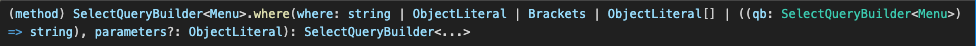

# test

---

# **Motivation**

DB migration(MySQL → PostgreSQL)이 진행되며 일어난 Issue에 대해 회고한 게시글이다.

광생에서 개발을 진행하다가 슬픈 소식이 들려왔다. 
Serverless SasS DB인 PlanetScale을 사용했는데, Hobby Plan이 종료된다는 소식이였다. 일시적인 종료가 아닌, 무료 플랜 자체를 지원하지 않는다고 한다. 
MVP 1.0 단계에서 최소한의 비용으로 서비스를 검증받아야하는 상황이고, 당시 Client에 비해 Server의 소요는 충분했기에, DB migration을 진행하며 비용을 최소화 하기로 했다. 

같은 SaaS 서비스인 Supabase를 사용하기로 하였다. 둘 다 같은 Serverless 기반 서비스라 개발자들이 개발에 집중할 수 있게 인프라에 대해 부담감을 덜어준다는 장점을 가지고 있다는게 큰 이유였다고 생각한다.

두 서비스의 차이점은 MySQL과 PostgreSQL이라는 점이다. 당시에 대표님이 이 작업에 소요를 물어보셨을 때, ORM이 적용되어 있던 애플리케이션이라 소요가 크지 않을 것이라 판단했다. 하지만…. 막상 그렇진 않았다..

# Issue

크게 세 가지의 이슈가 있었다.
1. Supabase의 TLS(CRT 파일)
2. MySQL과 PostgreSQL의 기본적인 문법 차이
3. PostgreSQL의 위·경도 거리 계산
## Supabase의 SSL(CRT 파일)

```javascript
ssl: {
	ca: readFileSync('src/global/config/certificate/supabase-ca.crt').toString(),
	rejectUnauthorized: true,
},
```

Supabase는 애플리케이션에서 DB에 접속하는 과정에 꼭 crt를 검증하는 과정이 필요했다. 위의 방법대로 하면 작동한다. 하지만, gitignore(docker ignore)을 더 늘리고 싶지 않았다. 무차별적으로 늘리는 방식 자체가 협업하는 개발자들에게도 전부 전달해야하기 때문에 불편했다고 판단했다.

따라서 crt파일을 env로 관리하고자 하였는데, crt파일은 기본적으로 줄넘김문자가 있었고, 이 줄 넘김 문자를 env를 통해 configuration 시키는 작업에서 어려움을 겪었다. 

갑자기 번뜩 떠오른 아이디어로 **crt파일 자체를 base64로 인코딩하여 한 줄로 만들면서 env에 추가**하였고, 별도의 파일 설치 없이 협업하는 개발자들에게 수정된 env파일을 공유하며 해당 이슈는 해결했다.

```javascript
ssl: {
	// Base64로 인코딩되어있는 CRT 디코딩
	ca: Buffer.from(process.env.DATABASE_CRT, 'base64').toString(),
	rejectUnauthorized: true,
},
```

## MySQL과 PostgreSQL의 기본적인 문법 차이

ORM을 통해 개발하는데 문법 차이가 무슨 소용이 있나? 라고 생각 들 수 있다. 나도 대표님이 물어봤을 땐 그렇게 생각했다.. 하지만 같은 RDBMS임에도 사소하게 문법의 차이가 존재했고, DB I/O를 줄이기 위해서 Query Builder를 통해 원하는 데이터를 한번에 가져오는 경우도 있었는데, 이런 QueryBuilder를 통한 SQL에서 오류가 발생했다. 주요 발생 원인은 나의 경우 다음과 같다.
1. IFNULL → COALESCE
2. QueryBuiler Method이 Parameter를 미사용
### **IFNULL → COALESCE**

이 문제는 진짜 기본적인 문법이 다른것에서 시작된 것이기에, 둘을 치환해주는 작업으로 쉽게 문제 해결이 가능했다. 

### **QueryBuiler Method이 Parameter를 미사용**

골치덩이였다. 기존의 QueryBuilder는 다음과 같은 방식으로 사용했다.

```javascript
const qb = this.entityManager
            .createQueryBuilder(Store, 's')
            .leftJoinAndSelect(Menu, 'm', 's.id = m.store_id')
            .select('MAX(discount_rate) AS discount_rate') // Point 1
            .where(`s.status = "${StoreStatus.OPEN}"`) // Point 2
```

select에서 AS를 위와 같은 방식으로 사용해왔고, where절을 가끔 백틱을 포함해 변수를 넣었다.




Optional이긴 하지만 select의 selectionAliasName과 where의 parameters를 볼 수 있다. 

저걸 사용하지 않고 string을 통해 모든 것을 해결하려 했는데… 문제가 발생했던 것이다.. 심지어 저런 방식으로 작성된 코드의 양이 꽤 됐었다. 이 부분은 노가다로 해결했고, 

**method를 그냥 사용하는 것이 아닌, 한번 더 parameter 값을 확인하는 습관을 가지게 된 거 같다.**

지금 생각해보면… 그렇게 짰던 이유가 궁금하긴 하다..

```javascript
const qb = this.entityManager
            .createQueryBuilder(Store, 's')
            .leftJoinAndSelect(Menu, 'm', 's.id = m.store_id')
            .select('MAX(discount_rate)', 'discount_rate')
            .where('s.status = :storeStatus', {storeStatus: StoreStatus.OPEN})
```

## PostgreSQL의 위·경도 거리 계산

광생에는 사용자와 가게의 픽업시간을 계산하기 위해 위·경도를 통해 거리를 계산해야한다.

MySQL에는 기본적으로 거리를 계산하는 함수인 ST_Distance_Sphere와, 위경도를 점으로  표현하는 POINT를 통해 쉽게 거리를 계산하고, 조건문을 걸 수 있었다.

```sql
ST_Distance_Sphere(POINT(storeLon, storeLat), POINT(userLon, userLat)) <= :range -- MySQL
```

PostgreSQL도 있다. 근데, 기본적으로 지원하지 않는다.

```sql
ST_DWithin(ST_SetSRID(ST_MakePoint(storeLon, storeLat), 4326), ST_SetSRID(ST_MakePoint(userLon, userLat), 4326), :range) -- PostgreSQL
```

하지만, 그냥 단순하게 바꿀 수 있지 않았다. 지리 객체에 대한 지원을 추가하는 오픈 소스인 Postgis Extension이 필요하였고, Supabase에서는 extension을 쉽게 설치할 수 있어서 prod, stage 둘 다 무사히 설치를 완료했다. 하지만, Docker로 이뤄진 개발 환경에서는 extension의 설치가 쉽지 않았다. 
1. Docker파일이 실행될 때 자동으로 extension을 설치하는 SQL을 실행
이 방법을 제일 먼저 시도했다. 하지만, Supabase에서 지원하는 PostgreSQL버전와 일치하며, Supabase에서 지원하는 Postgis를 설치하는 SQL에서 오류가 계속 발생했다.
2. 울며 겨자먹기로 Docker 환경 자체를 Postgis를 지원하는 이미지를 빌드하는 방법을 시도했다.
```sql
services:
    ks_db:
        image: postgis/postgis:15-3.4
        restart: always
        container_name: db
        environment:
            POSTGRES_USER: ${DATABASE_USERNAME}
            POSTGRES_PASSWORD: ${DATABASE_PASSWORD}
            POSTGRES_DB: ${DATABASE_NAME}
            TZ: Asia/Seoul
        healthcheck:
            test: ['CMD', 'pg_isready', '-U', 'postgres']
            timeout: 20s
            retries: 10
        ports:
            - ${DATABASE_PORT}:${DATABASE_PORT}
        networks:
            - local-network
volumes:
    db:
networks:
    local-network:
        driver: bridge
```

1번으로 정말 많이 헤맸는데, 무색해지게끔 이 시도로 바로 성공했다. 심지어 Supabase에서 지원하는 PostgreSQL, Postgis의 버전과 완벽히 일치하여 prod환경과 똑같은 DB환경을 만들 수 있었다.

환경 세팅을 마친 후, 위에서 서술한 거리 계산함수는 문제 없이 작동했고, 해결했다.

# **Realization**

지나고 봤을땐, 좋은 경험해봤다고 밖에 생각이 안 든다. 

사이드프로젝트에서 DB migration이 이뤄질 일이 있을까? → 어차피 곧 끝날텐데 돈 몇푼 내고 말지!
그렇다고 실무에서 DB migration은 자주 일어나는 일일까? → 리소스가 너무 큰 작업…. 시도하기 어렵다..

라고 생각된다.

당시 진행하면서 대표님께 죄송했다. 지식이 부족함에도 코스트를 너무 쉽게 산정했고, 원래 계획했던 기간을 초과해서 작업을 마쳤다.

“아 이거 얼마면 돼요~”라는 뉘앙스는 좋지 않은 거 같다. 작업의 코스트를 산정할 때 좀 더 조심스럽게 생각해야겠다. 
~~“3분 아니면 3주가 걸릴 거 같은데요..?”~~
