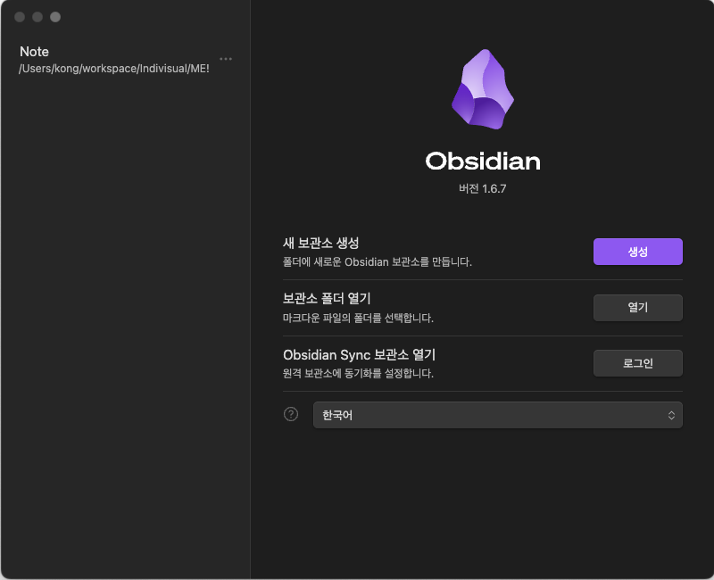
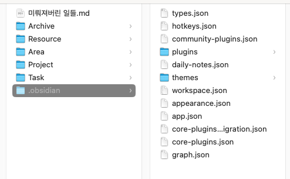
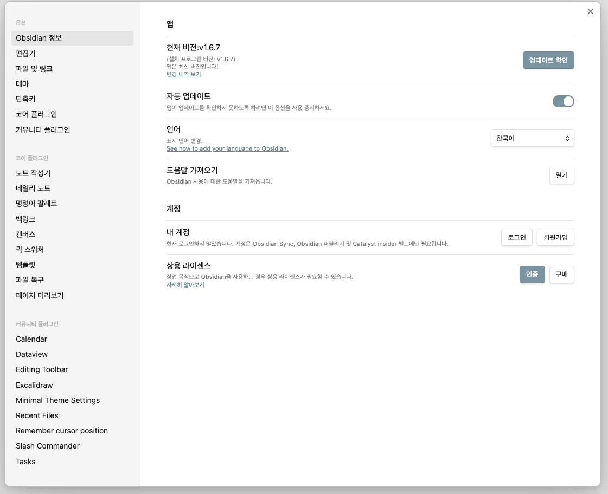
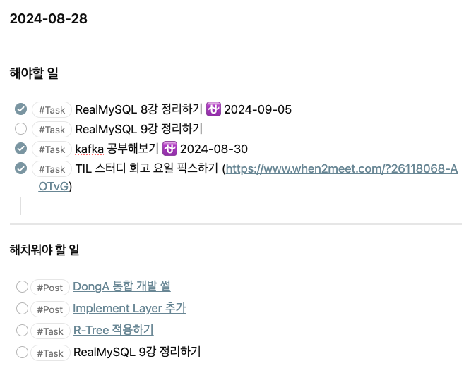
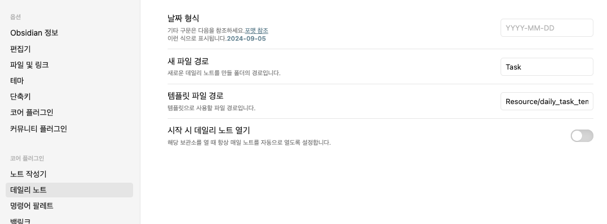

# 옵시디언 활용하기

---

AUSG TIL Study 팀원들에게 공유했던 내용에서 발췌한 글입니다. 너무 편한 말투로 작성되어 괴리감이 느껴질 수 있지만, 그래도 옵시디언 입문하는 사람들에겐 좋은 자료가 될 거 같아서 블로그에 남깁니다.

# 🚂 Motivation

TIL 첫 회고 도중, 옵시디언에 대해서 질문이 들어와서? 

아직 옵시디언 안써보신 분이 많으신 거 같더라구요!

그래서 간단히 사용법 + 제가 편히 쓰고 있는 플러그인 공유드리려고 합니다.

# ⭐ What I Learned(Shared)

### 보관소 생성

옵시디언을 설치하시면 우선 아래와 같은 창이 떠요! 새 보관소 생성해서 본인이 옵시디언을 사용해 저장할 md파일들의 위치를 지정해 둘 수 있습니다. 

보관소가 생성되셨다면 그 위치에 아래와 같이 .obsidian이 생성되실거에요!

아래 파일을 다운 받으신 후, **.plugins**에서 압축풀고 사용하시면 될 거 같아요!

[Download file](../../assets/img/Study/옵시디언 활용하기-0.zip)

(혁준님의 내보내기 방법은 제가 별도로 못 찾았습니다..)

적용되셨다면 아래사진의 좌측 아래 같이 커뮤니티 플러그인에 추가되신 걸 확인하실 수 있을 거 같습니다.

### 옵시디언 사용법

저는 간단히 PARA를 이용해 사용하고 있어요.(PARA를 처음 들어보셨다면 요 [링크](https://www.youtube.com/watch?v=lkRQuMIbFYc&t=472s)로)
사실 말만 번지르르 하지 폴더 구조라고 생각하시면 편할 거 같아요.
PARA로 만들어진 폴더 안에서 새 노트(새 md파일)을 만들어 끄적이고 있답니다.

### 밀린일 표시해두기

저는 위 사진처럼 캘린더 새 노트를 만들면 템플릿에 맞게 해당 날짜의 **해야할 일**과 **해치워야할 일**을 작성할 수 있는 노트가 만들어져요.

이게 탐나시는 분들은 아래 방법으로 적용하시면 돼요.

[Download file](../../assets/img/Study/옵시디언 활용하기-1.md)

요걸 다운 받아서 옵시디언 노트 파일들이 있는 위치에 넣어둔 후, 

옵시디언 설정 → 코어 플러그인 → 데일리 노트 ON → 데일리 노트 설정 → 템플릿 파일 경로에 다운받은 파일로 경로 선택

(저는 Task라는 폴더 안에 데일리 노트를 차곡차곡 쌓고 있어요.)

잘 적용이 됐다면, 캘린더 플러그인을 사용해 해당 날짜를 클릭했을 때 템플릿을 통해 해당 날짜의 데일리 노트가 생성돼요.

위의 템플릿 파일은 dataview라는 플러그인을 사용해 제작했는데, 저는 진짜 진짜 간단하게 사용한 편이라서, 더 다양하게 사용해보고 싶으신 분들은 [요 링크](https://www.youtube.com/watch?v=Iv7wCJArqPI)를 봐보시면 좋을 거 같아요!

# 💭 Impression

노트앱을 공부해서 써야하는 옵시디언.. 정리하다보니 배보다 배꼽이 더 큰가? 라는 생각이 들기도 했습니다. 막상 쓰다보면 편하긴 한데, 저도 처음 도입했을 때 “어.. 노션이 더 편한 거 같은데?”라고 생각했었던 거 같아요. 

뭔가 쓰시다가 궁금한 점이 있으신 분들은 편하게 연락주세요! ~~제가 대답 못하면 혁준님한테 물어볼게요.~~

아 저도 요거 쓰려고 옵시디언 재설치하고 이러진 않았어서, 설명이 부족했을 수도 있을 거 같아요! 적용하시다가 문제 발생하시면 진짜 편하게 연락주세요!

# ➡️ **What's Next**

는 별도로 없습니다.
