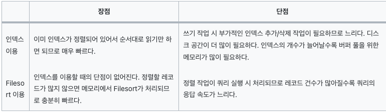
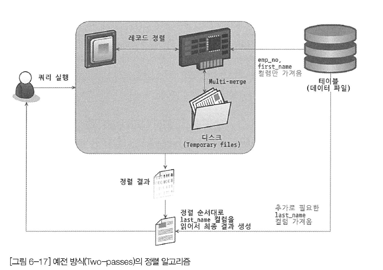
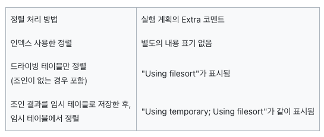
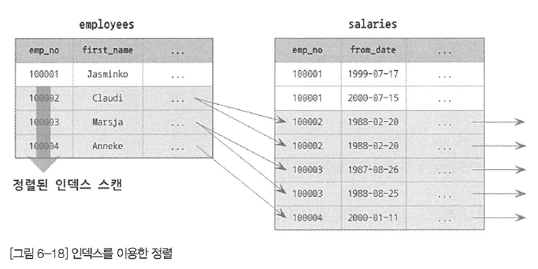
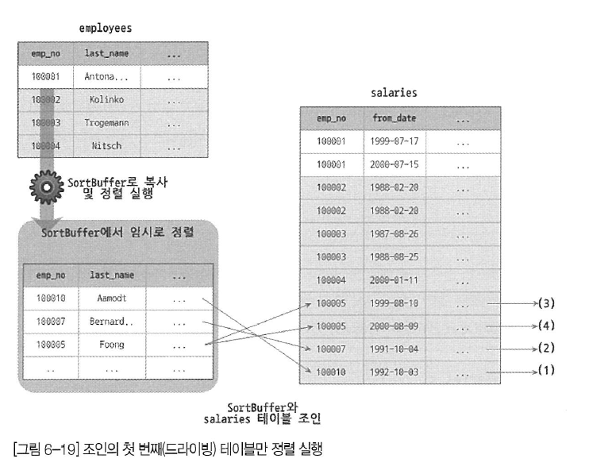
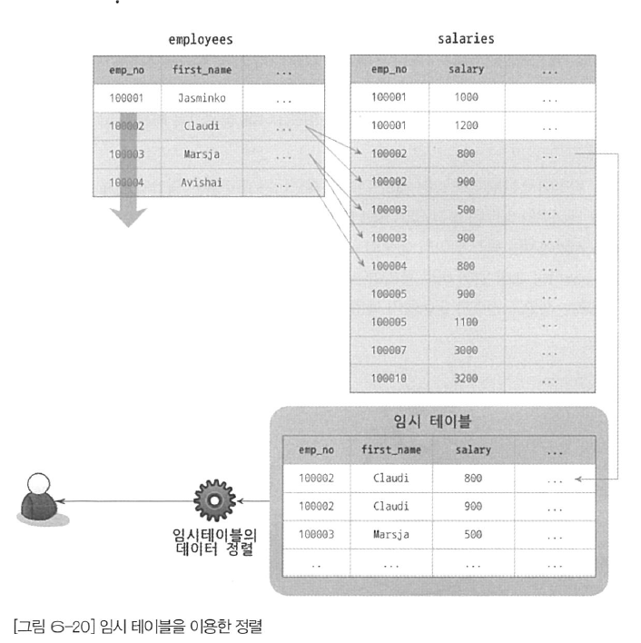
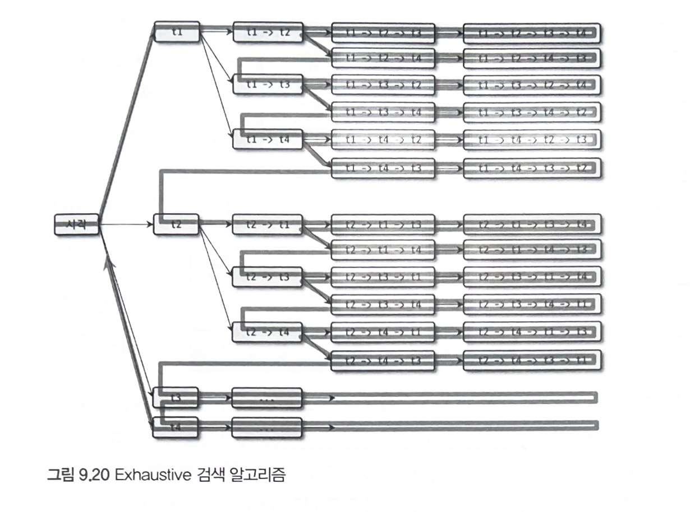
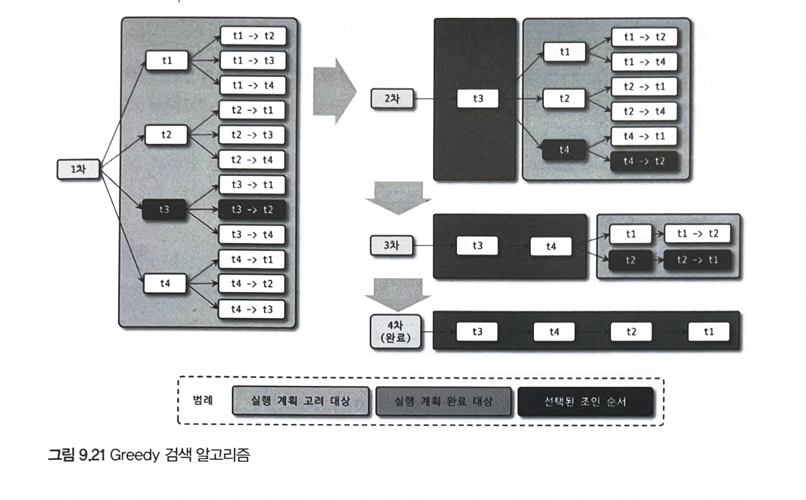

# 옵티마이저와 힌트

---

# 개요

**옵티마이저란?** 
- 옵티마이저는 데이터베이스에서 SQL 쿼리를 실행할 때, 쿼리의 최적 실행 계획을 자동으로 결정하는 역할을 합니다. 옵티마이저는 여러 가지 가능한 실행 계획 중에서 가장 비용이 적고 효율적인 방법을 선택한다.
- 여행 계획을 짤 때, 어떻게 이동할 때 교통비가 덜 들고 어떻게 할 때 가성비가 좋은지를 생각하는 것처럼, MySQL에서도 쿼리를 최적으로 실행하는 옵티마이저가 존재.
- ~~개요에서도 “쿼리의 실행 계획을 수립하는 옵티마이저는 가장 복잡한 부분”이라고…~~
- 개발자가 모든 쿼리를 작성할 때, 일일이 모든 경우의 수(인덱스… 레코드의 건수.. 조인의 횟수…)를 고려해 작성할 수 없음 → 엔진에 내장된 옵티마이저가 알아서 판단해서 최적의 경우를 나타내는 것.
**힌트란?** 
- 힌트는 SQL 쿼리 작성자가 옵티마이저에 특정 실행 계획을 강제로 사용하도록 지시하는 방법. 
옵티마이저가 자동으로 선택하는 계획이 항상 최선이 아닐 수 있기 때문에, 힌트를 사용하여 실행 계획에 영향을 줄 수 있습니다. 힌트는 쿼리 안에 주석 형식으로 삽입되며, 옵티마이저가 힌트를 존중하여 지정된 방법을 우선적으로 고려한다.
- 내장된 옵티마이저가 항상 정답을 뱉어내는 것은 아님. 그렇기에 실행 계획을 분석하고, 더 좋은 성능에 대해 개발자가 떠오른 게 있다면 힌트를 이용하는 것.
## 쿼리 실행 절차
- MySQL 서버에서 쿼리가 실행되는 과정은 크게 세 단계.
	1. 사용자가 요청한 SQL을 잘게 쪼개서 MySQL서버가 이해할 수 있는 수준으로 분리(파스트리 라고 함.)
	2. **SQL의 파싱 정보(파스트리)를 확인하며 어떤 테이블부터 읽고 어떤 인덱스를 이용해 데이터를 조회할지 선택**
	3. 두 번째 단게에서 결정된 테이블의 읽기 순서나 선택된 인덱스를 이용해 스토리지 엔진으로부터 데이터를 가져옴
- SQL문장이 잘못됐다면 첫 번째 단계(SQL 파싱)에서 걸러짐, 걸러지지 않았다면 파스 트리 생성
	- MySQL 서버는 SQL 파스 트리를 이용해 쿼리를 실행
- 두 번째 단계는 파스트리를 참조하며 아래의 내용을 처리
	- 불필요한 조건 제거 및 복잡한 연산의 단순화
	- 여러 테이블 조인의 경우 어떤 순서로 테이블을 읽을지 결정(작은 테이블이나 조건문과 관련)
	- 각 테이블에 사용된 조건과 인덱스 통계 정보를 이용해 사용할 인덱스 결정
	- 가져온 레코드들을 임시 테이블에 넣고 다시 한번 가공해야 하는지 결정
- 두 번째 단계는 “최적화 및 실행 계획 수립” 단계이며, 옵티마이저에서 처리. → 실행 계획이 만들어짐
- 세 번째 단계는 만들어진 실행 계획을 통해 스토리지 엔진에 레코드를 읽어오도록 요청
## 옵티마이저 종류
- 비용 기반 최적화와 규칙 기반 최적화 방법으로 나뉨
- 규칙 기반 최적화는 내장된 우선순위만을 고집함(레코드 건수나 선택도를 고려하지 않음)
- 비용 기반 최적화는 각 작업의 비용(부하) 정보를 예측된 통계정보를 이용해 실행 계획별 비용을 산출
- 그렇기에 현재는 대부분의 RDBMS가 비용 기반의 옵티마이저를 채택.
# 기본 데이터 처리

## 풀 테이블 스캔과 풀 인덱스 스캔
- 옵티마이저가 풀 테이블 스캔을 선택하는 경우는 아래와 같다.
	- 테이블의 레코드 건수가 너무 작아서 인덱스를 통해 읽는 것보다 풀 테이블 스캔이 빠른 경우(일반적으로 테이블이 페이지 1개로 구성된 경우)
	- WHERE절이나 ON 절에 인덱스를 이용할 수 있는 적절한 조건이 없는 경우
	- 인덱스 레인지 스캔을 사용할 수 있는 쿼리라고 하더라도, 옵티마이저가 판단한 조건 일치 레코드 건수가 너무 많은 경우
- InnoDB 엔진은 특정 테이블의 연속된 데이터 페이지가 읽히면 백그라운드 스레드에 의해 **리드 어헤드**란 작업이 자동으로 실행시킴
	- 쉽게 생각하면, 어떤 데이터가 앞으로 필요해질 거란 생각이 들면, 요청이 오기 전에 미리 디스크에서 읽어 버퍼 풀에 가져다 둔 후, 필요할 때 캐싱하는 것처럼 사용
	- 즉, 풀 테이블 스캔이 실행되면 처음 몇 개의 데이터 페이지는 포그라운드 스레드가 페이지 읽기를 실행하지만, 어느 시점 부터는 읽기 작업을 백그라운드 스레드로 넘김
	→ 백그라운드 스레드는 미리 페이지를 읽어 버퍼풀에 저장
	→ 추후에 필요하다면 포그라운드 스레드는 버퍼풀에 저장된 데이터를 가져다 사용
	- 그렇다면 백그라운드 스레드가 읽는동안 포그라운드 스레드는 뭐하냐?
		- 사실 명백히 따진다면 포그라운드 스레드는 데이터를 읽고 쿼리문을 클라이언트에 반납하고, 쿼리 결과를 만들고, 리드 어헤드 작업을 판단하는 등 다른 일도 많음.
		- 그러니까 포그라운드 스레드가 다양한 일을 할동안 백그라운드 스레드는 **비동기**적으로 알아서 지들끼리 페이지를 읽어 버퍼풀에 저장해두는 것.
		- 식당으로 예시를 들면, 손님이 1명일 경우(조회의 크기가 크지 않은 경우)는 알바생이 요리하고 서빙하고 다 할 수 있음. 요리사는 쉬어도 결국 손님한테 요리가 나오는 속도는 똑같음.
		근데 만약 손님이 여러명(데이터 조회의 크기가 크다면)이 된다면, 알바생은 서빙만 하고 요리사는 요리만 해야됨. 알바생(포그라운드 스레드)은 버퍼풀이란 홀에서 가져다가 손님에게 서빙만 해야하고, 요리사(백그라운드 스레드)는 열심히 요리를 만들어 버퍼풀에 올려둬야함. 그럼 확실히 성능이 좋아짐
	- MySQL 서버에서는 시스템 변수를 이용해 리드 어헤드의 임계값을 설정할 수 있음.
	- 만약 조회가 잦은 데이터 웨어하우스(ex. ERP)용으로 MySQL을 사용한다면 임계값을 낮춰 리드 어헤드를 자주 발생시키는것도 좋은 방법일 수 있음.
	- 리드 어헤드는 인덱스 풀 스캔에서도 사용된다.
## 병렬 처리
- MySQL 8.0부터는 한개의 쿼리를 여러 스레드가 나눠서 작업하는게 가능해짐
- 시스템 변수를 통해 한개의 쿼리를 몇개가 나눠가질건지 설정도 가능함.
- 스레드를 많이 사용할 수록 더 빨라질 거 같지만, 컨텍스트 스위칭도 고려해야함.
## ORDER BY 처리(Using filesort)
- 정렬을 처리하는 방법은 인덱스를 이용하는 방법과 Filesort라는 별도의 처리 방법이 있다.

- 결국 인덱스는 더 빠른 대신 디스크 공간을 더 많이 사용하고, Filesort는 디스크 공간을 사용하지 않는 대신 레코드 건수가 많아졌을 때 느려짐
- 실행 계획의 Extra칼럼에 “Using filesort”의 여부에 따라서 어떤 정렬 방법이 사용됐는지 판단 가능
### 소트 버퍼
- 소트 버퍼라 하는 별도의 메모리 공간을 할당받음(쿼리의 실행이 완료되면 즉시 반납함)
	- 이 소트 버퍼의 크기는 시스템 변수로 조절할 수 있음.
- 만약 정렬해야할 레코드 건수가 소트 버퍼로 할당된 공간보다 클 경우 임시 저장을 위해 디스크를 사용함
- 이렇게 디스크를 많이 차지하는건 문제를 초래할 수 있음. 소트 버퍼는 여러 클라이언트가 공유해서 사용할 수 있는 영역이 아니기에, 대량의 레코드를 정렬하는 쿼리가 여러 커넥션에서 동시에 실행되면 메모리상 이슈를 겪을 수 있음.
	- 메모리 여유 공간이 없는 경우에 운영체제의 OOM-Killer가 실행된다는데, 가장 메모리를 많이 사용하는 프로세스를 종료한다. → 매우 높은 확률로 MySQL 서버를 죽인다.
### 정렬 알고리즘
- 정렬할 때, 소트 버퍼에 레코드를 통째로 담을지 or 정렬 기준 칼럼만 담을지에 따라 싱글 패스와 투 패스로 나뉨
- 어떤 방법인지는 옵티마이저의 트레이스 기능으로 확인 가능
- 싱글 패스 정렬 방식
	- 레코드를 통째로 소트 버퍼에 담는 방법

- 투 패스 정렬 방식
	- 정렬 대상 칼럼과 프라이머리 키 값만 소트 버퍼에 담아 정렬 수행한 후, 필요한 컬럼은 SELECT해옴

	- 쿼리문을 두번(PK, 정렬 기준 컬럼을 받아와 정렬, 정렬된 값들을 기준으로 원하는 칼럼들은 SELECT)
	→ 대신 소트 버퍼 공간을 싱글 패스보다 덜 사용함
- 최신 버전에서는 일반적으로 싱글 패스 정렬 방식을 주로 사용한다
- 하지만, 아래의 경우 싱글 패스 정렬을 사용하지 못하고 투 패스 정렬 방식을 사용한다.
	- 레코드의 크기가 소트 버퍼를 설정하는 시스템 변수에 설정된 값보다 클 때
	- BLOB(오디오, 미디어 등)이나 TEXT 타입의 칼럼이 SELECT의 대상에 포함될 때
- 정렬 대상 레코드의 크기나 건수가 작을때 → 싱글 패스 방식
- 정렬 대상 레코드의 크기나 건수가 **상당히** 많을 때 → 투 패스 방식
### 정렬 처리 방법


- ORDER BY가 사용되면 위 표와 같이 세가지의 방법으로 처리됨.
- 옵티마이저는 정렬 처리를 위해 인덱스를 이용할 수 있는지 확인
	1. 인덱스를 사용할 수 있다면 Filesort과정 없이 인덱스를 순서대로 읽어서 결과를 반환
	2. 인덱스를 사용할 수 없다면 WHERE조건에 일치하는 레코드를 검색해 소트 버퍼에 저장하며 정렬을 처리(Filesort)
	- **옵티마이저는 정렬 대상의 레코드를 최소화 하기위해 2가지 방법을 사용**
		1. **조인의 드라이빙 테이블(우선 테이블)만 정렬한 다음 조인을 수행**
		2. **조인이 끝나고 일치하는 레코드를 모두 가져온 후 정렬을 수행**
		- **일반적으로 조인이 되면 레코드 크기가 불어나기 때문에 가능하면 첫번째 방법이 효율적**
- **인덱스를 사용한 정렬**
	- 인덱스를 사용한 정렬를 사용하기 위해선 아래의 조건을 만족해야함.
		- ORDER BY에 명시된 칼럼이 드라이빙 테이블에 속해야 됨.
		- ORDER BY의 순서대로 생성된 인덱스가 있어야 됨.
		- WHERE절에 첫 번째로 읽는 테이블의 칼럼에 대한 조건이 있다면, 그 조건과 ORDER BY는 같은 인덱스를 사용할 수 있어야 됨.
		- B-Tree를 제외한 인덱스(해시, 전문 검색, R-Tree 등)은 사용할 수 없음
		- 여러 테이블이 조인되는 경우에는 네스티드-루프(이중포문 느낌?)방식의 조인에서만 가능
	- ORDER BY를 안써도 정렬이 되어있는 경우가 있다.(보통은 PK를 기준으로 정렬되어서 나온다.)
	이 경우 ORDER BY를 안 써도 정렬이 되니까 ORDER BY를 쓰면 두 번 정렬이 된다고 생각할 수 있는데, 그렇지 않다고 한다. 
	**MySQL서버는 정렬을 인덱스로 처리할 수 있는 경우, 부가적으로 불필요한 정렬 작업은 수행하지 않는다. 그러므로 ORDER BY를 쓰는 습관을 가지는게 좋다.** 
	혹시나 실행 계획이 변경 되었을 때, ORDER BY가 명시되지 않았다면 원하는 결과가 나오지 않을 수도 있다.

- **조인의 드라이빙 테이블만 정렬**
	- 조인의 실행 전 첫 번째 테이블의 레코드를 먼저 정렬한 후 조인을 실행하는 것.
	- 이 방법이 사용되려면 드라이빙 테이블의 칼럼만으로 ORDER BY절을 작성해야 함


**(ORDER BY employees.last_name)**
- **임시 테이블을 이용한 정렬**
	- 위의 경우와 다르게 조인의 결과를 임시 테이블에 저장한 후, 그 결과를 다시 정렬하는 방법
	- 세가지 방법중에 제일 느린 정렬 방법
	- 드리븐 테이블의 칼럼이 ORDER BY절에 있는 경우, 정렬이 수행되기 전에 드리븐 테이블을 읽어야 하므로 조인된 데이터를 가지고 정렬하는 수 밖에 없다.


**(ORDER BY salaries.salary)**
- **정렬 처리 방법의 성능 비교**
	- ORDER BY와 함께 LIMIT이 사용되는 경우가 많은데, 결국 ORDER BY나 GROUP BY처럼 모든 컬럼을 정렬(그루핑)한 후, LIMIT으로 일부 결과를 가져오는게 의미가 있나? → 네트워크 부하는 줄일 수 있지만, MySQL서버의 작업량엔 크게 변화가 없는게 맞다. → 버퍼링 형태이기 때문
	단, 인덱스를 이용한 정렬은 LIMIT을 걸었을 때, 성능에도 차이가 있을 수 있다. → 순차적으로 조회하기 때문에 LIMIT만큼만 조회할 수 있다. → 스트리밍 형태이기 때문
	- 그렇다고 아예 의미가 없는 건 아니다. 만약 LIMIT 10을 걸었다면, 필요한 순서대로 정렬하다가 상위 10건만 채워졌을 때 결과를 반환하긴 한다. (MySQL서버는 퀵 소트와 힙 소트 알고리즘을 사용한다)
- 스트리밍? 버퍼링?
	- 스트리밍
		- 레코드가 검색될 때 마다 바로바로 클라이언트로 전송해주는 방식.
		→ 쿼리가 실행되더라도 조회된 레코드를 바로바로 보내줌
	- 버퍼링
		- ORDER BY나 GROUP BY가 주로 이 형태
		- 레코드를 검색하려면 모든 컬럼을 다 뒤져봐야 알기 때문에, 스트리밍과 반대로 모든 해당 레코드들을 모아둔 후, 한번에 클라이언트에 전송함
		- 결국 LIMIT 걸어도 별 의미 없어짐.
- **어느 테이블이 먼저 드라이빙되는지도 중요하지만, 어떤 정렬 방식으로 처리되는지가 더 큰 성능 차이를 만든다.
가능하면 인덱스를 사용한 정렬로 유도하고, 그렇지 못하다면 최소한 드라이빙 테이블만 정렬해도 되는 수준으로 유도하자.**
## GROUP BY 처리
- ORDER BY와 같이 쿼리가 스트리밍 처리를 할 수 없게 함
- 크게 인덱스 스캔, 루스 인덱스 스캔, 임시 테이블을 이용하는 세가지 방법으로 나뉨
- **인덱스 스캔**
	- 조인의 드라이빙 테이블에 속한 칼럼만을 이용해 그루핑할 때 작동
	- ORDER BY때와 유사
- **루스 인덱스 스캔**
	- 인덱스의 레코드를 건너뛰며 필요한 부분만 읽어서 가져오는 방식
	- GROUP BY를 사용하며 루스 인덱스 스캔으로 작동될 지는 판단하기 어려움
	- 다음 쿼리를 실행하면 루스 인덱스 스캔을 사용
	```text
	EXPLAIN
		SELECT emp_nᄋ
		FROM salaries
		WHERE from_date='1985-03-01'GROUP BY emp_no;
	
	+----+----------+-------+---------+---------------------------------------+
	| id | table    | type  | key     | Extra                                 |
	+----+----------+-------+---------+---------------------------------------+
	|  1 | salaries | range | PRIMARY | Using where; Using index for group-by |
	+----+----------+-------+---------+---------------------------------------+
	```

	**쿼리 실행 순서**
	1. `salaries` 테이블의 `(emp_no, from_date)` 인덱스를 사용하여 첫 번째 조건에 맞는 `emp_no` 값을 스캔한다. 여기서 `emp_no` 값 중 `from_date = '1985-03-01'` 조건을 만족하는 첫 번째 레코드를 찾는다.
	2. `emp_no`가 첫 번째 유일한 값에 대해 `from_date`가 `'1985-03-01'`인 레코드만 선택한다. 이 과정에서 인덱스 스캔을 통해서 해당 조건을 만족하는 레코드를 빠르게 가져온다.
	3. `GROUP BY`를 통해 중복된 `emp_no` 값은 제외하고, 다음 유니크한 `emp_no` 값을 스캔한다.
	4. 다시 해당 `emp_no`에 대해 `from_date = '1985-03-01'` 조건을 만족하는 레코드를 가져온다.
	5. 이러한 과정이 반복되며, 조건에 맞는 유일한 `emp_no` 값을 찾고, 더 이상 해당하는 레코드가 없으면 처리를 종료한다.
	루스 인덱스 스캔 방식은 단일 테이블의 GROUP BY 처리에만 사용할 수 있다. 또한 컬럼값의 앞쪽 일부만 생성된 인덱스인 프리픽스 인덱스는 루스 인덱스 스캔을 사용할 수 없다.

	일반적인 인덱스 레인지 스캔과는 다르게 루스 인덱스 스캔에서는 유니크한 값의 수가 적을수록 성능이 향상된다는 것을 생각해두자.

	**루스 인덱스 스캔을 사용할 수 없는 쿼리 패턴**

	```text
	// MIN()과 MAX() 이외의 집합 함수가 사용됐기 때문에 루스 인덱스 스캔은 사용 불가
	SELECT col1, SUM(col2) FROM tb_test GROUP BY col1;
	
	// GROUP BY에 사용된 칼럼이 인덱스 구성 칼럼의 왼쪽부터일치하지 않기 때문에 사용 불가
	SELECT col1, col2 FROM tb_test GROUP BY col2, col3;
	
	// SELECT 절의 칼럼이 GROUP BY와 일치하지 않기 때문에 사용 불가
	SELECT col1, col3 FROM tb_test GROUP BY col1, col2;
	```
- **임시 테이블을 사용하는 GROUP BY**
	- 드라이빙 테이블, 드리븐 테이블과 관계없이 인덱스를 전혀 사용하지 못하는 경우
	- 실행 계획에 Using temporary가 표시됨(값이 NULL이여도 임시 테이블을 사용한 것)
## DISTINCT 처리
- 유니크한 값만 조회할 때 사용
- 크게 집합 함수(MAX, MIN, COUNT 등)와 함께 사용될 때와 아닐때로 나뉨
- **집합함수와 함께 사용되지 않을 때**
	- GROUP BY와 동일하게 처리됨
	- 아래의 쿼리는 내부적으로 같은 작업을 수행
	```text
	SELECT DISTINCT emp_no FROM salaries; -- 1
	SELECT emp_no FROM salaries GROUP BY emp_no; -- 2
	```
	- DISTINCT는 한번 선언했을 때, SELECT절의 모든 값들에게 적용됨
	[SELECT DISTINCT first_name, last_name FROM table] 에서는 first_name에게만 유니크한 값이 적용되는 것이 아닌, first_name, last_name의 조합에서 유니크한 걸 조회함.
- **집합함수와 함께 사용될 때**
	- 집함함수와 함께 사용된다면 집합 함수의 인자로 전달된 칼럼값이 유니크한 것들을 가져온다.
	- 인덱스를 어떻게 적용하는지에 따라서 임시 테이블의 생성 개수(여부)가 달라진다.
	- 결론적으로, DISTINCT를 사용할때에도 인덱스를 적용시킨 칼럼에 했을때 최적화 된 쿼리이다.
## 내부 임시 테이블 활용
- 정렬이나 그루핑시 만들어지는 임시 테이블은 CREATE TEMPORARY TABLE할 때 만들어지는 임시 테이블과는 다르다. 얘는 “내부 임시 테이블”이다.
- 사용자가 생성한 임시테이블(외부?)와는 달리 내부 임시 테이블은 정렬이나 그루핑(쿼리)가 완료되면 자동으로 삭제된다.
- 내부 임시테이블을 생성은 일곱가지의 케이스로 나뉜다.
	1. ORDER BY와 GROUP BY에 명시된 컬럼이 다른 쿼리
	2. ORDER BY나 GROUP BY에 명시된 컬럼이 조인의 순서상 첫 번째 테이블이 아닌 쿼리
	3. DISTINCT와 ORDER BY가 동시에 존재하는 쿼리 또는 DISTINCT가 인덱스로 처리되지 못하는 쿼리
	4. UNION이나 UNION DISTINCT가 사용된 쿼리
	5. select_type 칼럼이 UNION RESULT인 경우
	6. 쿼리의 실행 계획에서 select_type이 DERIVED인 쿼리
	7. ex) FROM 절에서 사용된 서브쿼리
	→ 결론적으로는, 인덱스를 사용해서 스캔한 경우가 아닌경우에 내부 임시테이블을 생성한다.
	- 내부 임시 테이블에 유니크 인덱스가 있다면 처리 성능이 더 느려진다.
# 고급 최적화
- 옵티마이저 옵션은 조인과 관련된 옵티마이저 옵션과 옵티마이저 스위치로 구분 가능
## 옵티마이저 스위치 옵션
- 글로벌과 세션별 심지어 쿼리별까지 모두 시스템 변수 설정 가능
- 스위치 옵션은 defalut, on, off로 설정 가능
- 아래 설명부터 제목 옆 (on/off)가 default value
### MRR과 배치 키 액세스(mrr & batch_key_access)(off)
- MRR (multi-range read), DS-MRR(disk sweep multi-range read)라고도 함.
- 기존에는 네스티드 루프 조인 방식을 사용함 드라이빙 테이블의 레코드를 한 건 읽어서 드리븐 테이블의 일치하는 레코드를 찾아서 조인을 수행하는 방식
- 네스티드 루프 조인 방식에서는 조인 처리를 MySQL 엔진이 담당하고, 실제 레코드를 검색하고 읽는 부분은 스토리지 엔진이 담당, 이런 방식에서는 스토리지 엔진에서는 최적화를 수행할 수 없음
- 이런 단점을 보완하기 위해 조인 버퍼에 조인 대상을 버퍼링한다. 조인 버퍼에 레코드가 가득 차면 MySQL 엔진은 버퍼링된 레코드를 스토리지 엔진으로 한 번에 요청한다. 이렇게 해서 디스크 읽기를 최소화할 수 있다. 이 방식을 MRR이라고 한다.
- MRR을 응용해서 실행되는 조인 방식을 BKA(Batched Key Access) 조인이라고 한다. 부가적인 정렬 작업이 필요해서 성능이 저하되기도 한다.
- **결론: 버퍼링된 걸 원기옥처럼 모아서 스토리지 엔진에 전달하기 때문에 디스크 접근 횟수는 줄어든다.**
### 블록 네스티드 루프 조인(on)
- 조인의 연결 조건이 되는 칼럼에 모두 인덱스가 있는 경우 사용되는 조인 방식이다.
- 네스티드 루프 조인과 차이점은 조인 버퍼 사용 여부와 조인에서 드라이빙 테이블과 드리븐 테이블이 어떤 순서로 조인되느냐다. 블록 네스티드 루프 조인에서는 조인 버퍼가 사용된다. 실행 계획에서 Extra 칼럼에 Using join buffer가 표시되면 조인 버퍼를 사용한다는 것을 의미한다.
- 조인은 드라이빙 테이블에서 일치하는 레코드의 건수만큼 드리븐 테이블을 검색하면서 처리된다. 그래서 드리븐 테이블을 검색할 때 인덱스를 사용할 수 없는 쿼리는 느려진다.
- 옵티마이저는 드라이빙 테이블에서 읽은 레코드를 메모리에 캐시(조인 버퍼)한 후 드리븐 테이블과 이 메모리 캐시를 조인하는 형태로 처리한다.
- 조인 버퍼가 사용되는 쿼리에서는 조인의 순서가 거꾸로인 것처럼 실행된다. A가 드라이빙, B가 드리븐 테이블일 때, A에서 검색된 레코드를 조인 버퍼에 담아두고, B의 레코드를 먼저 읽고 조인 버퍼에서 일치하는 레코드를 찾는 방식으로 처리된다.
- **결론: 드라이빙 테이블을 먼저 읽어 메모리에 올려둔 후, 드리븐 테이블을 읽으면서 캐싱된 드라이빙 테이블값과 연계지어 조인을 처리 / 네스티드 루프 조인은 조인 버퍼를 사용하지 않지만, 얘는 조인버퍼를 사용함**
### 인덱스 컨디션 푸시다운(on)

first_name, last_name 칼럼이 있는 테이블에서 두 칼럼에 대한 인덱스 ix_lastname_firstname이 있다고 가정하자.

이때, `SELECT * FROM employees WHERE last_name=’Action’ AND first_name LIKE ‘%sal’;` 쿼리를 살펴보자.

`last_name=’Action’`은 ix_lastname_firstname을 인덱스 레인지 스캔으로 사용할 수 있지만, `first_name LIKE ‘%sal’` 는 아니다.
- 인덱스 컨디션 푸시다운이 없다면, `last_name=’Action’` 조건으로 인덱스 레인지 스캔을 하고 테이블 레코드를 읽은 후, `first_name LIKE ‘%sal’` 조건에 부합되는지 여부를 비교하여 레코드를 반환하게 된다. 2건의 테이블 읽기가 발생한다. 인덱스를 범위 제한 조건으로 사용하지 못하는 두번째 조건은 MySQL 엔진이 스토리지 엔진으로 넘기지 않기 때문이다.
- 결론: 인덱스 컨디션 푸시다운을 활성화하면, **인덱스를 범위 제한 조건으로 사용하지 못하는 조건이라도 인덱스에 포함된 칼럼의 조건이라면 같이 모아서 스토리지 엔진으로 전달**한다. 그러면 불필요한 2건의 테이블 읽기가 발생하지 않는다.
### 인덱스 확장(use_index_extensions)(on)
- 이 옵션은 InnoDB 스토리지 엔진을 사용하는 테이블에서 세컨더리 인덱스에 자동으로 추가된 프라이머리 키를 활용할 수 있게 할지를 결정하는 옵션이다.
- InnoDB 스토리지 엔진은 프라이머리 키를 클러스터링 키로 생성한다. 그래서 모든 세컨더리 인덱스는 리프 노드에 프라이머리 키 값을 가진다. 예를 들어, A테이블의 프라이머리 키가 (a, b)이고, ix_c라는 c 칼럼만을 포함하는 세컨더리 인덱스가 있다고 하자. 이 세컨더리 인덱스는 데이터 레코드를 찾아가기 위해 프라이머리 키인 a, b 칼럼을 순서대로 포함한다. 그래서 ix_c 인덱스는 (c, a, b) 조합으로 인덱스를 생성한 것과 흡사하게 작동한다.
- **결론: 세컨더리 인덱스는 InnoDB에서 프라이머리 키를 자동으로 포함한다.**
### 인덱스 머지(on)
- 교집합 (index_merge_intersection), 합집합 (index_merge_union), 정렬 후 합집합 (index_merge_sort_union) 세 가지로 나뉨
- **교집합**: 각각의 조건을 만족하는 인덱스를 사용해, 그 결과들의 **교집합**을 구하는 방식.
- **합집합**: 각각의 조건을 만족하는 인덱스를 사용해, 그 결과들의 **합집합**을 구하는 방식. OR 조건에서 주로 사용.
- **정렬 후 합집합**: 결과를 합집합한 후 **정렬이 필요**할 때 사용되는 방식.
### 교집합(index_merge_intersection)(on)
- **설명**: 쿼리의 `WHERE` 조건에 2개 이상의 인덱스를 사용할 수 있을 때, 각각의 인덱스가 반환하는 레코드들의 **교집합**을 구하는 방식이다. 즉, 여러 인덱스를 각각 검색한 후, **모두 만족하는 레코드**만을 반환하는 것.
- **사용 예시**:
	```sql
	SELECT * FROM employees WHERE last_name = 'Smith' AND first_name = 'John';
	```

	이 쿼리는 `last_name`에 대한 인덱스와 `first_name`에 대한 인덱스를 모두 사용할 수 있다. `last_name`과 `first_name` 각각의 인덱스에서 조건을 만족하는 레코드를 찾아낸 뒤, 그 교집합만 반환하는 방식이다.
- **성능 이점**: 각각의 조건이 많은 레코드를 반환할 때, **교집합**을 이용하면 불필요한 데이터 처리를 줄여 더 빠른 결과를 얻을 수 있다.
- **실행 계획에서 표시**: `EXPLAIN`을 통해 실행 계획을 확인할 때, `Using intersect`로 표시된다.
### 합집합(index_merge_union)(on)
- **설명**: `WHERE` 절에 **OR** 조건이 있을 때 사용된다. 두 개 이상의 인덱스를 사용하여 각각 조건을 만족하는 레코드를 가져와, **두 조건 중 하나라도 만족하는 레코드**를 반환하는 방식이다. 즉, **합집합**을 구하는 것이다.
- **사용 예시**:
	```sql
	SELECT * FROM employees WHERE last_name = 'Smith' OR first_name = 'John';
	```

	이 쿼리에서는 `last_name`과 `first_name`에 각각 인덱스를 사용할 수 있고, `OR` 조건으로 연결되어 있으므로, 각 인덱스에서 조건을 만족하는 레코드를 찾아 **합집합**을 구한다.
- **성능 이점**: OR 조건이 있는 쿼리에서 **각 조건을 만족하는 레코드를 효율적으로 결합**할 수 있다. 프라이머리 키를 기준으로 중복된 값을 제거하면서 결과를 병합한다.
- **실행 계획에서 표시**: `EXPLAIN` 실행 계획에서 `Using union`이라고 표시된다.
### 정렬 후 합집합(index_merge_sort_union)(on)
- **설명**: 합집합 방식과 유사하지만, 결과를 **정렬**해야 하는 경우 사용된다. 각 인덱스를 사용해 조건을 만족하는 레코드를 찾은 뒤, 그 결과들을 **정렬하여 합집합**을 구하는 방식이다.
- **사용 예시**:
	```sql
	SELECT * FROM employees WHERE last_name = 'Smith' OR first_name = 'John' ORDER BY hire_date;
	```

	이 쿼리에서는 `last_name`과 `first_name`에 대해 각각의 인덱스를 사용하고, 결과를 `hire_date`로 정렬해야 하므로, 인덱스 머지 정렬 후 합집합 방식이 사용될 수 있다
- **성능 이점**: 데이터를 합집합한 후 정렬이 필요할 때, 정렬을 포함한 최적화된 방식으로 결과를 얻을 수 있다.
- **실행 계획에서 표시**: `EXPLAIN`에서 `Using sort_union`으로 표시된다.
### 세미 조인(Semijoin)(on)
- 세미 조인은 실제로 다른 테이블과 조인을 수행하지 않고, 단순히 다른 테이블에서 조건에 일치하는 레코드가 있는지 여부만을 확인하는 쿼리를 의미한다.
### 테이블 풀-아웃(Table Pullout)
- 테이블 풀-아웃 최적화는 세미 조인의 서브쿼리에서 사용된 테이블을 아우터 쿼리로 끌어낸 후, 이를 조인 쿼리로 재작성하는 방식의 최적화이다. (**subquery → join**)
- 테이블 풀-아웃 최적화가 사용되었는지 확인하는 방법은 EXPLAIN 명령을 실행한 후, SHOW WARNINGS 명령을 통해 MySQL 옵티마이저가 재작성한 쿼리를 확인하는 것이다. 
이 경우, IN (subquery) 형태가 사라지고, 조인(JOIN)으로 재작성되어 있다.
- 단, 이 최적화는 모든 서브쿼리에 적용될 수 있는 것은 아니며, 특정 제한 사항이 존재한다.
- **예시**:
```sql
SELECT * FROM employees WHERE employee_id IN (SELECT manager_id FROM managers);
```

이 쿼리는 서브쿼리(`IN`)를 사용하고 있는데, **Table Pullout** 최적화가 적용되면 `IN (subquery)`가 JOIN으로 재작성된다.
- **실행 계획에서 표시**: `EXPLAIN`에서 **`Using join`**으로 표시된다.
### 퍼스트 매치(First Match)(on)
- 퍼스트 매치(First Match) 최적화 전략은 **IN (subquery)** 형태의 세미 조인을 **EXISTS (subquery)** 형태로 튜닝한 것과 유사한 방식으로 실행된다.
- **예시**:
```sql
SELECT * FROM employees WHERE EXISTS (SELECT 1 FROM managers WHERE employees.manager_id = managers.manager_id);
```

이 쿼리에서 서브쿼리가 조건을 만족하는 첫 번째 레코드를 찾으면 더 이상 서브쿼리를 탐색하지 않고 바로 결과를 반환하는 방식이다.
- **실행 계획에서 표시**: `EXPLAIN`에서 Extra 칼럼에 `FirstMatch(table-N)`으로 표시된다.
### 루스 스캔(Loose Scan)(on)
- 루스 스캔(Loose Scan) 최적화는 세미 조인 서브쿼리에서 루스 인덱스 스캔과 유사한 방식으로 데이터를 읽는 방법이다.
- 이 최적화는 서브쿼리 테이블을 루스 인덱스 스캔을 통해 읽은 다음, 아우터 테이블을 드리븐으로 사용하여 조인을 수행한다.
- 서브쿼리 부분이 루스 인덱스 스캔을 사용할 수 있는 조건을 충족해야만 적용될 수 있는 최적화이다.
- **예시**:
```sql
SELECT * FROM employees WHERE employee_id IN (SELECT DISTINCT manager_id FROM managers);
```
- **실행 계획에서 표시**: `EXPLAIN`에서 **`Using loose scan`**으로 표시된다.
### 구체화(Materialization)(on)
- 구체화(Materialization) 최적화는 세미 조인 서브쿼리를 전체적으로 구체화하여 내부 임시 테이블로 처리하는 최적화 방식이다. 이 과정에서 내부 임시 테이블이 생성된다.
- 다른 서브쿼리 최적화와 달리, 서브쿼리 내에 GROUP BY 절이 있어도 사용할 수 있는 최적화이다.
- **예시**:
```sql
SELECT * FROM employees WHERE employee_id IN (SELECT manager_id FROM managers GROUP BY department);
```

이 쿼리에서 서브쿼리는 그룹화가 이루어지므로, MySQL은 구체화 최적화를 사용해 서브쿼리를 효율적으로 처리할 수 있다.
- **실행 계획에서 표시**: `EXPLAIN`에서 **`Using materialization`**으로 표시된다.
### 중복 제거(Duplicated Weed-out)(on)
- 중복 제거(Duplicated Weed-out)는 세미 조인 서브쿼리를 일반적인 INNER JOIN으로 변환한 후, 마지막에 중복된 레코드를 제거하는 최적화 알고리즘이다.
- **예시**:
```sql
SELECT * FROM employees WHERE employee_id IN (SELECT manager_id FROM managers);
```

이 쿼리는 `INNER JOIN`으로 변환된 후, 중복된 레코드를 제거하는 방식으로 처리될 수 있다.

```sql
SELECT DISTINCT e.*
FROM employees e
INNER JOIN managers m ON e.employee_id = m.manager_id;
```
- **실행 계획에서 표시**: `EXPLAIN`에서 **`start temporary, end temporary`**로 표시된다.
### 컨디션 팬아웃(condition_fanout_filter)(on)
- 조인을 실행할 때 테이블의 순서는 쿼리의 성능에 매우 큰 영향을 미친다.
- 옵티마이저는 여러 테이블이 조인되는 경우, 가능하다면 일치하는 레코드 건수가 적은 순서대로 조인을 실행한다.
- 옵티마이저가 조건을 만족하는 레코드 건수를 정확하게 예측할 수 있다면, 더 빠른 실행 계획을 만들 수 있다. 실행 계획에서 예측된 컬럼 비율은 filtered 컬럼에서 확인할 수 있다.
- condition_fanout_filter 최적화 기능을 활성화하면 옵티마이저는 더 정교한 계산을 하므로 더 많은 시간, 컴퓨팅 자원이 소모된다. 그러므로 쿼리가 간단한 경우에는 큰 도움이 되지 않을 수 있다.
### 파생 테이블 머지(derived_merge)(on)
- 예전 버전의 MySQL 서버에서는 FROM 절에 사용된 서브쿼리는 먼저 실행해서 그 결과를 임시 테이블로 만든 다음 외부 쿼리 부분을 처리했다. 이렇게 FROM 절에 사용된 서브쿼리를 파생 테이블이라고 부른다.
- 임시 테이블에 레코드가 많아진다면 임시 테이블로 레코드를 복사하고 읽는 오버헤드로 인해 쿼리 성능이 저하된다.
- **파생 테이블 예시 (MySQL 5.7 이전)**
	- 아래 쿼리에서 `FROM` 절의 서브쿼리는 먼저 실행되어 **임시 테이블**로 저장되고, 외부 쿼리에서 이 임시 테이블을 사용하게 된다. 하지만 **레코드 수가 많을 경우**, 이 임시 테이블을 생성하고 그 데이터를 읽는 과정에서 **오버헤드**가 발생해 쿼리 성능이 떨어지게 된다.
```sql
SELECT *
FROM (SELECT employee_id, first_name FROM employees WHERE department_id = 101) AS emp
WHERE emp.employee_id > 1000;
```
- **파생 테이블 머지(derived_merge) 최적화**
	- MySQL 5.7부터는 **파생 테이블로 만들어지는 서브쿼리**를 **외부 쿼리와 병합**하는 최적화가 도입되었어. 이를 통해 **임시 테이블을 만들지 않고** 서브쿼리를 외부 쿼리의 일부로 결합해서 실행하게 된다. 이렇게 하면 서브쿼리와 외부 쿼리가 한 번에 처리되어, 불필요한 임시 테이블 생성 및 데이터 복사 과정을 줄일 수 있어 성능이 향상된다.
```sql
SELECT *
FROM employees
WHERE department_id = 101 AND employee_id > 1000;
```

### 인비저블 인덱스(use_invisible_indexes)(off)
- 인덱스를 삭제하지 않고, 해당 인덱스를 사용하지 못하게 제어하는 기능이다.
- use_invisible_indexes 옵션을 on으로 설정하면, INVISIBLE 상태의 인덱스도 옵티마이저가 볼 수 있다.
- **인덱스 비활성화 (Invisible 설정)**
```sql
ALTER TABLE employees ALTER INDEX idx_lastname_firstname INVISIBLE;
```

위 명령어를 실행하면, `employees` 테이블의 `idx_lastname_firstname` 인덱스가 **비활성화**되어 MySQL 옵티마이저는 이 인덱스를 쿼리에서 사용하지 않게 된다.
- **인덱스 활성화 (Visible 설정)**
```sql
ALTER TABLE employees ALTER INDEX idx_lastname_firstname VISIBLE;
```

이 명령어를 실행하면 해당 인덱스는 다시 활성화되어 옵티마이저가 인덱스를 사용하게 된다.

### 스킵 스캔(on)
- 인덱스의 핵심은 값이 정렬돼 있다는 것이며, 이로 인해 인덱스를 구성하는 칼럼의 순서가 매우 중요하다. 예를 들어, (A, B, C) 칼럼으로 구성된 인덱스가 있을 때, WHERE 절에 B와 C 칼럼에 대한 조건을 가지고 있다면 이 쿼리는 인덱스를 활용할 수 없다. 인덱스 스킵 스캔은 제한적이긴 하지만 인덱스의 이런 제약 사항을 뛰어넘을 수 있는 최적화 기법이다.
- 일반적으로 인덱스는 **칼럼 순서에 따라** 정렬되고, 쿼리에서 **선행 칼럼**이 조건에 사용되지 않으면 그 인덱스를 사용할 수 없는 경우가 많다. 예를 들어, 인덱스 `(A, B, C)`가 있을 때, `A` 칼럼에 대한 조건이 없다면, 일반적으로 **B와 C만으로 인덱스를 사용할 수 없다**는 것이 기본적인 제한이다.
- **스킵 스캔**은 이를 해결해, 선행 칼럼(A)이 조건절에 없더라도 후행 칼럼(B, C)에 대한 조건으로 인덱스를 활용할 수 있도록 도와준다.
- 하지만 인덱스의 선행 칼럼이 매우 다양한 값을 가지는 경우에는 비효율적일 수 있으므로, 옵티마이저는 인덱스의 선행 칼럼이 소수의 유니크한 값을 가질 때만 인덱스 스킵 스캔 최적화를 사용한다.
- **옵티마이저가 알아서 선행 칼럼의 유니크함을 판단해 스킵 스캔을 적용할 지 말 지 판단한다.**
### 해시 조인(on)


- 해시 조인은 첫 번째 레코드를 찾는 데는 시간이 많이 걸리지만 최종 레코드를 찾는 데까지는 시간이 많이 걸리지 않으므로, 최고 스루풋(best throughput) 전략에 적합하다.
- 네스티드 루프 조인은 마지막 레코드를 찾는 데까지는 시간이 많이 걸리지만 첫 번째 레코드를 찾는 것은 상대적으로 훨씬 빠르므로, 최고 응답 속도(best response-time) 전략에 적합하다.
- 일반적인 웹 서비스는 온라인 트랜잭션 서비스이므로 응답 속도가 더 중요하다. 
분석 서비스는 전체 스루풋이 더 중요하다. MySQL은 범용 RDBMS이므로 응답 속도에 더 집중해야 한다. 즉, MySQL 서버의 해시 조인 최적화는 네스티드 루프 조인이 사용되기에 적합하지 않은 경우를 위한 차선책이다. (그러니 힌트를 남발하며 해시조인을 사용하진 말자.)
- 해시 조인은 빌드 단계와 프로브 단계로 나뉘어 처리된다.
	- 빌드 단계에서는 조인 대상 테이블 중에서 레코드 건수가 적어서 해시 테이블로 만들기에 용이한 테이블을 골라서 메모리에 해시 테이블을 생성하는 작업을 수행한다. 해시 테이블을 만들 때 사용되는 원본 테이블을 빌드 테이블이라고 한다.
	- 프로브 단계는 나머지 테이블의 레코드를 읽어서 해시 테이블의 일치 레코드를 찾는 과정이다. 이 나머지 테이블을 프로브 테이블이라고 한다.
- 해시 테이블을 메모리에 저장할 때 조인 버퍼를 사용한다. 해시 테이블이 조인 버퍼 메모리보다 큰 경우 빌드 테이블과 프로브 테이블을 청크 단위로 나눠 저장된 청크 개수만큼 반복 처리하여 완성된 조인 결과를 만들어낸다.
- 옵티마이저는 빌드 테이블 크기에 따라 클래식 해시 조인 알고리즘(메모리에서 모두 처리 가능한 경우), 그레이스 해시 조인 알고리즘(해시 테이블이 조인 버퍼 메모리보다 큰 경우)을 하이브리드하게 활용하도록 구현돼 있다.
- **결론: 테이블의 조인이 있을 때, 레코드가 적은(테이블의 크기가 작은) 테이블을 빌드 테이블로 만들고, 레코드가 비교적 큰 테이블을 프로브 테이블로 만들어. 그 후, 메모리에 올려진 빌드 테이블을 통해 프로브 테이블을 비교해가며 결과를 도출**
### 인덱스 정렬 선호(prefer_ordering_index)(on)
- 옵티마이저도 실수할 수 있다. 옵티마이저가 ORDER BY를 위한 인덱스에 너무 가중치를 부여하지 않도록 prefer_ordering_index 옵션을 사용할 수 있다.
- 기본값은 on이지만, 옵티마이저가 자주 실수한다면 해당 쿼리나 해당 커넥션을 기준으로 off로 설정할 수 있다.
## 조인 최적화 알고리즘

### Exhaustive 검색 알고리즘


- FROM 절에 명시된 모든 테이블의 조합에 대해 실행 계획의 비용을 계산해서 최적의 조합 1개를 찾는 방법이다.
- 테이블이 n개라면 가능한 조인 조합은 n!개이므로, 테이블이 많아지면 시간이 오래 걸린다.
- 위의 예시의 경우 테이블이 4개이므로 4! = 24이다. 팩토리얼이다보니 테이블의 개수가 늘어나면 조합이 기하급수적으로 늘어나고, 어마무시한 시간이 걸려진다.
### Greedy 검색 알고리즘


- Exhaustive 검색 알고리즘의 시간 소모적인 문제점을 해결하기 위해 도입된 최적화 기법이다.
- **결론: 그리디 알고리즘과 유사하게, 그 상황의 최선의 판단으로 실행 계획을 수립한다.**
- **optimizer_search_depth(62)**: 이 변수는 **Exhaustive와 Greedy 중 어떤 알고리즘을 사용할지**를 결정한다.
	- 0으로 설정하면 MySQL이 **자동으로** 적절한 알고리즘을 선택하고,
	- 1~62로 설정하면 그 **숫자만큼의 테이블 개수**에 대해서는 Exhaustive 알고리즘을 사용하고, 그 이상은 Greedy로 처리한다.
- **optimizer_prune_level(on)**: 이 변수는 **Heuristic(휴리스틱) 검색**이 동작하는 방식을 조절한다. Heuristic 검색은 **빠른 추정**을 기반으로 효율적인 실행 계획을 찾는 방식이에요.
- **Heuristic(휴리스틱) 검색**이란, 그리디 알고리즘을 이해한다면 그게 결국 휴리스틱이다. 만약 한 뎁스에서 중간에 비용이 100인 값을 찾고, 그게 최적이였다면, 그 이후에 비용이 100이상인건 거들떠도 안본다.
# 쿼리 힌트

## 인덱스 힌트

**인덱스 힌트**는 `SELECT`, `UPDATE` 명령에서 옵티마이저가 사용하는 인덱스를 조정하는 방법입니다. MySQL에서 쿼리를 실행할 때, 어떤 인덱스를 사용할지 결정하는데, 이 때 가끔 선택이 잘못될 수 있어서 힌트를 통해 직접 인덱스를 지정할 수 있다.

### STRAIGHT_JOIN
- 여러 테이블을 조인할 때, 어느 테이블을 먼저 읽을지 결정하는데 이 순서를 고정할 수 있는 힌트
- 드라이빙 테이블(먼저 읽는 테이블)과 드리븐 테이블(그 다음 읽는 테이블)을 정하는 데 도움이 된다.
- 주로 임시 테이블이나 인덱스가 없는 테이블에서 사용한다.
### USE INDEX / FORCE INDEX / IGNORE INDEX
- **USE INDEX**: 특정 테이블에서 사용하고 싶은 인덱스를 옵티마이저에게 권장
- **FORCE INDEX**: 옵티마이저가 특정 인덱스를 강제로 사용하도록 만든다.
- **IGNORE INDEX**: 특정 인덱스를 사용하지 않도록 한다.
### SQL_CALC_FOUND_ROWS
- `LIMIT`이 있는 쿼리에서 전체 결과를 계산하고 싶을 때 사용한다.
- 하지만 성능 면에서 비효율적일 수 있어 사용하지 않는 것이 좋다.
## 옵티마이저 힌트
- **옵티마이저 힌트**는 쿼리의 실행 계획을 세밀하게 조정하는 방법입니다. 여기에는 인덱스 선택, 조인 순서, 실행 시간 제한 등의 옵션이 포함됩니다.
- 옵티마이저 힌트는 세부화(인덱스/테이블/쿼리 블록/글로벌(전체 쿼리))해서 설정할 수 있음.
### MAX_EXECUTION_TIME(글로벌)
- 쿼리가 실행되는 최대 시간을 설정할 수 있습니다.
- 지정된 시간을 초과하면 쿼리가 실패합니다.
### SET_VAR(글로벌)
- 버퍼 크기나 메모리 사용량을 일시적으로 늘려 대용량 데이터를 처리할 때 쓸 수 있는 힌트입니다.
### JOIN_FIXED_ORDER & JOIN_ORDER(쿼리 블록)
- **JOIN_FIXED_ORDER**: 테이블 조인 순서를 고정하여 `FROM` 절에 있는 순서대로 조인을 실행하게 합니다.
- **JOIN_ORDER**: 테이블의 순서를 명시적으로 지정해 조인할 수 있게 합니다.
### MERGE & NO_MERGE(테이블)
- 서브쿼리를 병합해서 임시 테이블을 만들지 않도록 최적화하는 방법입니다.
- 불필요한 리소스 낭비를 막기 위해 사용됩니다.
### INDEX & NO_INDEX(인덱스)
- 인덱스를 사용할지 말지 명확하게 지정하는 방법입니다.
- 옵티마이저가 자동으로 선택하는 대신 직접 인덱스를 지정해 성능을 최적화할 수 있습니다.
