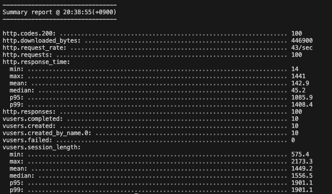
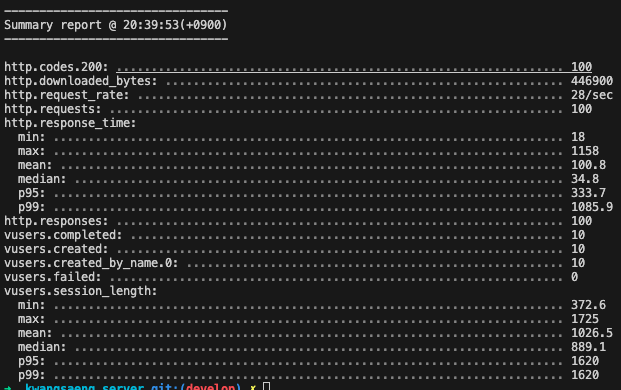
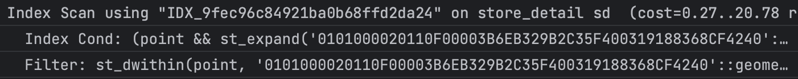

# R-Tree 인덱스 적용

---

# 🚂 Motivation

RealMySQL 8.0을 공부하던 도중, R-Tree를 사용하여 위경도 데이터를 인덱싱하면 성능적으로 이점을 얻을 수 있다고 하여서, 마침 위경도 데이터를 이용하던 광생에 적용한 후, **Before After**를 비교해봤다.

# ⭐ What I Learned

## Before

### SQL

```sql
SELECT "m"."id"               AS "menuId",  
       "m"."name"             AS "menuName",  
       "m"."price"            AS "price",  
       "m"."count"            AS "count",  
       "s"."id"               AS "storeId",  
       "s"."name"             AS "storeName",  
       "m"."menu_picture_url" AS "menuPictureUrl",  
       "m"."selling_price"    AS "sellingPrice",  
       "m"."discount_rate"    AS "discountRate",  
       "mv"."view_count"      AS "viewCount"  
FROM "menus" "m"  
         LEFT JOIN "menu_views" "mv" ON "m"."id" = "mv"."menu_id"  
         LEFT JOIN "stores" "s" ON "m"."store_id" = "s"."id" AND "s"."deleted_date" IS NULL  
         LEFT JOIN "store_detail" "sd" ON "s"."id" = "sd"."store_id"  
WHERE 1 = 1 
			AND ST_DWithin(ST_Transform(ST_SetSRID(ST_MakePoint("sd"."lon", "sd"."lat"), 4326), 3857),  ST_Transform(ST_SetSRID(ST_MakePoint(127.0577492000820::numeric, 37.6203769557633::numeric), 4326), 3857), 3000) 
			AND "m"."selling_price" < 5000
		  AND "m"."deleted_date" IS NULL  
ORDER BY "mv"."view_count" DESC, "m"."id" ASC  
```

기존의 쿼리문에서 주의깊게 봐야할 부분은 아래 부분이다.

```sql
**ST_DWithin(ST_Transform(ST_SetSRID(ST_MakePoint("sd"."lon", "sd"."lat"), 4326), 3857),  ST_Transform(ST_SetSRID(ST_MakePoint(127.0577492000820::numeric, 37.6203769557633::numeric), 4326), 3857), 3000)** 
```

위도와 경도값을 가지고 Point를 만든 후, Point와 Point사이의 거리를 계산해 3000m이내의 가게들을 가져오는 구조이다.

이 구조로 부하테스트(10명의 사용자가 10회)를 진행했을 때, 다음과 같은 결과가 도출됐다.



평균적으로 142ms, 가장 느린정도의 값은 1408ms로 어쩌면 사용자가 체감이 될 수 있을만큼 시간이 걸린 것으로 확인할 수 있다.

(이 결과값은 물론 쿼리문만 이뤄지진 않았다. Response 가공이나 서버단에서 간단한 if문이 있었으나, 쿼리 튜닝을 진행한 이후도 똑같은 과정을 거치기에 결과 도출에는 의미 없다고 판단했다.)

## After

```javascript
@Column({
        type: 'geometry',
        spatialFeatureType: 'Point',
        srid: 3857,
        nullable: false,
        comment: '위도와 경도를 결합한 공간 데이터',
    })
@Index({ spatial: true })
point: Point;   
```

우선, entity에서 point 칼럼을 추가한 후, R-Tree(공간 인덱스)를 적용해주었다.

```sql
SELECT "m"."id"               AS "menuId",  
       "m"."name"             AS "menuName",  
       "m"."price"            AS "price",  
       "m"."count"            AS "count",  
       "s"."id"               AS "storeId",  
       "s"."name"             AS "storeName",  
       "m"."menu_picture_url" AS "menuPictureUrl",  
       "m"."selling_price"    AS "sellingPrice",  
       "m"."discount_rate"    AS "discountRate",  
       "mv"."view_count"      AS "viewCount"  
FROM "menus" "m"  
         LEFT JOIN "menu_views" "mv" ON "m"."id" = "mv"."menu_id"  
         LEFT JOIN "stores" "s" ON "m"."store_id" = "s"."id" AND "s"."deleted_date" IS NULL  
         LEFT JOIN "store_detail" "sd" ON "s"."id" = "sd"."store_id"  
WHERE 1 = 1 
			AND ST_DWithin("sd"."point", ST_SetSRID(ST_MakePoint(127.0577492000820, 37.6203769557633), 3857), 3000) 
			AND "m"."selling_price" < 5000
		  AND "m"."deleted_date" IS NULL
ORDER BY "mv"."view_count" DESC, "m"."id" ASC  
```

마찬가지로 주의깊게 봐야할 곳은 아래와 같다.

```sql
ST_DWithin("sd"."point", ST_SetSRID(ST_MakePoint(127.0577492000820, 37.6203769557633), 3857), 3000) 
```

이번엔 entity에 저장되어 있는 point값과 사용자의 위치값을 point로 변환해 3000m이내의 가게를 찾았다.

entity에 저장될 때 기본적으로 point값을 저장하니 조회시 더 빠른것도 맞다고 생각한다. 
하지만 가게가 등록되는 시점에 Point값을 계산해서 넣는 것에 대한 오버헤드와 수많은 사용자들이 내 주변의 가게를 찾는 조회의 오버헤드를 비교하는 것은 호출 횟수가 차이나기에 무의미하다고 생각했다.

이 구조로 부하테스트(10명의 사용자가 10회)를 진행했을 때, 다음과 같은 결과가 도출됐다.



중간값은 100.8ms로 약 40ms를, 가장 느린정도의 값은 1085.9ms로 300ms 넘게 성능을 개선할 수 있었다. 

실행 계획을 확인하였을 때, Point에 대해서 Index Scan을 사용한 것도 확인하였다.



# 💭 Impression
1. R-Tree 인덱스를 적용해본것은 처음이여서 색다른 경험을 했다고 느꼈다.
2. 실제로 성능상의 변화가 크게 없으면 어떡하지? 라는 고민도 했었는데 유의미한 결과가 나와서 기분이 좋다.
3. 공간 데이터를 활용할 때, 위도와 경도값만을 DB에 저장하는 것보단, 위도와 경도를 이용한 공간데이터값도 추가해서 넣어두는 것도 좋아보인다. 상황에 따라 다르게 사용할 수 있는 거 같다.
