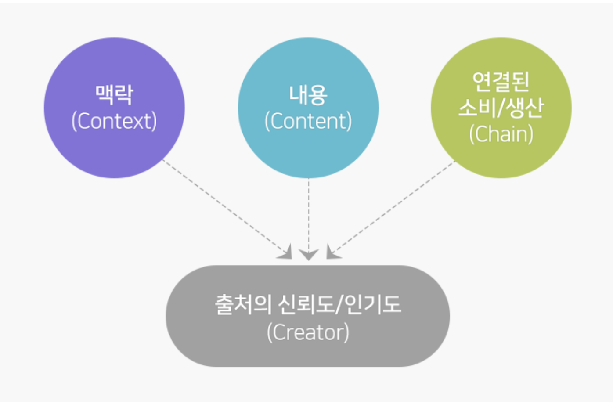
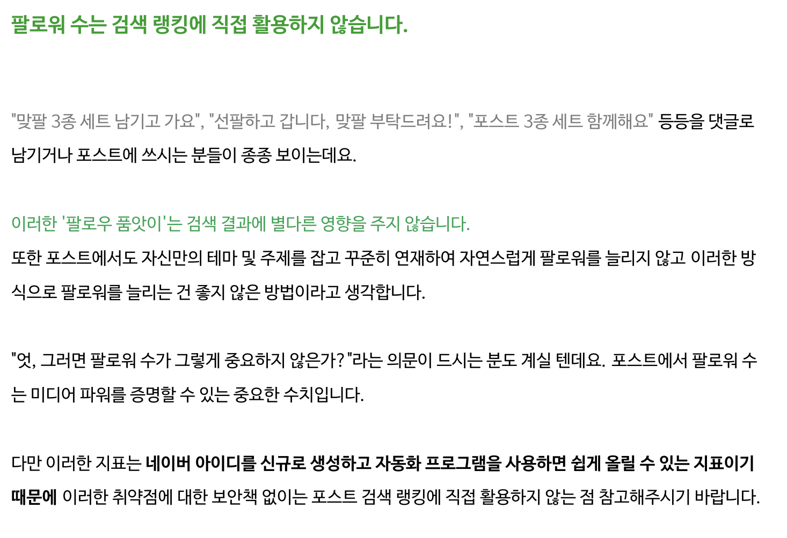

# 네이버 검색엔진 고찰

---

# 🚂 Motivation

대학 동기가 꿈이 파워블로거인데, 네이버에 아무리 검색해도 그 사람의 블로그가 잘 안뜸
→ 검색엔진을 잘 이용해서 네이버 파워블로거 내가 만들어줄 수 있을까? 란 의문에서 시작

# ⭐ What I Learned

## 통합 검색엔진 내용
1. 포스팅의 내용을 충실히 담아야한다.
- pogo sticking이라고 내 게시글에 체류 시간이 중요함.
- 체류 시간이 길수록 당연히 순위가 높아짐
2. '수식어'를 제목에 포함하라.
3. 감정적인 형용사로 키워드를 수식하라.
- 감정적인 형용사를 썼을때 공유 비율이 높은것을 확인
4. title과 h1 태그를 잘 활용.
- h1태그도 중요하지만, 더 가중치가 높은것은 title이긴 하다.
5. 콘텐츠 초반에 키워드를 반드시 넣자.(반복 노출되는것도 영향이 간다고 함)
- 아마도 후술할 meta data중 description의 값 때문이라 예상된다.
6. 포스팅 길이가 길수록 상단에 노출될 확률이 높아진다.(최소 2000자 이상을 권장)
7. 이미지도 꼭 신경쓰자
	- 보통 이미지에도 파일명을 설정할 수 있는데, 크롤링해서 파싱해올때 파일명도 중요하다.
	- 캡션(깨졌을 때 대체 텍스트)를 넣는것을 권장
## 네이버 검색엔진의 특징

### C-Rank

검색 랭킹의 정확도를 높이기 위해 사용되는 기술 중 문서 자체보다는 해당 문서의 출처인

**블로그의 신뢰도를 평가하는 알고리즘**

C-Rank 알고리즘을 통해 해당 블로그가 **주제별 관심사의 집중도는 얼마나 되고(Context), 생산되는 정보의 품질은 얼마나 좋으며(Content), 생산된 콘텐츠는 어떤 연쇄반응을 보이며 소비/생산되는지(Chain)를 파악**해 이를 바탕으로 해당 블로그가 **얼마나 믿을 수 있고 인기 있는 블로그인지(Creator)를 계산**

### D.I.A

D.I.A. (다이아, Deep Intent Analysis)란, 네이버의 데이터를 기반으로 키워드별로 사용자들이 선호하는 문서들에 대한 점수를 랭킹에 반영한 모델

D.I.A.+ 의 알고리즘
- 질의 의도 분석기 : 의미 기반 클러스터링과 학습을 통해 질의 패턴을 분석합니다.
- 문서 패턴 분석기 : 문서의 구조, 본문 텍스트, 이미지 정보 등으로부터 추출된 새로운 패턴 피처들을 D.I.A.+ 랭킹 로직에 활용합니다.
- 문서 확장 모듈 : 의미적으로 대체가 될 만한 단어를 문서에 추가함으로써 문서와 검색어의 매칭 확률을 높이고 검색품질을 높이고 있습니다.
- D.I.A.+ 랭킹 : 다양해진 패턴 피처들과 사용자 피드백을 통해 질의 의도에 적합한 문서인지 유동적으로 파악해 다채로운 검색 결과를 제공합니다.
- 피드백 반영 : 이러한 알고리즘은 계속 새로운 데이터를 반영해 학습되고 개선되고 있습니다.
### 파워블로그를 만들 수 있을까?

**불가능**하다고 생각된다. 처음 간단히 생각해봤을때, 'IP를 바꿔가며 조회수를 올리면 되지 않을까?'나 '서로이웃을 신청하는 크롤러를 만들면 도움이 되지 않을까?' 등 무언가 봇을 만들어서 고의적으로 가중치를 바꾸는 방법이 가능할 것이라 생각됐는데, 네이버의 검색 엔진은 C-Rank와 D.I.A를 기반으로 검색 엔진의 가중치를 결정한다면 가중치를 고의적으로 조작하기는 힘들어 보인다.

맞는 예시인지는 모르겠지만 옵시디언의 그래프뷰와 유사하게 가중치를 계산할 거 같다. 엄청나게 무수히 많은 게시글이 저장된 그래프뷰에서 백링크로 많이 접촉되어 있는 게시글(블로그)이 상단에 노출될 거 같은 느낌? 물론, 백링크 게시글의 백링크 개수도 유의미하다.(백링크가 네이버의 판단 하에 신뢰할 수 있는 사이트여야한다.)

그러므로 파워블로그를 임의로 만드는것은 불가능하다고 생각된다. 그나마 내가 할 수 있는 건,, 검색 엔진이 html을 파싱하며 어떤 값의 가중치가 높게 부여되는지 어림잡는 정도...?
[와중에 이건 네이버에서 설명되어있다.](https://searchadvisor.naver.com/guide/seo-help)

그래도 공부한 게 있으니.. 이걸 기준으로 게시글 작성할 때의 팁은... 아래와 같다.

### TIP
- 게시글 제목을 작성할 때, 고유한(유니크한?) 제목이 있을 수록 좋음(키워드는 반드시 있어야 함)
	- ex) 인천 노가리 맛집, 노가리상회(x), 인천 간석동 최고의 마른 안주집, 노가리상회(o)
- 게시글 제목이 너무 길면 오히려 안 좋음
- meta data중 description의 값도 가중치 부여
	- 네이버 블로그에서는 게시글이 시작되고 57글자를 description에 넣음
	- 그러므로 57글자동안 최대한 키워드를 넣어 어필
- H1 태그가 두개 이상일 경우 검색 엔진이 이해하기 어려운 구조가 됨
	- 어짜피 네이버 블로그는 Markdown이 아니라 의미 없음
- 네이버가 신뢰할 수 있는 데이터(네이버 지도 등)를 적재하는게 도움이 됨.
- 이미지에 부가 설명을 반드시 추가할 것.
### 팔로워 수에 대한 오해

추가로, 서로 이웃(팔로우)를 통한 방법은 네이버에서 공식적으로 영향이 없다고 말하고 있다.

똑똑한 사람들..

# 💭 Impression

살짝 분하기도 하지만, 대기업은 대단하다고 느꼈다.(~~사실 나 같은 사람이 쉽게 시도할 수 있었다면 그게 더 말이 안되는 것 같기도...~~)

개발적으로 아무것도 하지 못했다. 결과물은 어이없는 블로그 글 쓰기 팁 뿐.. 슬프다.
