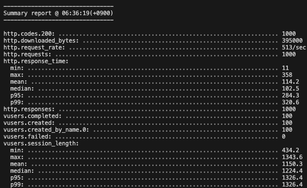
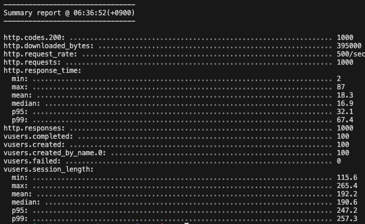

# TypeORM vs Prisma 2

---

# 🚂 Motivation

계속 진행하고 있는 ORM 비교(TypeORM vs Prisma)하다가 같은 실행계획임에도 성능차이가 나는 것을 확인.

### TypeORM



## Prisma



# ⭐ What I Learned

```sql
SELECT * 
FROM users AS u 
LEFT JOIN company AS c ON u.company_id = c.id
WHERE u.id = 500
```

위와 같은 간단한 쿼리를 각각의 ORM method를 이용해 실행한다.

```javascript
// ID 500인 유저 찾기(TypeORM)
  async findUsersForTypeORM() {
    return await this.users.find({
      where: { id: 500 },
      relations: {
        company: true,
      },
    });
  }
// ID 500인 유저 찾기(prisma)
  async findUsersForPrisma() {
    return await this.prisma.users.findMany({
      where: { id: 500 },
      include: {
        company: true,
      },
    });
  }
```

이 때, 실질적으로 실행되는 쿼리와 실행계획은 다음과 같다.

## **TypeORM**

### Query

```sql
SELECT `Users`.`id`                               AS `Users_id`,
       `Users`.`name`                             AS `Users_name`,
       `Users`.`gender`                           AS `Users_gender`,
       `Users`.`created_date`                     AS `Users_created_date`,
       `Users`.`updated_date`                     AS `Users_updated_date`,
       `Users`.`company_id`                       AS `Users_company_id`,
       `Users__Users_company`.`id`                AS `Users__Users_company_id`,
       `Users__Users_company`.`name`              AS `Users__Users_company_name`,
       `Users__Users_company`.`address`           AS `Users__Users_company_address`,
       `Users__Users_company`.`longitude`         AS `Users__Users_company_longitude`,
       `Users__Users_company`.`latitude`          AS `Users__Users_company_latitude`,
       `Users__Users_company`.`scale`             AS `Users__Users_company_scale`,
       `Users__Users_company`.`big_job_kind_id`   AS `Users__Users_company_big_job_kind_id`,
       `Users__Users_company`.`mid_job_kind_id`   AS `Users__Users_company_mid_job_kind_id`,
       `Users__Users_company`.`small_job_kind_id` AS `Users__Users_company_small_job_kind_id`
FROM `users` `Users`
         LEFT JOIN `company` `Users__Users_company` ON `Users__Users_company`.`id` = `Users`.`company_id`
WHERE ((`Users`.`id` = 500));
```

 

### 실행계획

| id | select_type | table                | partitions | type  | possible_keys | key     | key_len | ref   | rows | filtered |
| -- | ----------- | -------------------- | ---------- | ----- | ------------- | ------- | ------- | ----- | ---- | -------- |
| 1  | SIMPLE      | Users                | null       | const | PRIMARY       | PRIMARY | 4       | const | 1    | 100      |
| 1  | SIMPLE      | Users__Users_company | null       | const | PRIMARY       | PRIMARY | 4       | const | 1    | 100      |

## **Prisma**

### Query

```sql
SELECT `test_db`.`users`.`id`,
       `test_db`.`users`.`name`,
       `test_db`.`users`.`gender`,
       `test_db`.`users`.`created_date`,
       `test_db`.`users`.`updated_date`,
       `test_db`.`users`.`company_id`
FROM `test_db`.`users`
WHERE `test_db`.`users`.`id` = 500;
-- id 500인 유저의 company id가 259인 것을 찾아 애플리케이션단에서 조합한 후, 두번째 쿼리를 실행한다.
SELECT `test_db`.`company`.`id`,
       `test_db`.`company`.`name`,
       `test_db`.`company`.`address`,
       `test_db`.`company`.`longitude`,
       `test_db`.`company`.`latitude`,
       `test_db`.`company`.`scale`,
       `test_db`.`company`.`big_job_kind_id`,
       `test_db`.`company`.`mid_job_kind_id`,
       `test_db`.`company`.`small_job_kind_id`
FROM `test_db`.`company`
WHERE `test_db`.`company`.`id` IN (259);
```

### **실행계획**

| id | select_type | table | partitions | type  | possible_keys | key     | key_len | ref   | rows | filtered |
| -- | ----------- | ----- | ---------- | ----- | ------------- | ------- | ------- | ----- | ---- | -------- |
| 1  | SIMPLE      | users | null       | const | PRIMARY       | PRIMARY | 4       | const | 1    | 100      |

| id | select_type | table   | partitions | type  | possible_keys | key     | key_len | ref   | rows | filtered |
| -- | ----------- | ------- | ---------- | ----- | ------------- | ------- | ------- | ----- | ---- | -------- |
| 1  | SIMPLE      | company | null       | const | PRIMARY       | PRIMARY | 4       | const | 1    | 100      |

결국 두번의 쿼리를 실행하니, 실행계획도 따로따로 분리되게 표현했다.

## Issues

실행계획도 사실 같다. const type으로 가장 빠른 타입인것도 확인했고, 둘 다 PRIMARY KEY를 사용한 것도 똑같다. 근데 성능은 중간값 기준 10배 가까이 차이난다. 

사실 비교한다면 쿼리문을 두번 실행시켜 애플리케이션과 DB가 두번 통신하는 Prisma가 더 느려야한다고 생각한다.
1. 쿼리 캐싱?
	1. TypeORM은 쿼리 캐싱하지 않고 Prisma는 쿼리 캐싱을 진행해서 부하테스트 환경에서 여러번 쿼리문을 진행할 때, Prisma는 캐싱되어 빠른가?
	2. 지금 띄워져있는 MySQL 8.0 버전부터는 쿼리 캐싱이 없어졌다고 한다.
	3. 그래도 TypeORM과 Prisma는 애플리케이션단에서 쿼리 캐싱을 진행할 수 있는데, default는 false라서 위의 코드들에서는 진행되지 않았다.
2. 커넥션 풀링?
	1. Prisma와 TypeORM 모두 커넥션 풀링에 대해 default value로 진행되어 상관 없을거라 여겨짐..
3. **킹갓 Prisma?**
	1. 아무래도 최근에 확 뜨고 있는 Prisma가 쿼리 결과를 객체로 변환하는 과정에서 빠른게 아닐까 라는 생각이 든다.
	2. Typescript가 2012년에 출시되고 그때부터 TypeORM이 빠르게 적용하며 만들기 시작했으니,, 성능 이슈를 신경쓰지 않고 복잡한 타입안에서 규격을 만들어나가는데 집중했을 거 같다. 공식문서에서도 그런 Geek함이 느껴진다.
	3. ~~근데 왜 타입안정성도 Prisma가 더 좋지…?~~
	4. 그래도 전 QueryBuilder 사랑합니다
# 💭 Impression

[https://blog.voidmainvoid.net/131](https://blog.voidmainvoid.net/131)

개인적으로 정말 좋아하는 아티클이다.

근데 TypeORM과 Prisma는 비교하면 비교할수록 한쪽으로 마음이 너무 기운다..
TypeORM을 더 많이 써봤고, 더 많이 정감이 가는데 쬐끔 슬퍼지는 거 같다.
