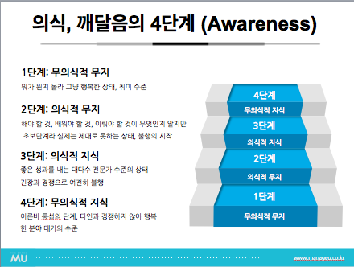

# 2024 AUSGCON 후기

---

# 🚂 Motivation

AUSG 8기로 합류한 후, AUSG의 첫 번째 큰 행사이고, 세션별로 건너건너 들었지만 배울분들이 많은 거 같아서 신청했다!

# ⭐ What I Learned

우선 내가 들은 세션은 아래와 같다.

| 제목                                                            | 연사자                                   |
| --------------------------------------------------------------- | ---------------------------------------- |
| 커뮤니티 활동을 하라, 그럼 당신에게 드넓은 기회가 펼쳐질 것이니 | 박태성 / 아이디어샘 / AWS Community Hero |
| gRPC와 함께 알아보는 같이 일하고 싶은 엔지니어                  | 김한수 / 뱅크샐러드 / AUSG               |
| 신입의 클라우드 엔지니어 적응기                                 | 정지우 / 여기어때컴퍼니 / AUSG           |
| 아무것도 모르던 코더가 살아남기                                 | 김민태 / 우아한형제들 / AUSG             |
| 어디서도 보지 못한 Github Actions의 마법                        | 김수빈 / 당근마켓 / AUSG                 |
| Hey, Jina                                                       | 송주영 / LG U+ / AWS Container Hero      |

~~확실히 라인업이 확실히 살벌…~~

티켓값 10,000원이 생각나지 않을만큼 너무 유익했던 하루였다. 주관적으로 감명깊게 들었던 세션은 김한수님의 “gRPC와 함께 알아보는 같이 일하고 싶은 엔지니어” 와 김민태님의 “아무것도 모르던 코더가 살아남기”이다. 다른 세션들도 정말 유익했지만, 두 개를 뽑은 이유는 다음과 같다.

### 같이 일하고 싶은 엔지니어

김한수님의 “gRPC와 함께 알아보는 같이 일하고 싶은 엔지니어”에 대해서 간단히 세션 설명을 하자면, gRPC의 특징 및 기술에 대해 간략히 소개해주고서 본격적으로 같이 일하고 싶은 엔지니어에 대해서 설명이 들어갔다.

gRPC의 특성도 유익했지만, 결국 엔지니어로서 팀원들과 협업하고, 결과를 도출해내는 과정에 대해서 더 기억에 남는 거 같다.

한수님의 얘기하길, 같이 일하고 싶은 엔지니어는 아래와 같은 특성을 가졌었다고 한다.

-   **현재 우리 팀에 중요한 게 뭔지 파악하고 요구사항을 명확히 하기 위해 적극적으로 소통한다**
    -   **본인이 이해 안 된 게 있다면 역질문한다**
-   **설득력 있는 근거와 함께 자신의 의견을 명확히 이야기한다**
    -   **무언가 제안할 부분이 있다면 트레이드오프를 적절히 고려한다**
    -   **시각적 자료를 활용하기도 한다**

그리고, Software Engineering에 관련되어 얘기한 것은 다음과 같다.

-   **Software Engineering에는 올바른 방향성은 존재하지만, 정답은 없다.**
-   **우리는 정답이 없는 문제를 푸는 사람들이고 그렇기 때문에 치밀하게 계획하고 실행하고 피드백하는 것이 중요하다.**
-   **그래서 우리가 도구로 사용하는 기술을 명확하게 이해하는 것은 당연히 중요하다.** - **이해가 기반이 되는 근거와 주장은 강력하다**

정답이 없는 문제를 푼다는게 내가 좋아했던 [아티클](https://blog.voidmainvoid.net/131)의 내용과 비슷하다고 생각해 큰 공감이 이뤄졌고, 그렇기에 도구로 사용하는 기술을 명확하게 이해한다는 주장도 뒷받침 됐던 거 같다.

이를 바탕으로 한수님이 겪어왔던 같이 일하고 싶은 엔지니어상을 이해되는데 도움이 됐다.

### 학습, 무의식적 무지

사실 발표의 8할은 민태님의 일대기(?)와 본인이 주니어(신입)으로 돌아간다면 어떻게 했을지에 대한 내용이였다.

하지만 나머지 2할이 좀 깊게 다가왔다.

맨날 스스로에 대해 “우물 안의 개구리”, “뭘 모르는지도 모르는 바보”라고 지칭한다. 이렇게 어렵게 얘기할 게 아니라, 위의 사진에 써있듯 결국 나는 “무의식적 무지”였다.

민태님이 설명하신 것도 그렇고, 내가 생각하기로도 “무의식적 무지”를 해결하는 가장 쉬운 방법은 **커뮤니티**라고 생각든다.

누군가가 어떤 문제를 겪었고, 그 문제를 어떻게 해결해 왔는지를 들어보면 “와.. 이런 방법도 있었어?”라고 많이 생각 든다. 이게 무의식적 무지에서 의식적 무지로 넘어가는 시점이고, 이 이후는 내가 공부해 의식적 지식을 터득하면 된다. (그러다 보면 언젠간 나도 무의식적 지식을…?)

# 💭 Impression

## 엔지니어로서 나

두 세션은 엔지니어로서의 공진성에 대해서 다시금 리마인드 해줄 수 있었다.

김한수님이 말씀해주셨던 “**과연 나는 같이 일하고 싶은 엔지니어일까?**” 와 김민태님이 말씀해주신 학습에 관한 이야기 중 “**나는 과연 무의식적 무지에서 벗어났을까?**”의 공통점을 생각해보면 결국 커뮤니티, 협업 등 **소프트스킬**이 정답이라고 생각된다.

하드 스킬(기술)이 기반을 다지는 작업이라면, 소프트 스킬(커뮤니케이션)이 새싹을 심는일이 아닐까?

기반이 다져지지 않았다면? 새싹을 심지않았다면? 당연히 꽃은 안 핀다.
