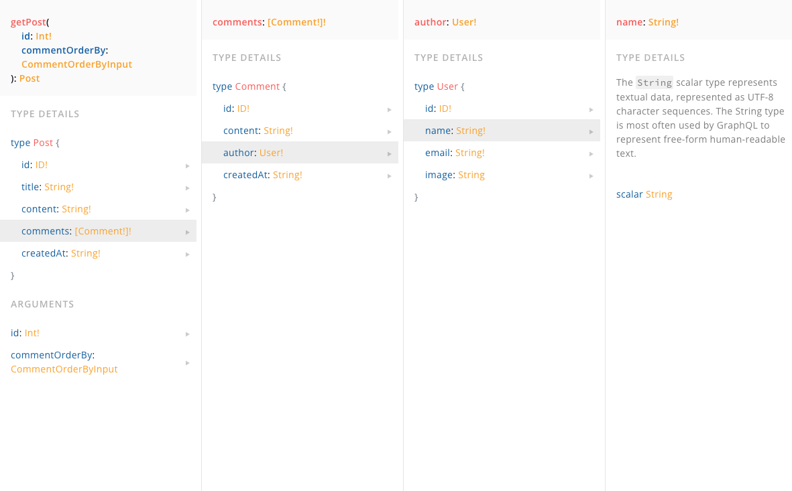

# GraphQL

---

# 🚂 Motivation

최근에 REST, GraphQL, gRPC등 API 통신 방식에 대해서 흥미가 생겨서 공부를 했습니다. 그러다 GraphQL이란 통신 방식이 재밌어보여서 사용해보고자 하였습니다.

새로운 창업에서 GraphQL을 적용하게 되었던 배경과, **적용되었던 GraphQL을 다시 도려낸 과정을 설명합니다.**

gRPC의 경우 HTTP3버전을 사용하다보니 client - server간의 통신보단 server - server간의 통신에서 자주 사용한다고 알고 있어, MVP런칭 단계와 어울리지 않아 고려하지 않았습니다.

# ⭐ What I Learned

## GraphQL의 특징

-   Facebook에서 개발한 API 쿼리 언어
-   클라이언트가 필요한 데이터를 정확히 요청할 수 있게 해줍니다.
-   클라이언트는 어떤 데이터를 받고 싶은지 직접 정의하며, 서버는 그에 맞춰 데이터를 반환합니다.
-   REST에 비해 오버페칭(overfetching)과 언더페칭(underfetching) 문제를 해결할 수 있습니다.
    이걸로 이해가 안될 거 같아 간단한 게시판 예시도 작성해보았습니다

### Schema(gql파일) 예시

```graphql
# 느낌표가 달려있는 타입들은 non-nullable이라고 생각하시면 됩니다.
# User 타입
type User {
    id: ID!
    name: String!
    email: String!
    image: String
}
# Comment 타입
type Comment {
    id: ID!
    content: String!
    author: User! # 댓글 작성자
    createdAt: String!
}
# Post 타입
type Post {
    id: ID!
    title: String!
    content: String!
    comments: [Comment!]! # 게시글에 달린 댓글들
    createdAt: String!
}
# Query 타입
type Query {
    getPost(id: Int!, commentOrderBy: CommentOrderByInput): Post
}
input CommentOrderByInput {
    createdAt: SortOrder
    # 다른 필드들도 추가 가능
}
enum SortOrder {
    asc
    desc
}
```

### 실제 쿼리(앱 요청 쿼리)

-   게시글 상세를 가져오며, 그 게시글의 댓글들을 모두 가져오고, 댓글들 각각의 user정보까지 가져올 때 앱의 요청 방법

```graphql
query {
    getPost(id: 1, commentOrderBy: {createdAt: desc}) {
        id
        title
        content
        author {
            id
            name
        }
        comments {
            id
            content
            createdAt
            author {
                id
                name
            }
        }
    }
}
```

### API 명세서(Playground)



이런 구조에서 GraphQL의 장점을 엿볼 수 있는데, client입장에서 원하는 데이터만 요청을 보내고, 그에 맞는 데이터 구조로 응답해준다. 이를 REST와 비교해 underfetching, overfetching문제를 해결한다고 합니다

## Overfetching, Underfetching

### Overfetching (오버페칭)

**Overfetching**은 클라이언트가 서버로부터 필요 이상의 데이터를 가져오는 상황입니다.

즉, 클라이언트가 실제로 필요로 하는 데이터보다 더 많은 데이터를 받는 것입니다. REST는 엔드포인트마다 고정된 데이터 구조를 반환하는 경향이 있어, 클라이언트는 종종 필요 없는 필드나 리소스를 함께 받아야 합니다.

### 예시:

-   사용자가 모바일 앱에서 사용자 프로필 이름만 필요하지만, REST API 엔드포인트는 이름뿐만 아니라 이메일, 전화번호, 주소 등 많은 정보를 함께 반환할 때 발생합니다.
-   이렇게 불필요한 데이터는 대역폭을 낭비하고, 특히 제한된 네트워크 환경에서는 성능 문제를 야기할 수 있습니다.

### Underfetching (언더페칭)

**Underfetching**은 클라이언트가 요청한 리소스로부터 원하는 정보를 얻기 위해 **여러 번의 추가 요청**을 해야 하는 상황입니다.

즉, 한 번의 요청으로 필요한 모든 데이터를 얻지 못해 여러 요청을 해야 하는 문제이며, 특히 복잡한 데이터를 처리할 때 문제가 됩니다.

### 예시:

-   사용자가 게시글 목록을 불러오는데, 각 게시글의 작성자 정보도 함께 필요할 때가 있는데, REST API는 게시글 목록만 반환하고 작성자 정보는 다른 엔드포인트를 통해 가져와야 할 때, 클라이언트는 여러 번의 추가 요청을 해야함.
-   이는 불필요한 요청을 반복하게 되어 네트워크 트래픽을 증가시키고 성능 저하로 이어질 수 있다.
    창업 아이템은 커뮤니티 플랫폼이 주된 비지니스기에 Overfetching, Underfetching 문제를 해결하는 것도 성능상의 이점을 챙길 수 있을 거 같아 GraphQL을 사용하고자 하였습니다.

## 근데 왜 GraphQL을 도려내게 되었나요?

사실 도려냈다는 표현은 좀 과장된 거 같습니다. GraphQL을 사용하여 아키텍쳐를 설계하던 도중, 문제점을 발견했고 그에 따라 REST 방식을 채택하는게 더 좋다고 생각되었습니다.

이는 우리의 서비스가 웹이 아닌 앱이였기 때문이었습니다.

GraphQL은 굉장히 프론트엔드 의존적인 통신 프로토콜이라고 생각합니다.

예를 들어, 기존의 게시글 상세 API에서는 댓글들을 나열할 때 createdAt으로 내림차순이였는데, 만약 요구사항이 변경되어 updatedAt의 내림차순으로 변경된다면, GraphQL의 장점은 서버에 변동사항 없이 프론트엔드의 요청만을 바꿔서 해결할 수 있다는 점입니다.

하지만, 앱의 특성상 요구사항의 변동으로 코드를 재작성한 후, 각종 스토어에 배포하는 게 힘든것으로 알고 있습니다. 차라리 요구사항이 변경되었을 때, 백엔드 로직을 바꿔서 Response를 강제하는게 적합하다고 생각되어 GraphQL의 도입이 올바르지 않다고 판단했습니다.

물론, GraphQL에서 유연하게 이를 조절하는 방법도 존재하고, 그걸 적용할만큼 GraphQL의 장점도 명확하다고 생각하지만, **MVP를 런칭하는 단계에서 개발자의 소요를 생각했을 때 적당한 트레이드오프가 아니라고 생각들었습니다.**

# 💭 Impression

무엇이든 근거가 뒷받침되어야 한다고 생각합니다.

GraphQL의 장점은 뒷받침하기에 적절한 이유가 된다고 생각했는데, 결국 번복하게 되었습니다.

이래서 개발은 하면 할수록 아는게 힘이라는 생각이 듭니다..

설계단계에서 깨달아서 다행이지(~~사실 기능 개발 도중이였다면 어떻게든 최대한 유연하게 만들어냈을 거란 생각은 있지만~~) 같이 협업하는 개발자들에게 민폐를 끼칠 뻔 했다고 생각이 듭니다.

휴,,,

# ➡️ **What's Next**

프론트엔드와 도려낸 GraphQL을 어떤것으로 대체할 지, 어떻게 대체할 지를 좀 고민해봐야 할 거 같습니다.

일단 눈길을 끈 건 이 [아티클](https://medium.com/daangn/%EC%BB%A4%EB%AE%A4%EB%8B%88%ED%8B%B0%EC%8B%A4-api-design-first-%EC%A0%91%EA%B7%BC%EB%B0%A9%EC%8B%9D-%EC%A0%95%EC%B0%A9%EA%B8%B0-cecca0a37c05)인데, 협의 후에 결정해보려구요…!
