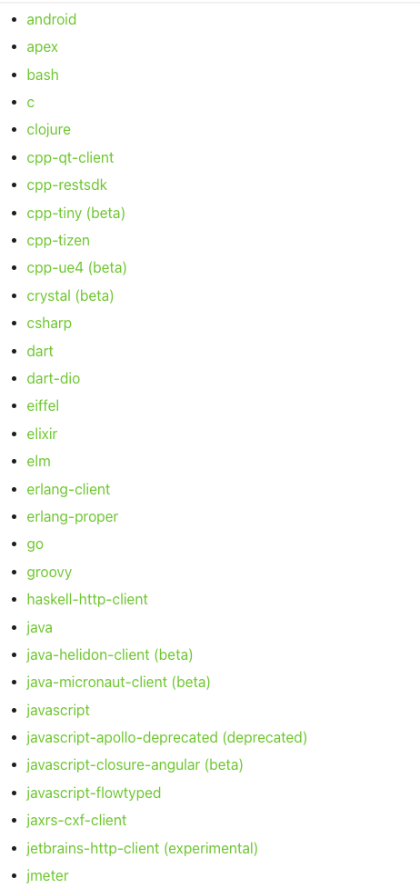
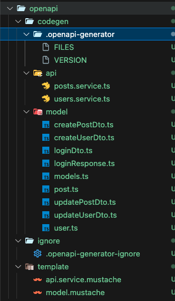

# OpenAPI-Generator For NestJS

---

# 🚂 Motivation

[아티클](https://medium.com/daangn/%EC%BB%A4%EB%AE%A4%EB%8B%88%ED%8B%B0%EC%8B%A4-api-design-first-%EC%A0%91%EA%B7%BC%EB%B0%A9%EC%8B%9D-%EC%A0%95%EC%B0%A9%EA%B8%B0-cecca0a37c05)을 보고 너무 매력적인 협업 스타일인 거 같아서 적용해보려고 OpenAPI-Generator를 적용 및 공부했습니다.

# ⭐ What I Learned

### OpenAPI-Generator

-   Openapi를 생성하는 json이나 yaml파일을 가지고서 codegen해주는 녀석입니다.
-   아래 사진만 봐도 어마무시하게 다양한 언어 및 프레임워크에서 지원하는 것을 볼 수 있는데, nestjs 옆에는 experimental이라는 불안한 문구가 붙어있습니다.




아니나 다를까 처음보는 nestjs 코드를 생성하더군요,,(codegen 만든 사람이 nestjs 안써본 거 같았습니다.)

그래서 [OpenAPI-Generator의 깃헙 코드](https://github1s.com/OpenAPITools/openapi-generator/blob/master/modules/openapi-generator/src/main/java/org/openapitools/codegen/languages/TypeScriptNestjsClientCodegen.java)를 보고 codegen template을 적용하는 방법을 찾아 오버라이드 해버렸습니다. (공식문서에도 템플릿을 수정하는 방법이 잘 안 나와있어(~~자바로만 있어~~) 좀 헤맸습니다.)
Mustache이라는 템플릿 언어를 처음 작성해봤는데, 생각보다 엄청 직관적이더군요..!

### Mustache

-   Mustache는 웹 개발에서 자주 사용되는 **로직 없는 템플릿 엔진**입니다.
-   다양한 프로그래밍 언어와 함께 사용될 수 있으며, 주로 HTML, XML, JSON 등의 형식에서 변수를 바인딩해 데이터를 표시하는 데 사용된다고 합니다.
    아래의 두개의 tamplate mustache파일을 생성했습니다.

```markdown
# model.mustache

{{#models}}
{{#model}}
import { IsString, IsNumber, IsBoolean, IsOptional, IsNotEmpty } from 'class-validator';
import { ApiProperty } from '@nestjs/swagger';
export class {{classname}} {
{{#vars}}
@ApiProperty({{#description}}{ description: '{{{description}}}' }{{/description}})
{{#required}}@IsNotEmpty(){{/required}}{{^required}}@IsOptional(){{/required}}
{{#isString}}@IsString(){{/isString}}{{#isInteger}}@IsNumber(){{/isInteger}}{{#isLong}}@IsNumber(){{/isLong}}{{#isFloat}}@IsNumber(){{/isFloat}}{{#isDouble}}@IsNumber(){{/isDouble}}{{#isBoolean}}@IsBoolean(){{/isBoolean}}
{{name}}{{^required}}?{{/required}}: {{{dataType}}};
{{/vars}}
}
{{/model}}
{{/models}}
```

```markdown
# api.service.mustache

import { Injectable } from '@nestjs/common';
{{#models}}
import { {{classname}} } from './{{classname}}.dto';
{{/models}}
@Injectable()
export class {{classname}} {
{{#operations}}
{{#operation}}
{{operationId}}({{#allParams}}{{baseName}}: {{dataType}}{{#hasMore}}, {{/hasMore}}{{/allParams}}): Promise<{{returnType}}> {
// Business Logics
return {
// Return Data
};
}
{{/operation}}
{{/operations}}
}
```

### Result



필요없는 파일들은 ignore시켰고, Service Layer와 model(dto)의 템플릿을 지정해준 대로 잘 만들어진 것을 확인했습니다

controller로 만들고 싶었지만, 두개 외에는 nestjs에서 설정할 방법도 없더군요. ㅠ

# 💭 Impression

오픈소스 깃헙을 열어본게 굉장히 오랜만인 거 같습니다.

마음같아서는 nestjs codegen하는 부분은 기여를 해보고싶지만, 자바로 작성되어있어 용기가 나질 않네요. **자바 무셔**

# ➡️ **What's Next**

openapi.json(OpenAPI 생성 파일)을 Github PR을 이용해 앞단 뒷단이 논의하고, PR이 머지되었을 때 Github Actions로 앞단 뒷단 각각의 Codegen이 이뤄지도록 만들 예정입니다.

But, 현재 openapi.json파일의 변경사항을 확인하진 않습니다. 기존에 있던 코드들과, 현재 변경된 openapi.json의 변경사항을 확인해서 나눠 Codegen을 하려하는데 어떻게 해야할 지 좀 고민해봐야 할 거 같습니다.
