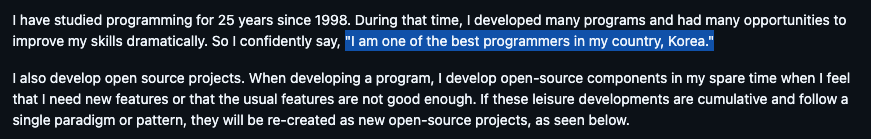

# Typia

---

# 🚂 Motivation

새로 시작하는 프로젝트에서 OpenAPI-Generator를 적용하며 class-validator로 codegen template을 적용하는 것이 아닌, typia로 적용시켜보고 싶어짐.

**정리한 글에는 Typia의 전체적인 사용처보단, class-validator를 Typia로 대체한 과정만 서술합니다.**

# ⭐ What I Learned

NestJs의 가장 대표적인 validation 라이브러리는 class-validator이란 녀석입니다. 
이를 통해 DTO를 구성할 때는 아래와 같은 코드로 작성됩니다.

### Class-validator

```typescript
// class-validator
import { ApiProperty } from "@nestjs/swagger";
import {
  ArrayNotEmpty,
  IsArray,
  IsObject,
  IsOptional,
  IsString,
  Match,
  MaxLength,
  Type,
  ValidateNested,
} from "class-validator";
 
export class BbsArticle {
  @ApiProperty({
    format: "uuid",
  })
  @IsString()
  id!: string;
 
  @ApiProperty({
    type: () => AttachmentFile,
    nullable: true,
    isArray: true,
    description: "List of attached files.",
  })
  @Type(() => AttachmentFile)
  @IsArray()
  @IsOptional()
  @IsObject({ each: true })
  @ValidateNested({ each: true })
  files!: AttachmentFile[] | null;
 
  @ApiProperty({
    type: "string",
    nullable: true,
    minLength: 5,
    maxLength: 100,
    description: "Title of the article.",
  })
  @IsOptional()
  @IsString()
  title!: string | null;
 
  @ApiProperty({
    description: "Main content body of the article.",
  })
  @IsString()
  body!: string;
 
  @ApiProperty({
    format: "date-time",
    description: "Creation time of article",
  })
  @IsString()
  created_at!: string;
}
 
export class AttachmentFile {
  @ApiProperty({
    type: "string",
    maxLength: 255,
    pattern: "^[a-zA-Z0-9-_]+$",
    description: "File name.",
  })
  @Matches(/^[a-z0-9]+$/)
  @MaxLength(255)
  @IsString()
  name!: string | null;
 
  @ApiProperty({
    type: "string",
    nullable: true,
    maxLength: 255,
    pattern: "^[a-zA-Z0-9-_]+$",
    description: "File extension.",
  })
  @Matches(/^[a-z0-9]+$/)
  @MaxLength(8)
  @IsOptional()
  @IsString()
  extension!: string | null;
 
  @ApiProperty({
    format: "url",
    description: "URL of the file.",
  })
  @IsString()
  url!: string;
}
```

어떻게 보면 가독성이 좋다고 생각할 순 있지만, 중복되는 코드가 존재합니다.

> 💡 1. Swagger에 선언하기 위한 ApiProperty 데코레이터  
>   
> 2. DTO단에서 타입을 검증하기 위한 데코레이터(IsString, IsNumber 등)  
>   
> 3. 직접적으로 선언해두는 타입(title!: string | null 등)
	1. Swagger에 선언하기 위한 ApiProperty 데코레이터
	2. DTO단에서 타입을 검증하기 위한 데코레이터(IsString, IsNumber 등)
	3. 직접적으로 선언해두는 타입(title!: string | null 등)
### 
Typia

이를 Typia는 가독성 좋게, 심지어는 20,000배 빠르게 검증합니다.
아래는 위 코드를 Typia로 변경한 코드입니다.

```typescript
// Typia
import typia, { tags } from "typia";
 
export interface IBbsArticle {
  /**
   * Primary Key.
   */
  id: string & tags.Format<"uuid">;
 
  /**
   * List of attached files.
   */
  files: null | IAttachmentFile[];
 
  /**
   * Title of the article.
   */
  title: null | (string & tags.MinLength<5> & tags.MaxLength<100>);
 
  /**
   * Main content body of the article.
   */
  body: string;
 
  /**
   * Creation time of article.
   */
  created_at: string & tags.Format<"date-time">;
}
 
export interface IAttachmentFile {
  /**
   * File name.
   */
  name: string & tags.Pattern<"^[a-z0-9]+$"> & tags.MaxLength<255>;
 
  /**
   * File extension.
   */
  extension: null | (string & tags.Pattern<"^[a-z0-9]+$"> & tags.MaxLength<8>);
 
  /**
   * URL of the file.
   */
  url: string;
}
```

중복되는 코드 없이 깔끔하게 타입을 표기하는 것을 볼 수 있습니다.

### Prisma

심지어는 Prisma와 연계하여 아래와 같이 `///` 주석을 사용해 formatting하는 방법도 있더군요!

```javascript
// prisma.schema
model bbs_articles {
  id String @id @db.Uuid /// @format uuid
  created_at DateTime @db.Timestamptz
 
  /// @minItems 1
  snapshots bbs_article_snapshots[]
}
 
model bbs_article_snapshots {
  id String @id @db.Uuid /// @format uuid
  bbs_article_id String @db.Uuid /// @format uuid
  format String @db.VarChar
 
  /// @minLength 5
  /// @maxLength 80
  title String @db.VarChar
  body String
  created_at DateTime @db.Timestamptz
 
  article bbs_articles @relation(fields: [bbs_article_id], references: [id])
}
```

### Mustache(OpenAPI-Generator Template)

기존에 class-validator로 작성되어있던 템플릿을 Typia 방식으로 바꿨습니다. (Mustache/OpenAPI-Generator에 대해서 모른다면 이 [게시글](https://kkardd.github.io/study/2024-10-23-OpenAPI-Generator-For-NestJS/) 참조)

```javascript
{{#models}}
{{#model}}
import { tags } from "typia";
export interface {{classname}} { {{#vars}}
    {{#description}}/** {{{description}}} */{{/description}}
    {{name}}{{^required}}?{{/required}}: {{{dataType}}}{{#pattern}} & tags.Pattern<"{{pattern}}">{{/pattern}}{{#minimum}} & tags.Minimum<{{minimum}}>{{/minimum}}{{#maximum}} & tags.Maximum<{{maximum}}>{{/maximum}}{{#minLength}} & tags.MinLength<{{minLength}}>{{/minLength}}{{#maxLength}} & tags.MaxLength<{{maxLength}}>{{/maxLength}}{{#isEmail}} & tags.Format<"email">{{/isEmail}}{{#isDate}} & tags.Format<"date">{{/isDate}}{{#isDateTime}} & tags.Format<"date-time">{{/isDateTime}};{{/vars}}
}
{{#vars}}
{{#isEnum}}
export type {{enumName}} = {{#allowableValues}}{{#values}}"{{.}}"{{^@last}} | {{/@last}}{{/values}}{{/allowableValues}};
{{/isEnum}}
{{/vars}}
{{/model}}
{{/models}}
```

깔끔하게 생성되지는 않는데,, Mustache로는 이게 최선같더군요. 어차피 prettier이 이쁘게 정리해줄거니 만족합니다! 

# 💭 Impression

Typia는 [한국인 개발자](https://github.com/samchon)가 만든 오픈소스 라이브러리라 더 신기한 거 같습니다. 내가 만든것도 아닌데 자랑스러운 느낌..? 그리고 이분의 소개글이 너무 멋있어요.



저렇게 스스로에게 자랑스러운 개발자가 되는것도 목표중 하나로 잡아야겠어요 !
