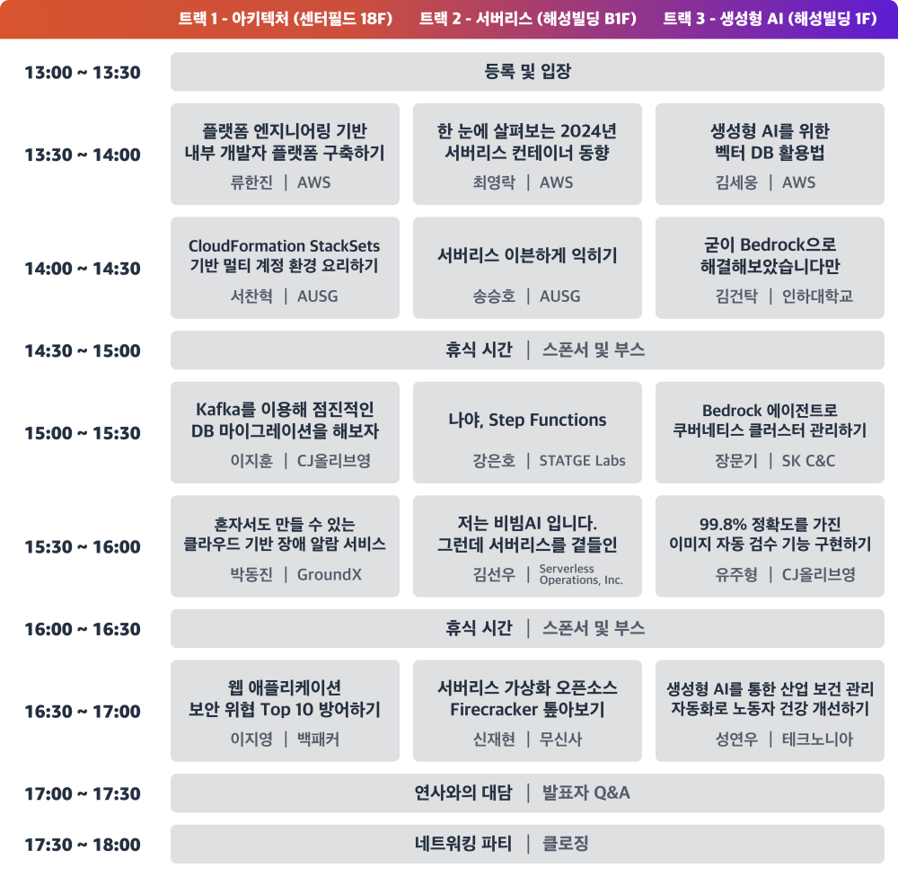
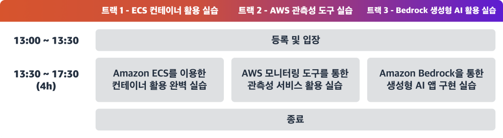
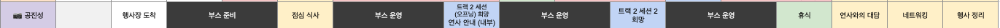
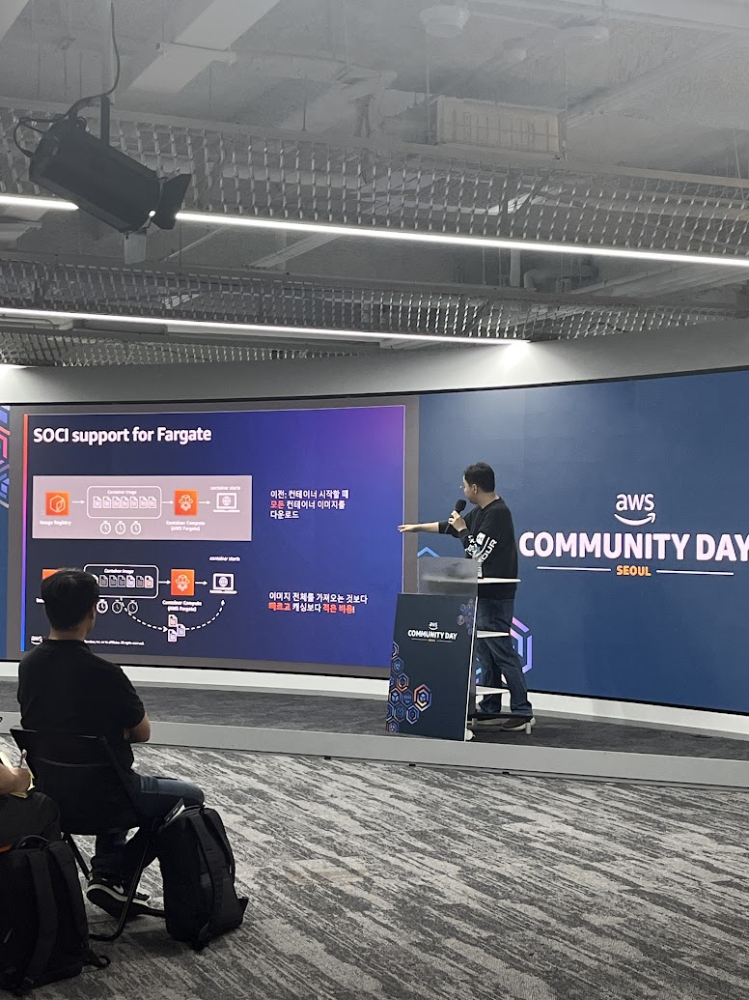
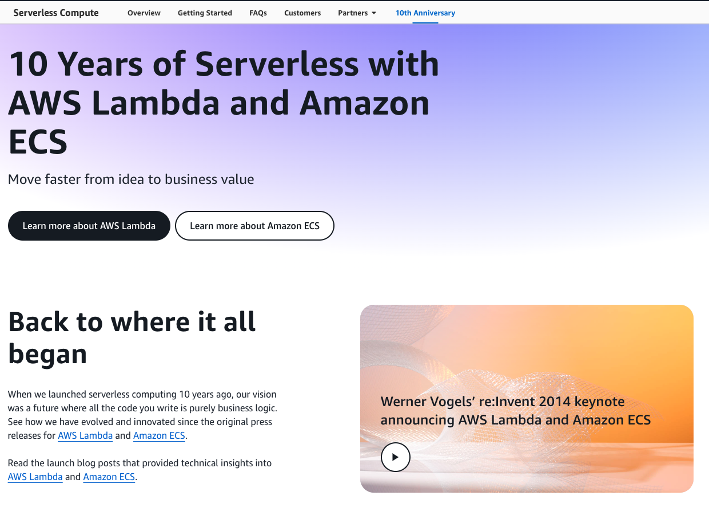
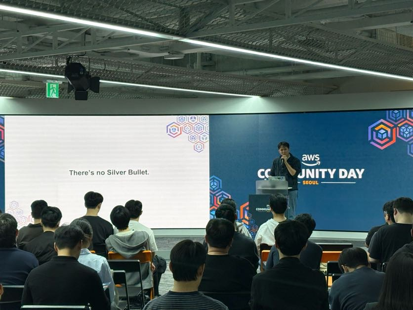
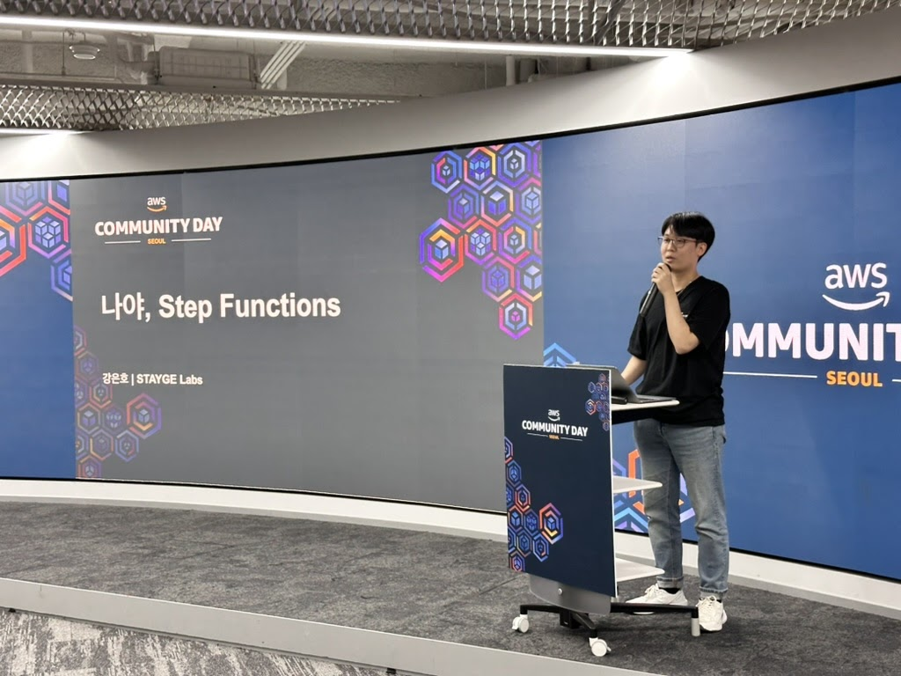
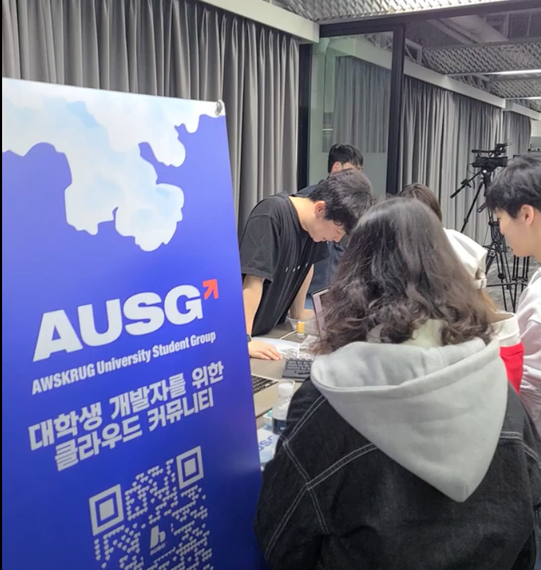
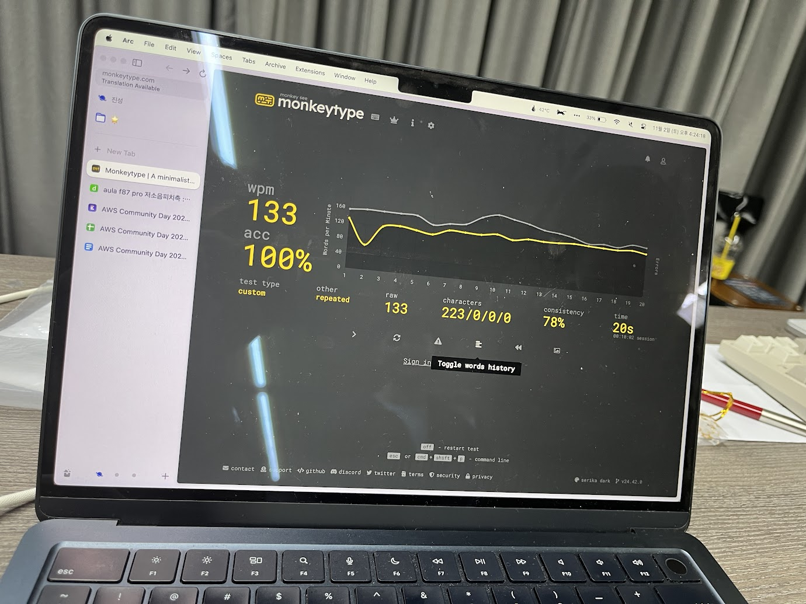
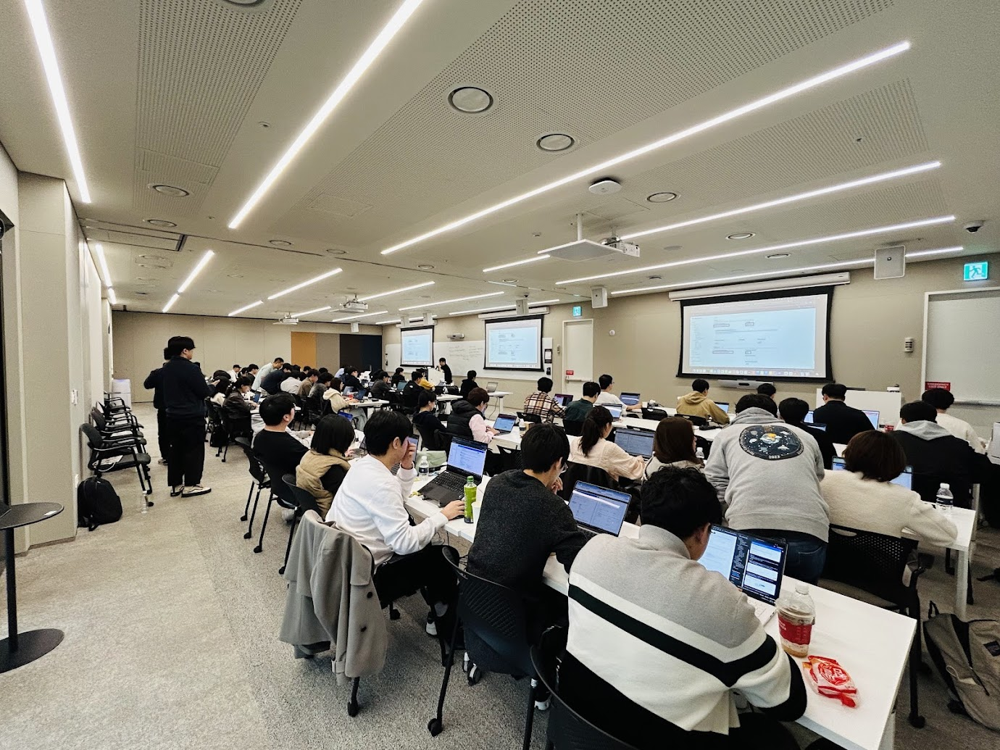

# AWS Community Day 2024 Staff 회고

---

# 🚂 Motivation

AUSG에서[ AWS Community Day 2024](https://event-us.kr/awskrug/event/92849)에 스태프를 구한다고 하여 신청하였습니다! 

11월 3, 4일 이틀동안 진행하였고, 3일은 강연형식으로, 4일은 핸즈온이 진행되었습니다.

### 11월 3일

### 11월 4일

저는 좋은 기회로 이틀 내내 스태프활동을 하였고, 그러면서 느낀점을 써보려고 합니다. 

# ⭐ What I Felt

## 첫째 날,

저는 트랙 2(서버리스)와 트랙 3(생성형 AI)가 진행되는 해성빌딩에서 AUSG 부스 스태프 및 연사자 안내, 사진 촬영을 맡았습니다.

주로 AUSG 부스에 있었지만, 세션 2 앞에 부스가 자리하여 대부분의 트랙을 들을 수 있었습니다.

### 트랙
- 한 눈에 살펴보는 2024 서버리스 컨테이너 동향
- 서버리스 이븐하게 익히기
- 나야, Step Functions
세가지 세션을 들을 수 있었고 간단하게 각각의 느낀점을 정리하면 다음과 같습니다.

**한 눈에 살펴보는 2024 서버리스 컨테이너 동향**

AWS에서 Lambda가 발표된 시기가 2014년이라고 합니다. 그게 AWS에서 서버리스의 시작이였고, 지금 2024년은 Lambda의 발표 10주년이자, 서버리스 10주년이라고 합니다.

전혀 몰랐었는데, 이미 AWS에서는 10주년이라고 띄워뒀더군요.(한국어에선 보이지 않습니다.)

AWS에서는 다양한 서버리스 제품을 10년동안 꾸준히 출시하였지만, 최근의 동향은 서버리스 컨테이너 서비스라고 합니다.
서버리스의 대명사는 Lambda이고, Lambda는 아직까지도 많이 사용하고 있지만, 제가 생각하기에도 가독성이 떨어진다고 생각합니다. 가장 유연하게 분리되어 있는 FaaS이지만, 여러 Funtions의 상호작용을 관리하는 건 유연한만큼 개발 리소스가 크다고 생각되네요. 

그래서 최근에는 서버리스 컨테이너 서비스를 많이 사용하고, AWS에서도 이를 목표로 나아가고 있다고 합니다. 대표적으로 AWS fargate가 있겠네요.

**서버리스 이븐하게 익히기**

서버리스 초심자가 들으면 좋을 내용으로 구성된 발표였습니다. 

기본적인 서버리스의 정의부터 동기/비동기 호출, 그리고 이를 통한 서버리스 아키텍쳐 구축에 대한 발표였습니다.

제가 개인적으로 가장 좋아하는 아티클인 “[개발자에게 은총알은 없다](https://blog.voidmainvoid.net/131)” 에 대해서 소개해주셨을 때 엄청 반가웠습니다.

AUSG 8기 오거나이저 송승호님의 발표였는데, 뒤에서 AUSG 부스를 운영하며 흐뭇하게 들었던 기억이 나네요!

**나야, Step Functions**

제 멘토님의 발표였습니다. 

제가 생각하기엔 200정도의 난이도였고, 회사 솔루션과 다양한 예시들로 Step Functions를 설명해주는게 인상 깊었습니다.

트랙 2 오프닝 세션인 2024 서버리스 동향에 대해서 오히려 반박하듯, Lambda를 사용하여 여러 워크플로우를 구축하고, 솔루션을 제공해나갈 수 있음을 보여줬습니다.

GUI로 워크플로우를 설계하는건 진짜 신기하고 진짜 편해보이더라구요! 

저도 Step Functions를 써볼 기회가 생겼으면 좋겠다고 생각했습니다.

### 연사자 안내

AUSG에서 스태프를 구한다길래 신청하였고, 운영 및 발표자 명단을 받았을 때, 굉장히 놀랐습니다.

컴퓨터공학부 학생임에도 뭘 공부해야하는지 갈피를 못 잡던 저에게 가장 처음 방향성을 제시해주신 분이 트랙2의 3번째 발표자인 강은호님이였고, 정말 우연히 만났습니다.

주로 AUSG 부스 스태프에 자리했지만, 중간중간 긴장하고 있는 은호형의 헬스체크(?)도 진행했던 거 같습니다.

### AUSG 부스

Community Day에 오신분들에게 타건 체험 및 타자 빨리 치기 부스를 운영했습니다.

가성비 키보드인 독거미, 대학생 공식픽 로지텍, 무난한 키크론, 제 값 못하는 (내) 애플 매직 키보드, 짱짱 신기한 해피해킹 스튜디오 키보드 등 다양한 키보드를 AUSG분들에게 제공 받아 타건 체험을 진행하였습니다.

의외로 가장 평이 좋은 키보드는 독거미더군요… 로지텍 다음으로 가장 싼 독거미가 다른 키보드들보다 압도적 호평을 받았습니다. 사실 저도 탐나더라고요… 무슨 6만원 짜리 키보드가 그리 타건감이 좋던지…

타자 빨리 치기 부스는 아래 문구를 **25초**안에 작성하면 귀여운 구르미 키캡을 증정하였습니다.

`아우쓱은 에이더블유에스와 클라우드에 관심 있는 대학생들이 모여 자유롭게 대화하고 지식을 나누는 커뮤니티입니다. 다양한 네트워킹 기회와 기술 공유의 장점이 가득한 아우쓱에서 함께 성장하세요!`

저는 **20초**만에 당당히 클리어했습니다.

### 뒤풀이

AWS Community Day 트랙 오너, 발표자, AWSKRUG 자원봉사자, AUSG 스태프들과 함께 뒤풀이를 갔습니다.

같이 고생한 AUSG 스태프들과 트랙1(아키텍쳐)에서 고생한 스태프분들과 함께 노고를 치하했습니다.

뒤풀이 포함 Commnunity Day의 첫째날을 가장 잘 설명할 수 있는 방법은 이 [브이로그](https://www.youtube.com/watch?v=-RofO_qctvI&t=978s)인 거 같아요!

~~아우슥 부스에서 뻘쭘히 앉아있는 제 모습… 쑥스럽네요. 머쓱머쓱~~

# 둘째 날,

워크샵 : [https://catalog.workshops.aws/ecs-cats-and-dogs/ko-KR](https://catalog.workshops.aws/ecs-cats-and-dogs/ko-KR)

첫째 날은 즐거움이 베이스였다면, 둘째 날은 신체적으로 굉장히 힘들었습니다. **그만큼, 많은 것을 배웠습니다.**

트랙1(아키텍쳐) 핸즈온의 스태프로 참여하게 되었고, 핸즈온을 참여하러 오신 분들이 워크샵을 진행하다가 어려움을 겪으실 때 도움을 주는 역할을 맡았습니다.(조교?)

ECS에서 EC2와 Fargate를 사용해 컨테이너화/자동 확장 웹 애플리케이션을 빌드하고 배포하는 워크샵이였고, 저를 포함해서 AWS Community Hero, AWS Software Developement Engineer 등 존경스러운 분들과 함께 진행하며 많은 것을 배웠던 거 같습니다.

실제로 핸즈온의 참석자가 날카로운 질문을 던졌을 때, 제가 대답하지 못하는 경우도 있더라구요. 많이 도움 받으며 제가 성장하는 것을 실시간으로 느꼈습니다.

지금은 ~~해당 워크샵 한정~~ ECS 마스터가 된 거 같아요. 뭐든 물어봐도 대답할 자신이 있슴다!

# 💭 Impression

한번 더 커뮤니티의 힘을 느끼게 하는 행사였습니다.

누군가의 세션을 들으며 새로운 인사이트를 얻기도 하였지만, 핸즈온 스태프를 진행하며 누군가에게 제가 아는 내용을 공유하기도 했습니다.

그러면서 문득 혼자서 개발을 진행하며 블로그와 ChatGPT에 의존했던 시기도 떠올랐습니다.

지금 뭘 하는지도 모르고, 뭘 만드는지도 모르며, 오로지 결과에만 집착하였던 제가, 주변 사람들과 AUSG에 서 다양한 사람의 색다른 관점에 대해서도 인사이트를 넓혀가고, 스스로 생각하게끔 성장했습니다.

AWS Commnunity Day는 누군가에게 이런 생각하게끔 만드는 행사이기에 충분했고, 제가 드렸던 도움으로써 그런 생각을 갖게 된 사람이 있었으면 좋겠습니다.

**그랬다면 커뮤니티에서 또 만나요!**
