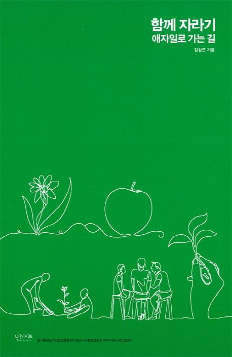

# 함께 자라기

---

김창준님의 “함께 자라기, 애자일로 가는 길” 을 읽었습니다.

글의 후기에 앞서, 이 글의 표지 뒷장에 있는 글을 인용해보겠습니다.

> 다음 문장들을 보고 거짓이라고 생각하는 게 있으면 골라보세요.  
> 
	1. 일반적으로 경력이 많으면 전문성도 높다.
	2. 수십 년간 같은 수련을 날마다 반복하면 실력이 는다.
	3. 실수는 최대한 예방하는 것이 좋고 그것이 가능하다.
	4. 업무 중 공유를 하면 신뢰가 쌓인다.
	5. 전문가들은 문제를 풀 때 하향식 접근(문제 이해, 분석, 설계, 구현 등의 순서)을 한다.
	6. 전문가들로 팀을 만들면 성공률이 높아진다.
	7. 독립적으로 일하는 팀원들이 각자 높은 확률로 일을 마칠 수 있다고 말하면 우리 팀이 일을 제대로 마칠 확률도 높다.
	8. 애자일로 성공하고 싶으면 작은 실천부터 시도하는 것이 좋다.
	9. 더 좋은 방법론을 도입하면 우리의 성공률이 올라갈 것이다.
	
몇 개나 거짓으로 고르셨나요? 사실 위의 진술들은 모두 거짓입니다.

만약, 위의 9가지의 질문 중, 이견이 있거나 이유가 궁금하신 분들은 꼭 읽어보길 바랍니다.

(저는 4가지의 질문이 거짓이라고 생각했으나, 현재는 모두 거짓이라고 생각합니다.)

---

저는 모든 것에 대해 “은탄환은 없다”라고 생각하며 살고 있습니다. 그게 개발 관련이든, 인간관계든 분야에 가리지 않고 “**분명하게 정해져있는 정답**”을 정의하는 것은 사람을 쉽게 **매몰**시킨다고 생각해요.

자기개발서의 대부분은 독자들에게 **어떠한 정답을 강요**하고 있다고 느꼈고, 동귀어진되어 자기개발서 자체를 좋지 않은 시선으로 보게 됐습니다.

이 책 또한, 책 표지 뒷장의 9가지 질문에 대해 모두 거짓이라고 “분명하게 정해진 정답”처럼 얘기하고 있기에 편견을 갖고 읽기 시작했던 거 같아요.

하지만, 읽고나서의 생각은 달라졌습니다.

이 글은 "자라기", "함께", "애자일"의 세가지 챕터가 진행되며 위 9가지 질문이 **왜** 거짓인 지에 대하여 논리적으로 반박합니다. 많은 통계들과 데이터를 바탕으로 납득시키더라구요.

또한, 반박할 뿐 아니라 경험을 바탕으로 한 해결책을 제시해줍니다. 매우 조심스럽게요.

업무 중 공유를 **어떻게** 해야 신뢰가 쌓이는지, 팀의 전문가를 **어떻게** 사용했을 때 가장 좋은 결과물을 만들어내는지, 실력을 기르기 위해선 **어떻게** 시작해야하는지 등 “함께 자라기”의 다양한 방법을 설명합니다.

개발자에게 5W and 1H 중, “Why”, “How”는 꼬리표처럼 붙어다닙니다.

비용, 팀원, 성능, 상황 등 다양한 변수들 사이에서 의사결정이 진행되려면 Why에 대해 탐구해보고, How를 기반으로 설득해야 합니다.

이 책은 “Why”, “How”를 기반으로, “함께”, “자라기”라는 추상적인 주제를 **애자일**이란 도구로 딥다이브합니다.

그 과정에서 애자일의 지엽적인 실천법이 아닌, 본질을 파악하는 게 중요하다는 메시지를 주고자 하구요.

읽으며 머리를 한 대 맞은 것처럼 “이미 매몰되어 있던 건 나였구나”란 생각이 들더군요. 또한, **성장**에 대한 긍정적 사고를 함양할 수 있었습니다.

---

이 책에서 감명깊게 읽었던 부분에 대해서 인용하며 마치고 싶은데요. 

“여러분 열심히 하고 있으니 잘될 겁니다”, “하나하나씩 바꿔나가면 나중에 큰 변화가 될거에요.” 같은 자기개발서다운 문장이 없습니다. 아쉽게도요.

그냥, 읽어보시고 납득당해보는걸 추천합니다.
